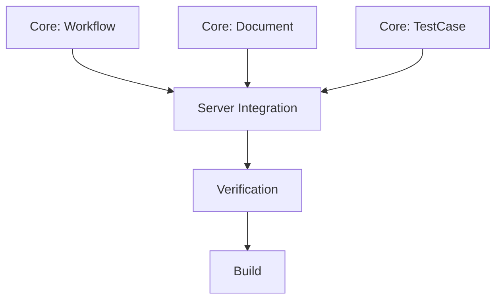

# 原子任务列表

## 任务 1: Core - Workflow Manager
- **输入**: `feature_name`
- **输出**: 目录结构
- **文件**: `src/apps/six_a_test_workflow/core/workflow.py`
- **要求**: 支持中文目录名，幂等（已存在不报错）。

## 任务 2: Core - Document Handler
- **输入**: `stage`, `doc_type`, `content`
- **输出**: Markdown 文件
- **文件**: `src/apps/six_a_test_workflow/core/document.py`
- **要求**: 自动识别阶段目录前缀（如输入 "Align" 自动对应 "01_Align"）。

## 任务 3: Core - Test Case Manager
- **输入**: `case_dict`
- **输出**: 追加到 Markdown 表格
- **文件**: `src/apps/six_a_test_workflow/core/test_case.py`
- **要求**: 表头自动生成，列对齐（可选，只需 Markdown 格式正确）。

## 任务 4: Server Integration
- **输入**: MCP Requests
- **输出**: MCP Responses
- **文件**: `src/apps/six_a_test_workflow/server.py`
- **要求**: 注册所有设计中的 Tool。

## 任务 5: Verification
- **输入**: `npx @modelcontextprotocol/inspector`
- **输出**: 验证通过
- **要求**: 所有 Tool 可调用，无报错。

## 任务 6: Build
- **输入**: `build_app.py`
- **输出**: `dist/six_a_test_workflow.exe`
- **要求**: EXE 可独立运行。
