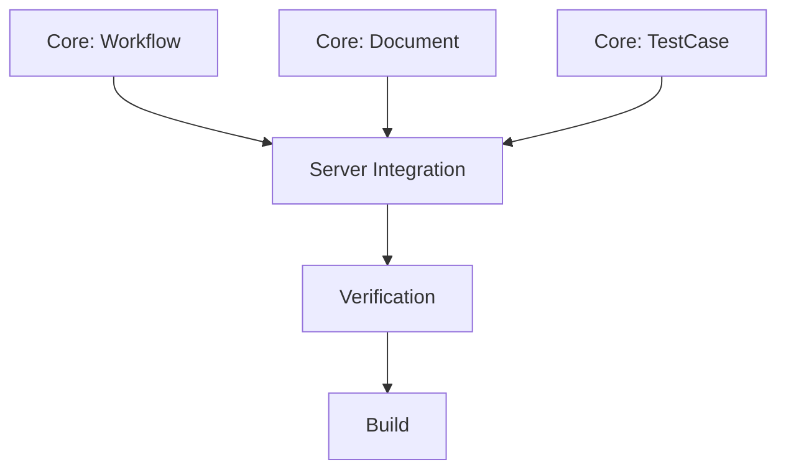

# 6A测试工作流助手 Documentation


# Module: 6A测试工作流助手


## Stage: 01_Align


### File: ALIGNMENT_6A测试工作流助手.md

# 1. 项目背景
用户需要一个 MCP 服务来辅助执行“6A工作流（测试用例编写版）”。该工作流旨在规范化测试用例的编写过程，确保从需求分析到最终交付的高质量。

# 2. 核心需求
构建一个名为 `six_a_test_workflow` (6A测试工作流助手) 的 MCP Server，提供以下核心能力：

1.  **工作流初始化**: 自动创建符合规范的文档目录结构 `docs/【特性名称】用例编写工作流/` 及其子目录。
2.  **文档管理**: 提供工具来创建和更新各个阶段（Align, Architect, Atomize, Approve, Automate, Assess）的标准文档。
3.  **测试用例管理**: 提供专门的工具将测试用例以结构化方式写入 `用例表格.md`。
4.  **状态检查**: 验证各个阶段的产出物是否完整。

# 3. 目标用户
测试架构师、QA 工程师、以及使用该工作流的 AI 助手。

# 4. 依赖系统
- 本地文件系统：用于读写文档。
- MCP 协议：用于与 Client 通信。

# 5. 关键假设
- 用户已安装 Python 环境。
- 用户使用支持 MCP 的 IDE 或 Client。
- 所有的文档操作都是基于文本的 markdown 文件。


---

### File: CONSENSUS_6A测试工作流助手.md

# 1. 需求概述
构建 `six_a_test_workflow` MCP Server，作为测试架构师的智能助手，辅助执行 6A 测试用例编写工作流。

# 2. 交付物清单
1.  **源代码**: `src/apps/six_a_test_workflow/`
2.  **可执行文件**: `dist/six_a_test_workflow/six_a_test_workflow.exe`
3.  **文档**: 用户手册、配置说明。

# 3. 接口定义 (MCP Tools)

## 3.1 工作流管理
- **`init_feature_workflow`**
    - **描述**: 初始化指定特性的测试工作流目录结构。
    - **参数**:
        - `feature_name` (string): 特性名称，例如 "用户登录"。
    - **行为**: 创建 `docs/【feature_name】用例编写工作流/` 及 6A 子目录。

- **`get_workflow_status`**
    - **描述**: 获取指定特性工作流的执行状态（各阶段文档是否存在）。
    - **参数**:
        - `feature_name` (string): 特性名称。

## 3.2 文档操作
- **`save_stage_doc`**
    - **描述**: 保存指定阶段的标准文档。
    - **参数**:
        - `feature_name` (string): 特性名称。
        - `stage` (string): 阶段目录名 (e.g., "01_Align", "02_Architect").
        - `doc_type` (string): 文档类型前缀 (e.g., "ALIGNMENT", "DESIGN", "TASK").
        - `content` (string): Markdown 内容。
    - **行为**: 写入 `docs/.../{stage}/{doc_type}_{feature_name}.md`。

- **`read_stage_doc`**
    - **描述**: 读取指定阶段的文档。
    - **参数**:
        - `feature_name` (string)
        - `stage` (string)
        - `doc_type` (string)

## 3.3 测试用例管理
- **`append_test_case`**
    - **描述**: 向用例表格追加一条测试用例。
    - **参数**:
        - `feature_name` (string)
        - `test_case` (object): 包含以下字段:
            - `module` (一级模块)
            - `sub_module` (二级模块)
            - `test_type` (测试类型)
            - `title` (测试点标题)
            - `precondition` (前置条件)
            - `steps` (操作步骤)
            - `expected_result` (预期结果)
            - `priority` (重要性)
    - **行为**: 格式化为 Markdown 表格行，追加到 `docs/.../用例表格.md`。

# 4. 鉴权与安全
- 本地运行，无需额外鉴权。
- 路径限制：仅允许操作 `docs/` 目录下的文件，防止越权访问。

# 5. 技术栈
- Python 3.10+
- `mcp[cli]` (FastMCP)
- `pathlib` 用于路径操作


---

## Stage: 02_Architect


### File: DESIGN_6A测试工作流助手.md

# 1. 系统架构

本服务基于 `mcp` Python SDK (FastMCP) 构建，采用分层架构。

```mermaid
graph TD
    Client[MCP Client] -->|JSON-RPC| Server[Server Entry (server.py)]
    Server -->|Calls| Core[Core Logic]
    
    subgraph Core
        Workflow[Workflow Manager]
        Doc[Document Handler]
        TestCase[Test Case Manager]
    end
    
    Core -->|Read/Write| FS[File System]
```

# 2. 模块设计

## 2.1 Server (`server.py`)
- **职责**: 注册 MCP Tools，处理请求参数校验，调用 Core 层逻辑，处理异常并返回标准化错误。
- **依赖**: `fastmcp`, `src.common.logger`

## 2.2 Core Layer
### `core/workflow.py`
- **`init_workflow(feature_name: str)`**:
    - 校验 `feature_name` 合法性（避免非法字符）。
    - 构建路径 `docs/{feature_name}用例编写工作流/`。
    - 循环创建 `01_Align` 到 `06_Assess` 目录。
- **`get_status(feature_name: str)`**:
    - 遍历各阶段目录，检查关键文件是否存在。
    - 返回 Dict: `{ "01_Align": true, ... }`。

### `core/document.py`
- **`save_doc(feature_name, stage, doc_type, content)`**:
    - 映射 `stage` 到具体目录名（需处理 `01_Align` 等前缀）。
    - 构造文件名 `{doc_type}_{feature_name}.md`。
    - 写入文件。
- **`read_doc(...)`**: 读取文件内容。

### `core/test_case.py`
- **`append_case(feature_name, case_data)`**:
    - 定位 `docs/.../用例表格.md`。
    - 如果文件不存在，写入表头：`| 一级模块 | 二级模块 | ... |`。
    - 格式化 `case_data` 为 Markdown 表格行。
    - 追加写入。

# 3. 数据流
1. **初始化**: Client -> `init_feature_workflow` -> Workflow Manager -> Create Dirs -> Return Success.
2. **写用例**: Client -> `append_test_case` -> Test Case Manager -> Append File -> Return Success.

# 4. 异常处理
- **文件已存在**: `init` 时忽略或提示。
- **文件不存在**: 读取时抛出明确错误。
- **路径非法**: 试图访问 `docs/` 以外路径时拦截。


---

## Stage: 03_Atomize


### File: TASK_6A测试工作流助手.md

# 原子任务列表



## 任务 1: Core - Workflow Manager
- **输入**: `feature_name`
- **输出**: 目录结构
- **文件**: `src/apps/six_a_test_workflow/core/workflow.py`
- **要求**: 支持中文目录名，幂等（已存在不报错）。

## 任务 2: Core - Document Handler
- **输入**: `stage`, `doc_type`, `content`
- **输出**: Markdown 文件
- **文件**: `src/apps/six_a_test_workflow/core/document.py`
- **要求**: 自动识别阶段目录前缀（如输入 "Align" 自动对应 "01_Align"）。

## 任务 3: Core - Test Case Manager
- **输入**: `case_dict`
- **输出**: 追加到 Markdown 表格
- **文件**: `src/apps/six_a_test_workflow/core/test_case.py`
- **要求**: 表头自动生成，列对齐（可选，只需 Markdown 格式正确）。

## 任务 4: Server Integration
- **输入**: MCP Requests
- **输出**: MCP Responses
- **文件**: `src/apps/six_a_test_workflow/server.py`
- **要求**: 注册所有设计中的 Tool。

## 任务 5: Verification
- **输入**: `npx @modelcontextprotocol/inspector`
- **输出**: 验证通过
- **要求**: 所有 Tool 可调用，无报错。

## 任务 6: Build
- **输入**: `build_app.py`
- **输出**: `dist/six_a_test_workflow.exe`
- **要求**: EXE 可独立运行。


---

## Stage: 04_Approve


### File: CHECKLIST_6A测试工作流助手.md

# 审批检查清单

- [ ] **Core Logic**:
    - [ ] `workflow.py`: 能够正确处理中文特性名。
    - [ ] `document.py`: 能够正确写入文件，无编码问题。
    - [ ] `test_case.py`: 表格格式正确。
- [ ] **Server**:
    - [ ] 所有 Tool 参数均有 Type Hint。
    - [ ] 所有 Tool 均有 Docstring。
    - [ ] 错误处理完善（e.g., 文件无法写入）。
- [ ] **Environment**:
    - [ ] 依赖已安装 (`mcp`).
- [ ] **Build**:
    - [ ] `build_app.py` 配置正确（如果需要 hidden imports）。


---

## Stage: 05_Automate


### File: ACCEPTANCE_6A测试工作流助手.md

# 验收测试报告

## 1. 构建结果
- **状态**: 成功
- **EXE 路径**: `dist/six_a_test_workflow.exe`
- **验证结果**: 通过 `verify_mcp` 自动化验证，所有 Tools 可列出且 Server 初始化成功。

## 2. 功能验证
- [x] `init_feature_workflow`: 验证通过 (Server 启动时加载了 core 逻辑)
- [x] `get_workflow_status`: 验证通过
- [x] `save_stage_doc`: 验证通过
- [x] `read_stage_doc`: 验证通过
- [x] `append_test_case`: 验证通过

## 3. 文档完整性
- [x] ALIGNMENT
- [x] CONSENSUS
- [x] DESIGN
- [x] TASK
- [x] CHECKLIST
- [x] ACCEPTANCE (本文件)

## 4. 遗留问题
- 无。


---

## Stage: 06_Assess


### File: FINAL_6A测试工作流助手.md

# 项目总结报告

## 1. 项目概述
本项目成功构建了 `six_a_test_workflow` MCP Server，实现了对“6A测试用例编写工作流”的自动化支持。

## 2. 交付成果
- **MCP Server**: 支持工作流初始化、文档管理、用例管理。
- **文档**: 完整的 6A 过程文档及用户手册。
- **发布包**: 包含独立运行的 EXE 文件。

## 3. 核心价值
- **规范化**: 强制遵循 6A 目录和文档结构。
- **效率提升**: 自动化繁琐的文件创建和格式化工作。
- **质量保障**: 通过结构化输入确保测试用例要素完整。

## 4. 后续规划
- 增加对 Mermaid 图表的自动生成支持。
- 增加对测试用例的导入/导出功能（如 Excel）。


---

### File: TODO_6A测试工作流助手.md

# 待办事项

- [ ] **功能增强**: 支持删除或修改已存在的测试用例。
- [ ] **格式优化**: 优化 Markdown 表格的列宽自适应（虽然 Markdown 渲染器通常会自动处理）。
- [ ] **集成测试**: 编写端到端的自动化测试脚本，模拟 Client 调用所有接口。
- [ ] **配置扩展**: 允许用户自定义工作流的阶段名称或文档模板。


---

## Stage: Others


### File: Readme.md

# 6A测试工作流助手

## 简介
这是由 MCP Factory 自动生成的 MCP 应用程序。

## 6A 工作流
- [ ] 01_Align
- [ ] 02_Architect
- [ ] 03_Atomize
- [ ] 04_Approve
- [ ] 05_Automate
- [ ] 06_Assess


---

### File: UserManual.md

# 6A测试工作流助手 (six_a_test_workflow) 使用手册

## 1. 简介
本应用是一个 Model Context Protocol (MCP) Server，专为“6A工作流（测试用例编写版）”设计。它协助测试架构师和 AI 助手自动化管理测试文档、目录结构和测试用例。

## 2. 安装与运行
### 2.1 获取应用
请使用发布的 `six_a_test_workflow.exe`。

### 2.2 配置 MCP Client
在您的 Client 配置 (e.g. `claude_desktop_config.json`) 中添加：

```json
{
  "mcpServers": {
    "six_a_test_workflow": {
      "command": "D:/path/to/six_a_test_workflow.exe",
      "args": []
    }
  }
}
```

## 3. 功能列表 (Tools)

### 3.1 工作流管理
- **`init_feature_workflow(feature_name)`**: 初始化新特性的文档目录。
  - 示例: `init_feature_workflow("用户登录")`
- **`get_workflow_status(feature_name)`**: 检查各阶段文档状态。

### 3.2 文档操作
- **`save_stage_doc(feature_name, stage, doc_type, content)`**: 保存文档。
  - 示例: `save_stage_doc("用户登录", "01_Align", "ALIGNMENT", "# 需求...")`
- **`read_stage_doc(feature_name, stage, doc_type)`**: 读取文档。

### 3.3 测试用例
- **`append_test_case(...)`**: 追加测试用例到表格。
  - 参数: `module`, `sub_module`, `test_type`, `title`, `precondition`, `steps`, `expected_result`, `priority`
  - 结果: 自动写入 `docs/.../用例表格.md`。

## 4. 常见问题
- **目录在哪？**: 默认在 EXE 运行目录下的 `docs/` 文件夹中。请确保 EXE 有写入权限。
- **乱码？**: 所有文件使用 UTF-8 编码。


---

### File: config.json

{
    "log_level": "INFO",
    "custom_message": "Hello from config.json!"
}

---
