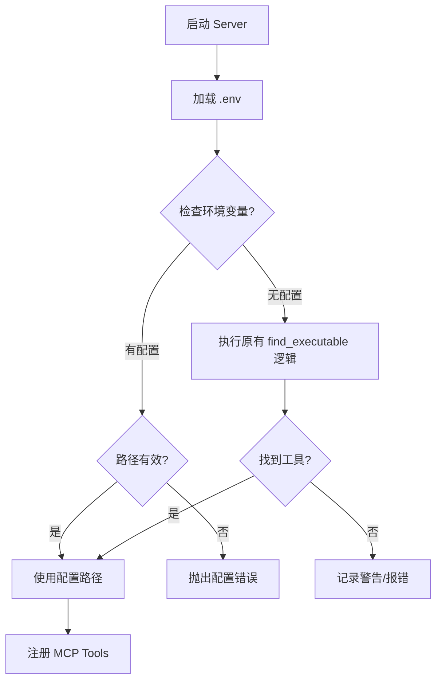

# 设计文档 (DESIGN) - Everything2MD 配置增强

## 1. 架构概览
本次变更不涉及宏观架构调整，仅在 `server.py` 的初始化阶段增加配置加载模块。



## 2. 模块设计
### 2.1 配置加载
- 使用 `dotenv.load_dotenv` 加载当前目录或指定路径的 `.env` 文件。
- 建议在 `server.py` 顶部导入依赖后立即执行。

### 2.2 路径解析逻辑增强
修改全局变量初始化部分：

```python
# 伪代码
load_dotenv()

def get_tool_path(env_var, binary_name, default_paths):
    custom_path = os.getenv(env_var)
    if custom_path:
        if os.path.exists(custom_path):
            return custom_path
        else:
            raise FileNotFoundError(f"Configured {env_var} path not found: {custom_path}")
    
    return find_executable(binary_name, default_paths)

SOFFICE_PATH = get_tool_path("LIBREOFFICE_PATH", "soffice", [...])
PANDOC_PATH = get_tool_path("PANDOC_PATH", "pandoc", [...])
```

## 3. 接口设计
- **输入**: `.env` 文件 (Key-Value pairs)
- **输出**: `SOFFICE_PATH`, `PANDOC_PATH` 全局变量

## 4. 异常处理
- **配置错误**: 当用户显式配置了错误的路径时，必须通过 `RuntimeError` 或 `FileNotFoundError` 阻止服务启动，确保配置的有效性。
