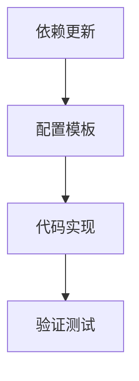

# 任务清单 (TASK) - Everything2MD 配置增强

## 任务列表

### 1. 依赖更新 (config_deps)
- **输入**: `src/apps/everything2md/requirements.txt`
- **动作**: 添加 `python-dotenv`
- **输出**: 更新后的 `requirements.txt`

### 2. 配置模板 (config_example)
- **输入**: 无
- **动作**: 创建 `src/apps/everything2md/.env.example`
- **内容**: 包含 `LIBREOFFICE_PATH` 和 `PANDOC_PATH` 的注释示例
- **输出**: `.env.example` 文件

### 3. 代码实现 (config_impl)
- **输入**: `src/apps/everything2md/server.py`
- **动作**:
  - 导入 `dotenv`
  - 封装路径获取逻辑 `get_tool_path(env_key, exe_name, defaults)`
  - 替换原有的 `SOFFICE_PATH` 和 `PANDOC_PATH` 初始化代码
- **约束**: 保持向后兼容（无 .env 时正常工作）

### 4. 验证测试 (config_verify)
- **输入**: `test_config.py`
- **动作**:
  - 创建临时 `.env`
  - 验证路径加载是否正确
  - 验证错误路径是否抛出异常
- **输出**: 测试通过报告
