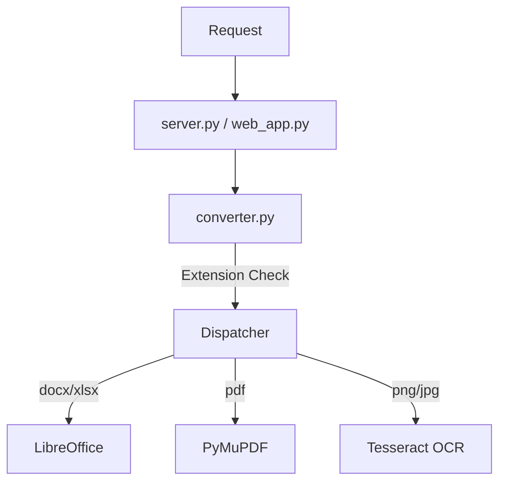

# Design Document - Everything2MD OCR Support

## 1. Architecture

The OCR module fits into the existing `converter.py` architecture as another conversion strategy.



## 2. Component Details

### 2.1 `converter.py`
- **New Import**: `import pytesseract`, `from PIL import Image`.
- **Path Resolution**:
  ```python
  TESSERACT_PATH = find_executable("tesseract", [...], "TESSERACT_PATH")
  if TESSERACT_PATH:
      pytesseract.pytesseract.tesseract_cmd = TESSERACT_PATH
  ```
- **Conversion Function**:
  ```python
  def _convert_image_to_md(source_path, output_path):
      image = Image.open(source_path)
      text = pytesseract.image_to_string(image)
      with open(output_path, 'w') as f:
          f.write(text)
  ```

### 2.2 `server.py`
- Update `convert_to_markdown` decorator/docstring to include `.png, .jpg, .jpeg, .tiff, .bmp`.
- Update the extension check logic to pass these extensions to `convert_file_sync`.

## 3. Error Handling
- If `TESSERACT_PATH` is not found: Log warning at startup. Raise error if user tries to convert an image.
- If `pytesseract` raises error (e.g., invalid image): Catch and re-raise as `RuntimeError` or `ValueError` with clear message.
