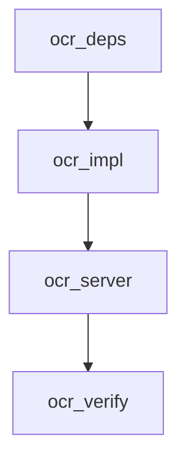

# Task Decomposition - Everything2MD OCR Support

## Tasks

### 1. Dependencies
- **Task ID**: `ocr_deps`
- **Description**: Add `pytesseract` and `Pillow` to `requirements.txt`.
- **Priority**: High

### 2. Core Logic Implementation
- **Task ID**: `ocr_impl`
- **Description**: Update `converter.py`.
  - Add Tesseract path resolution.
  - Implement `_convert_image_to_md`.
  - Update `convert_file_sync` to handle image extensions.
- **Priority**: High

### 3. Server Integration
- **Task ID**: `ocr_server`
- **Description**: Update `server.py` to accept image file extensions in the `convert_to_markdown` tool.
- **Priority**: High

### 4. Verification
- **Task ID**: `ocr_verify`
- **Description**: Create `verify_ocr.py` to test image conversion.
  - Should mock `pytesseract` if real Tesseract is missing to verify logic flow.
  - Should attempt real conversion if configured.
- **Priority**: High

## Dependency Graph

