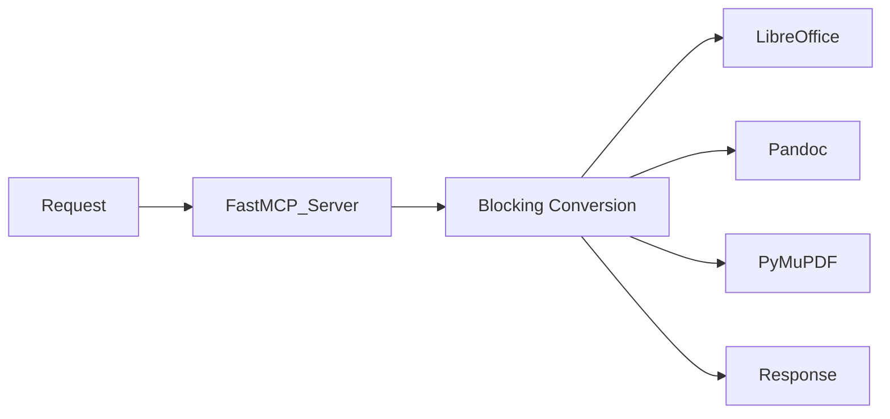
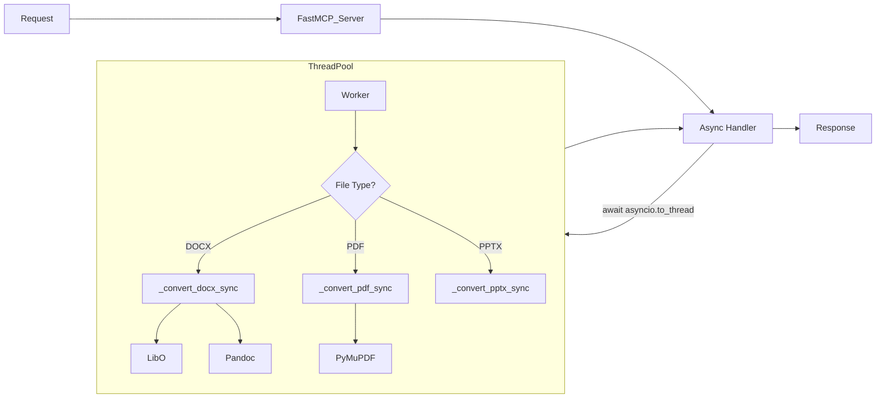

# Design Document - Everything2MD Async Processing

## 1. Architecture Overview

The goal is to decouple the request handling from the heavy file conversion processing. We will utilize Python's `asyncio` and `concurrent.futures.ThreadPoolExecutor` (implicitly via `asyncio.to_thread` in Python 3.9+) to achieve non-blocking behavior.

### Current Architecture (Synchronous)

### Proposed Architecture (Asynchronous)

## 2. Component Design

### 2.1 Main Async Entry Point
`async def convert_to_markdown(source_path: str, output_path: str) -> str`
- Performs path mapping.
- Checks file existence.
- Dispatches to the appropriate synchronous helper based on file extension.
- Uses `await asyncio.to_thread(helper_func, ...)` to run in a thread.

### 2.2 Synchronous Helpers
Refactor the existing monolithic logic into these focused functions:
- `def _convert_office_to_md(source_path: str, output_path: str, format_type: str) -> None`
  - Handles DOCX, DOC, XLSX, XLS.
  - Logic: LibreOffice -> Intermediate (HTML/CSV) -> Pandoc -> Markdown.
- `def _convert_pptx_to_md(source_path: str, output_path: str) -> None`
  - Handles PPTX.
  - Logic: pptx2md.
- `def _convert_ppt_to_md(source_path: str, output_path: str) -> None`
  - Handles PPT.
  - Logic: LibreOffice -> PPTX -> pptx2md.
- `def _convert_pdf_to_md(source_path: str, output_path: str) -> str`
  - Handles PDF.
  - Logic: pymupdf4llm.

## 3. Data Flow
1. **Input**: Client sends `call_tool("convert_to_markdown", ...)`
2. **Process**:
   - `FastMCP` receives request.
   - `convert_to_markdown` (async) starts.
   - Validation checks passed.
   - `asyncio.to_thread` submits job to thread pool.
   - **Main Loop Freed**: Server can accept other requests.
   - Thread completes conversion.
3. **Output**: `convert_to_markdown` awaits result and returns success message or error string.

## 4. Exception Handling
- Exceptions inside the thread (e.g., `subprocess.CalledProcessError`) will be raised in the async context when awaiting.
- The main `try...except` block in `convert_to_markdown` will catch these and return a formatted error string.
