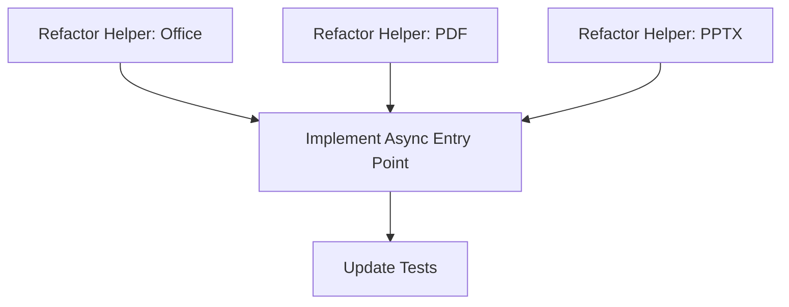

# Task Decomposition - Everything2MD Async Processing

## 1. Task Dependency Graph

## 2. Atomic Tasks

### Task 1: Refactor Helper - Office (DOCX/XLSX)
- **Goal**: Extract LibreOffice/Pandoc logic into `_convert_office_to_md`.
- **Input**: `source_path`, `output_path`, `format_type`.
- **Output**: None (Raises exception on failure).
- **Implementation**: Move existing `if file_extension in ['.docx'...]` and `['.xlsx'...]` logic.

### Task 2: Refactor Helper - PDF
- **Goal**: Extract PyMuPDF logic into `_convert_pdf_to_md`.
- **Input**: `source_path`, `output_path`.
- **Output**: Success string or raises Exception.
- **Implementation**: Move `if file_extension == '.pdf'` logic.

### Task 3: Refactor Helper - PPT/PPTX
- **Goal**: Extract pptx2md logic into `_convert_pptx_to_md` and `_convert_ppt_to_md`.
- **Input**: `source_path`, `output_path`.
- **Output**: None.
- **Implementation**: Move `if file_extension == '.pptx'` and `'.ppt'` logic.

### Task 4: Implement Async Entry Point
- **Goal**: Rewrite `convert_to_markdown` as `async def`.
- **Logic**:
  - Validate paths.
  - Select helper function based on extension.
  - Execute helper using `await asyncio.to_thread(helper, ...)`.
  - Catch exceptions and return error messages.

### Task 5: Update Tests
- **Goal**: Verify async tool works.
- **Implementation**:
  - Update `test_server.py` (if exists) or create `verify_async.py`.
  - Use `asyncio.run()` to call the tool in the verification script.
