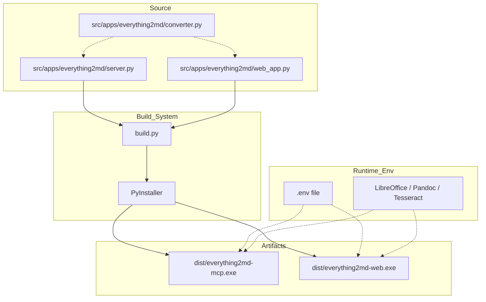

# Design Document - Everything2MD Build

## 1. System Architecture

The build system is a lightweight automation layer sitting on top of `PyInstaller`. It orchestrates the packaging of the Python source code into standalone Windows executables.

### Architecture Diagram

## 2. Component Design

### 2.1 `build.py`
A Python script located at `src/apps/everything2md/build.py`.

**Responsibilities:**
1.  **Cleanup**: Remove previous `build/`, `dist/`, and `.spec` files to ensure a clean build.
2.  **Configuration**: Define common PyInstaller arguments (e.g., log level, clean).
3.  **Execution**: Invoke PyInstaller for both targets (`server.py` and `web_app.py`).
4.  **Verification**: Check if output files exist after build.

**PyInstaller Configuration:**
*   `--onefile`: Bundle everything into a single `.exe`.
*   `--clean`: Clean PyInstaller cache.
*   `--noconfirm`: Overwrite existing output.
*   `--name`: Specific names (`everything2md-mcp`, `everything2md-web`).
*   `--hidden-import`: Explicitly include dynamic dependencies that static analysis might miss.
    *   `uvicorn.loops`, `uvicorn.loops.auto`, `uvicorn.protocols`, `uvicorn.protocols.http`, `uvicorn.protocols.http.auto`, `uvicorn.lifespan`, `uvicorn.lifespan.on`
    *   `fastapi`
    *   `pydantic`
    *   `pymupdf4llm`

### 2.2 Runtime Configuration (`.env`)
*   The application relies on `dotenv`.
*   **Constraint**: In `--onefile` mode, `sys.executable` points to the executable, but the app runs in a temp folder (`sys._MEIPASS`).
*   **Solution**: `python-dotenv` by default looks in the current working directory (CWD). We will instruct users to place the `.env` file in the same directory as the `.exe` and run the `.exe` from that directory (or ensure CWD is correct). No code changes are strictly required if we rely on CWD, but we should verify this behavior.

## 3. Interface Design
*   **Input**: None (Command line arguments optional, but defaults are sufficient).
*   **Output**: Console logs of the build process. Success/Failure exit codes.

## 4. Exception Handling
*   If PyInstaller fails, `build.py` should exit with non-zero code.
*   If artifacts are missing after build, report error.
