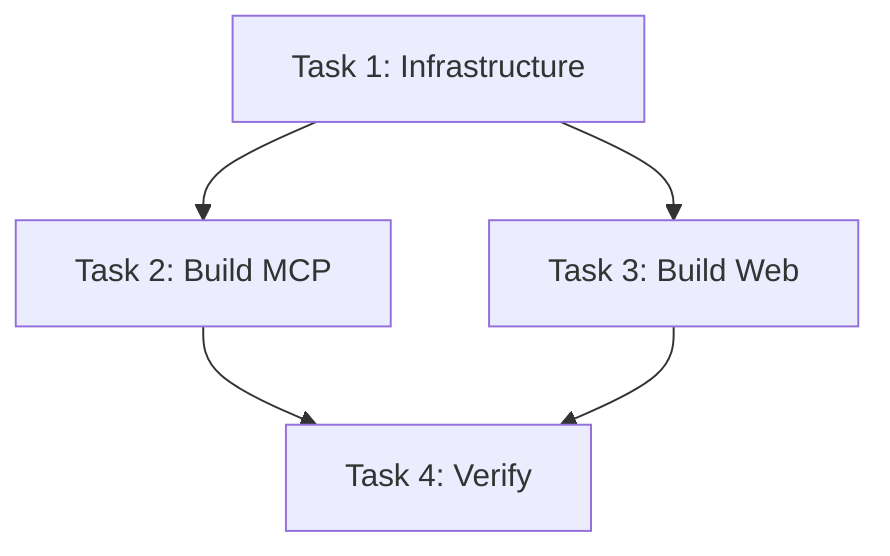

# Task Document - Everything2MD Build

## Task List

### Task 1: Create Build Script Infrastructure
- **Description**: Create `src/apps/everything2md/build.py` with necessary imports, logging setup, and cleanup logic (removing `dist/` and `build/` dirs).
- **Input**: None.
- **Output**: `build.py` file that runs and cleans directories.
- **Dependencies**: `PyInstaller` installed in environment.

### Task 2: Implement MCP Server Build
- **Description**: Add function to build `server.py` into `everything2md-mcp.exe`.
- **Details**:
  - Use `PyInstaller.__main__.run`.
  - Arguments: `--onefile`, `--name=everything2md-mcp`, hidden imports (`fastapi`, `uvicorn`, `pydantic`, `mcp`).
- **Verification**: `dist/everything2md-mcp.exe` exists.

### Task 3: Implement Web Preview Build
- **Description**: Add function to build `web_app.py` into `everything2md-web.exe`.
- **Details**:
  - Arguments: `--onefile`, `--name=everything2md-web`, hidden imports (`fastapi`, `uvicorn`, `jinja2`, `python-multipart`).
- **Verification**: `dist/everything2md-web.exe` exists.

### Task 4: End-to-End Verification
- **Description**: Run the full `build.py` and verify the resulting executables can start.
- **Details**:
  - Run `dist/everything2md-mcp.exe --help` (or check if it starts waiting for input).
  - Run `dist/everything2md-web.exe` (check if port opens, then kill).
- **Constraint**: This is a manual/scripted verification step.

## Task Dependency Graph

