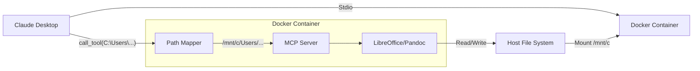

# 设计文档 (DESIGN) - Everything2MD Docker 化

## 1. 架构图


## 2. Dockerfile 详细设计
```dockerfile
FROM python:3.10-slim-bullseye

# 设置国内源 (可选，根据 User Rules)
# RUN sed -i 's/deb.debian.org/mirrors.aliyun.com/g' /etc/apt/sources.list

# 安装系统依赖
RUN apt-get update && apt-get install -y \
    libreoffice-headless \
    libreoffice-java-common \
    pandoc \
    fonts-noto-cjk \
    tini \
    && rm -rf /var/lib/apt/lists/*

# 设置工作目录
WORKDIR /app

# 复制依赖配置
COPY src/apps/everything2md/requirements.txt .

# 安装 Python 依赖
RUN pip install --no-cache-dir -r requirements.txt

# 复制源码
COPY src /app/src

# 设置环境变量
ENV PYTHONPATH=/app
ENV LIBREOFFICE_PATH=soffice
ENV PANDOC_PATH=pandoc
ENV HOST_ROOT="C:\"
ENV CONTAINER_ROOT="/mnt/c/"

# 入口点
ENTRYPOINT ["/usr/bin/tini", "--"]
CMD ["python", "src/apps/everything2md/server.py"]
```

## 3. 路径映射模块 (`path_mapper.py`)
```python
import os

HOST_ROOT = os.environ.get("HOST_ROOT", "C:\\")
CONTAINER_ROOT = os.environ.get("CONTAINER_ROOT", "/mnt/c/")

def map_path_to_container(host_path: str) -> str:
    """将宿主机路径映射到容器路径"""
    # 简单替换，忽略大小写差异（Windows是不区分大小写的，但替换时要注意）
    # 统一转为正斜杠处理
    clean_host_root = HOST_ROOT.replace("\\", "/")
    clean_path = host_path.replace("\\", "/")
    
    if clean_path.lower().startswith(clean_host_root.lower()):
        rel_path = clean_path[len(clean_host_root):]
        # 去除开头的斜杠
        if rel_path.startswith("/"):
            rel_path = rel_path[1:]
        return os.path.join(CONTAINER_ROOT, rel_path)
    
    return host_path # 无法映射则原样返回
```
需要在 `server.py` 中集成此模块。

## 4. 启动命令示例
```bash
docker run -i --rm \
  -v "C:\:/mnt/c" \
  everything2md:latest
```
