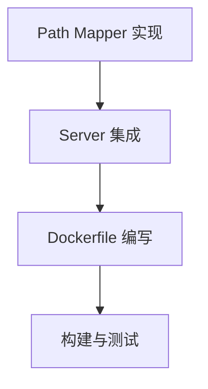

# 任务清单 (TASK) - Everything2MD Docker 化

## 任务列表

### 1. 路径映射 (docker_mapper)
- **输入**: 无
- **动作**: 创建 `src/apps/everything2md/path_utils.py`
- **输出**: `map_path_to_container` 函数

### 2. Server 集成 (docker_server)
- **输入**: `src/apps/everything2md/server.py`
- **动作**: 在 `convert_to_markdown` 入口处调用映射函数
- **输出**: 更新后的 `server.py`

### 3. Dockerfile (docker_file)
- **输入**: `requirements.txt`
- **动作**: 编写 `src/apps/everything2md/Dockerfile`
- **输出**: `Dockerfile`

### 4. 构建与测试 (docker_build)
- **输入**: `Dockerfile`
- **动作**: `docker build`, `docker run` 测试
- **输出**: 验证报告 (由于当前环境可能无法运行 docker build，将生成详细的构建脚本供用户执行)
