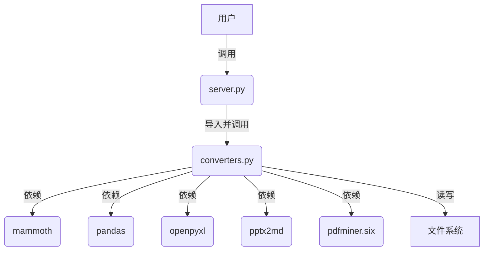

# 设计文档: Everything2MD MCP 集成

## 1. 系统分层设计

### 1.1 概述
本 MCP 服务将采用分层架构，以确保模块化、可维护性和可扩展性。核心层包括 MCP 接口层、业务逻辑层和工具层。

```mermaid
graph TD
    A[MCP 客户端] --> B(FastMCP Server)
    B --> C{MCP 接口层}
    C --> D{业务逻辑层 (文件类型检测与分发)}
    D --> E[工具层 (具体转换器)]
    E --> F[文件系统 (输入/输出)]
```

### 1.2 各层职责
- **MCP 客户端**: 外部系统，通过 MCP 协议调用本服务提供的工具。
- **FastMCP Server**: MCP 框架提供的核心服务，负责接收和响应 MCP 请求。
- **MCP 接口层**: `server.py`，定义 MCP 工具函数，作为外部调用的入口。
- **业务逻辑层**: `server.py` 内部逻辑，负责根据输入文件类型，选择合适的转换器进行调用。
- **工具层**: `converters.py`，包含各种文件格式到 Markdown 的具体转换实现。
- **文件系统**: 存储输入文件和输出 Markdown 文件。

## 2. 核心组件

### 2.1 `src/apps/everything2md/server.py`
- **职责**: MCP 服务入口，定义并暴露 `convert_to_markdown` 工具。
- **主要功能**:
  - 初始化 `FastMCP` 实例。
  - 实现 `convert_to_markdown(source_path: str, output_path: str) -> str` 函数。
  - 在 `convert_to_markdown` 中，根据 `source_path` 的文件扩展名，动态调用 `converters.py` 中相应的转换函数。
  - 处理异常并返回统一的错误信息。

### 2.2 `src/apps/everything2md/converters.py`
- **职责**: 封装各种文件格式到 Markdown 的转换逻辑。
- **主要功能**:
  - `convert_docx_to_md(source_path: str, output_path: str) -> str`: 使用 `mammoth` 或 `python-docx` 将 DOCX 转换为 Markdown。
  - `convert_xlsx_to_md(source_path: str, output_path: str) -> str`: 使用 `pandas` 和 `openpyxl` 将 XLSX 中的表格转换为 Markdown 表格。
  - `convert_pptx_to_md(source_path: str, output_path: str) -> str`: 使用 `pptx2md` 将 PPTX 转换为 Markdown。
  - `convert_pdf_to_md(source_path: str, output_path: str) -> str`: 使用 `pdfminer.six` 或类似库提取 PDF 文本并格式化为 Markdown。

## 3. 模块依赖图



## 4. 接口契约与数据流

### 4.1 `convert_to_markdown` 工具接口
```python
def convert_to_markdown(
    source_path: str, 
    output_path: str
) -> str:
    """
    将指定路径的文档转换为 Markdown 格式并保存到目标路径。

    Args:
        source_path: 源文件的绝对路径。
        output_path: 目标 Markdown 文件的绝对路径。

    Returns:
        转换结果信息，成功则返回 "转换成功"，失败则返回错误信息。
    """
```

### 4.2 数据流
1.  客户端调用 `convert_to_markdown(source_path, output_path)`。
2.  `server.py` 接收请求，验证 `source_path` 和 `output_path` 的有效性。
3.  根据 `source_path` 的文件扩展名（例如 `.docx`, `.xlsx`, `.pptx`, `.pdf`），确定要使用的转换器。
4.  调用 `converters.py` 中对应的转换函数，例如 `convert_docx_to_md(source_path, output_path)`。
5.  转换函数读取 `source_path` 文件内容，执行转换逻辑。
6.  转换后的 Markdown 内容写入 `output_path` 文件。
7.  转换函数返回成功或失败信息。
8.  `server.py` 将此信息返回给客户端。

## 5. 异常处理策略
- **文件不存在/权限不足**: 在 `server.py` 中进行初步检查，并由各个转换器函数处理文件操作异常。
- **不支持的文件类型**: `server.py` 在文件类型检测阶段返回错误。
- **转换失败**: 各个转换器函数内部捕获第三方库的异常，并返回详细的错误信息。
- **日志记录**: 使用 Python 的 `logging` 模块记录关键操作和错误，便于调试和问题排查。

## 6. 避免过度工程和重用现有组件
- **重用 FastMCP**: 利用 `Try_make_mcp` 现有的 MCP 框架。
- **Python 原生库**: 优先使用成熟的 Python 库进行文件解析和转换，避免引入复杂的外部系统依赖。
- **模块化**: 将转换逻辑封装在 `converters.py` 中，便于测试和维护。
