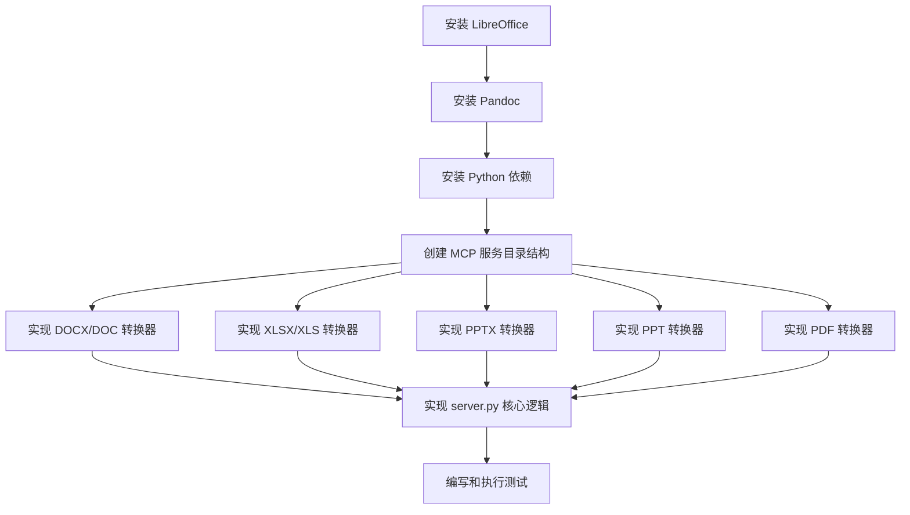

# 任务文档: Everything2MD MCP 集成

## 1. 任务分解

本阶段将把 MCP 服务的实现分解为一系列可独立执行的原子任务。每个任务都包含输入、输出、约束和依赖关系。

## 2. 原子任务列表

### 任务 1: 安装 LibreOffice
- **输入**: Windows 操作系统环境。
- **输出**: LibreOffice 成功安装，并且 `soffice` 命令可在 PATH 中访问。
- **实现约束**: 确保安装的是无头 (headless) 版本或支持无头模式，以便在后台运行。
- **依赖关系**: 无。

### 任务 2: 安装 Pandoc
- **输入**: Windows 操作系统环境。
- **输出**: Pandoc 成功安装，并且 `pandoc` 命令可在 PATH 中访问。
- **实现约束**: 确保安装最新稳定版本。
- **依赖关系**: 无。

### 任务 3: 安装 Python 依赖
- **输入**: 项目的 `.venv` 虚拟环境已激活。
- **输出**: 所有必要的 Python 库 (`python-docx`, `openpyxl`, `pptx2md`, `pdfminer.six` 等) 已安装到虚拟环境中。
- **实现约束**: 使用 `pip install -r requirements.txt` 进行安装。
- **依赖关系**: 无。

### 任务 4: 创建 MCP 服务目录结构
- **输入**: `src/apps/` 目录存在。
- **输出**: `src/apps/everything2md/` 目录及其子文件 `server.py` 和 `converters.py` 已创建。
- **实现约束**: 遵循项目现有目录结构和命名规范。
- **依赖关系**: 无。

### 任务 5: 实现 DOCX/DOC 转换器 (`converters.py`)
- **输入**: `source_path` (DOCX/DOC 文件路径), `output_path` (Markdown 文件路径)。
- **输出**: 将 DOCX/DOC 文件内容转换为 Markdown 格式并保存到 `output_path`。
- **实现约束**: 
  - 使用 LibreOffice 进行转换 (DOCX/DOC -> HTML)。
  - 使用 Pandoc 将 HTML 转换为 Markdown。
  - 处理 LibreOffice 和 Pandoc 的命令行调用和错误。
- **依赖关系**: 任务 1 (安装 LibreOffice), 任务 2 (安装 Pandoc)。

### 任务 6: 实现 XLSX/XLS 转换器 (`converters.py`)
- **输入**: `source_path` (XLSX/XLS 文件路径), `output_path` (Markdown 文件路径)。
- **输出**: 将 XLSX/XLS 文件中的表格内容转换为 Markdown 表格格式并保存到 `output_path`。
- **实现约束**: 
  - 使用 LibreOffice 进行转换 (XLSX/XLS -> CSV/HTML)。
  - 使用 Pandoc 将 CSV/HTML 转换为 Markdown。
  - 处理 LibreOffice 和 Pandoc 的命令行调用和错误。
- **依赖关系**: 任务 1 (安装 LibreOffice), 任务 2 (安装 Pandoc)。

### 任务 7: 实现 PPTX 转换器 (`converters.py`)
- **输入**: `source_path` (PPTX 文件路径), `output_path` (Markdown 文件路径)。
- **输出**: 将 PPTX 文件内容转换为 Markdown 格式并保存到 `output_path`。
- **实现约束**: 使用 `pptx2md` Python 库进行转换。
- **依赖关系**: 任务 3 (安装 Python 依赖)。

### 任务 8: 实现 PPT 转换器 (`converters.py`)
- **输入**: `source_path` (PPT 文件路径), `output_path` (Markdown 文件路径)。
- **输出**: 将 PPT 文件内容转换为 Markdown 格式并保存到 `output_path`。
- **实现约束**: 
  - 使用 LibreOffice 进行转换 (PPT -> PPTX)。
  - 然后使用 `pptx2md` 将 PPTX 转换为 Markdown。
  - 处理 LibreOffice 和 `pptx2md` 的命令行调用和错误。
- **依赖关系**: 任务 1 (安装 LibreOffice), 任务 3 (安装 Python 依赖)。

### 任务 9: 实现 PDF 转换器 (`converters.py`)
- **输入**: `source_path` (PDF 文件路径), `output_path` (Markdown 文件路径)。
- **输出**: 将 PDF 文件中的文本内容提取并格式化为 Markdown 格式，保存到 `output_path`。
- **实现约束**: 
  - 使用 LibreOffice 进行转换 (PDF -> HTML)。
  - 使用 Pandoc 将 HTML 转换为 Markdown。
  - 处理 LibreOffice 和 Pandoc 的命令行调用和错误。
- **依赖关系**: 任务 1 (安装 LibreOffice), 任务 2 (安装 Pandoc)。

### 任务 10: 实现 `server.py` 核心逻辑
- **输入**: 已创建的 `server.py` 和 `converters.py` 文件。
- **输出**: `server.py` 能够正确接收 MCP 请求，检测文件类型，并调用 `converters.py` 中相应的转换函数。
- **实现约束**: 
  - 实现文件扩展名到转换器函数的映射。
  - 添加健壮的错误处理和日志记录。
- **依赖关系**: 任务 4 (创建 MCP 服务目录结构), 任务 5-9 (实现所有转换器)。

### 任务 11: 编写和执行测试
- **输入**: 已实现的 MCP 服务和转换器。
- **输出**: 针对每个转换器和 `convert_to_markdown` 工具的单元测试和集成测试通过。
- **实现约束**: 
  - 为每种支持的文件类型准备测试文件。
  - 验证转换结果的正确性。
- **依赖关系**: 任务 5-10。
