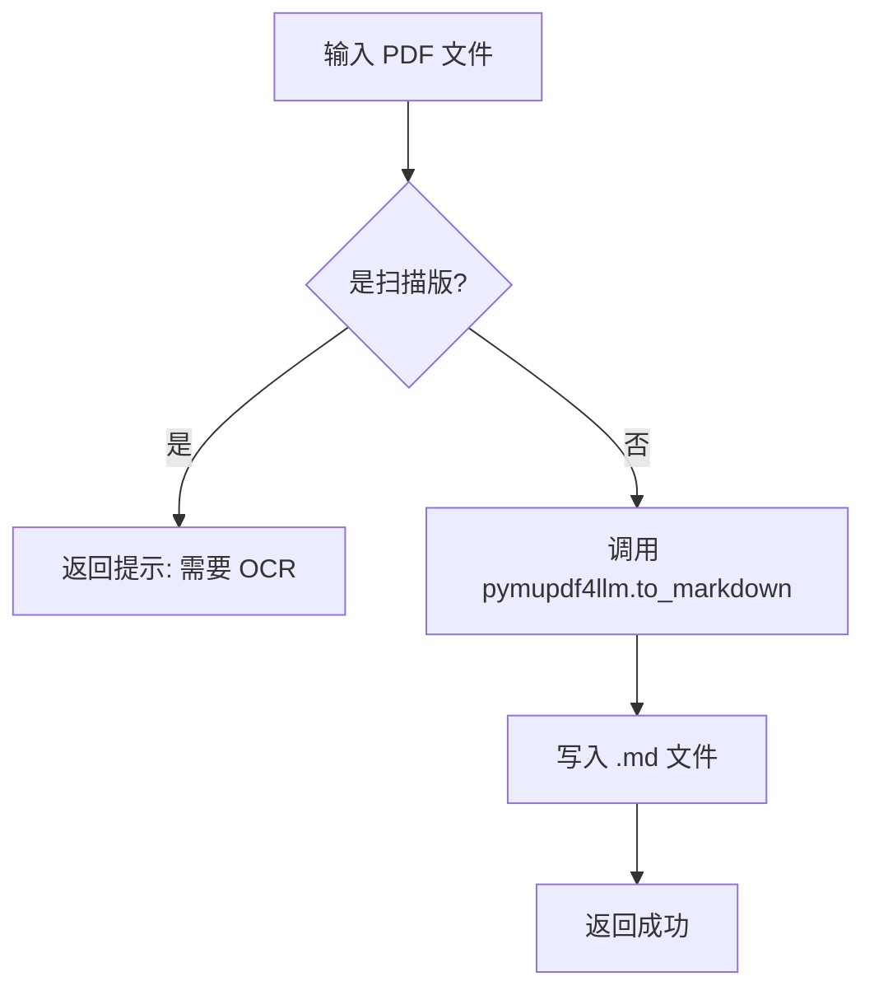

# 设计文档 (DESIGN) - Everything2MD PDF 优化

## 1. 逻辑流程


## 2. 模块设计
### 2.1 依赖引入
```python
import pymupdf4llm
import pathlib
```

### 2.2 转换函数重构
```python
# server.py 片段
elif file_extension == '.pdf':
    try:
        # 直接转换为 Markdown 字符串
        md_text = pymupdf4llm.to_markdown(source_path)
        
        # 写入文件
        with open(output_path, 'w', encoding='utf-8') as f:
            f.write(md_text)
            
        return "Conversion successful"
    except Exception as e:
        return f"PDF Conversion failed: {str(e)}"
```

## 3. 接口设计
- 保持 `convert_to_markdown` 签名不变。
- 内部实现完全替换。

## 4. 异常处理
- 捕获 `pymupdf` 可能抛出的异常（如文件损坏、权限问题）。
- 检查输出内容是否为空，若为空可能为扫描版 PDF。
