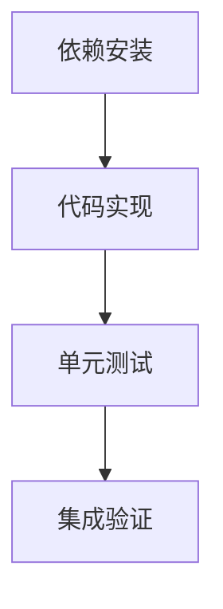

# 任务清单 (TASK) - Everything2MD PDF 优化

## 任务列表

### 1. 依赖安装 (pdf_deps)
- **输入**: `requirements.txt`
- **动作**: 添加 `pymupdf4llm`
- **输出**: `requirements.txt` 更新并 `pip install`

### 2. 代码实现 (pdf_impl)
- **输入**: `server.py`
- **动作**: 替换 PDF 转换逻辑
- **输出**: 更新后的 `server.py`

### 3. 单元测试 (pdf_test)
- **输入**: `test_pdf.py`
- **动作**: 
  - 创建一个简单的 PDF (使用 `reportlab` 或 `fpdf`)
  - 调用转换函数
  - 检查输出是否包含预期文本
- **输出**: 测试脚本及运行结果

### 4. 集成验证 (pdf_verify)
- **输入**: `verify_conversion.py` (复用或更新)
- **动作**: 运行完整流程
- **输出**: 验收报告
