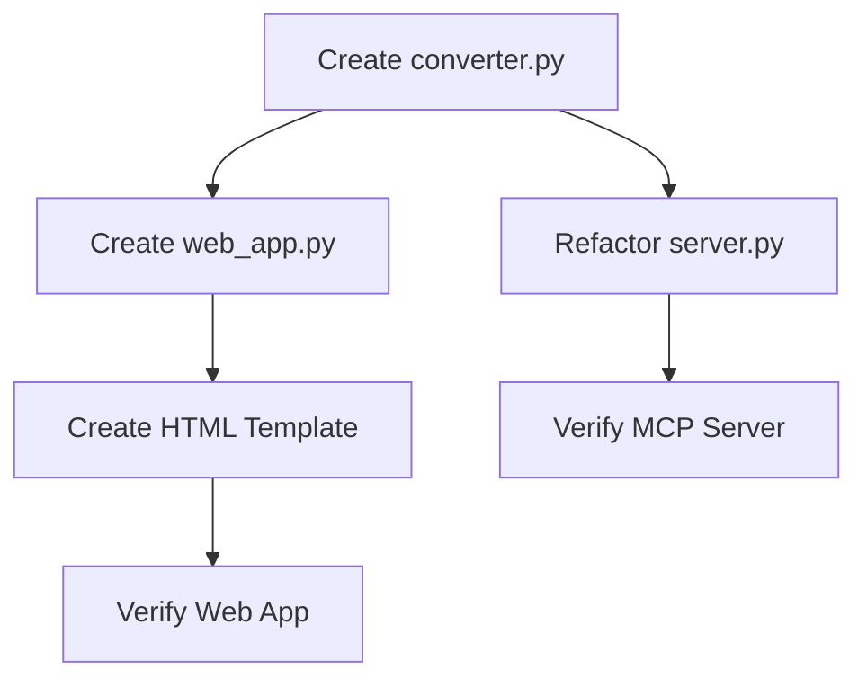

# Task Decomposition - Everything2MD Web Preview

## 1. Task Dependency Graph

## 2. Atomic Tasks

### Task 1: Create `converter.py`
- **Goal**: Extract logic from `server.py`.
- **Input**: `server.py` content.
- **Output**: `src/apps/everything2md/converter.py`.
- **Details**: Move `find_executable`, `SOFFICE_PATH`, `PANDOC_PATH` initialization, and `_convert_*` functions.

### Task 2: Refactor `server.py`
- **Goal**: Use `converter.py`.
- **Input**: `server.py`.
- **Output**: Cleaned `server.py`.
- **Details**: Import functions from `converter`. `server.py` should only contain the MCP tool definition and logging setup.

### Task 3: Create `web_app.py`
- **Goal**: Implement FastAPI server.
- **Input**: `converter.py`.
- **Output**: `src/apps/everything2md/web_app.py`.
- **Details**:
  - Setup FastAPI app.
  - Implement `GET /` (HTML form).
  - Implement `POST /convert` (Upload processing).

### Task 4: Create HTML Template
- **Goal**: Simple UI.
- **Output**: Embedded HTML string in `web_app.py`.
- **Details**: File input, submit button, result display area.

### Task 5: Verify MCP Server
- **Goal**: Ensure refactoring didn't break MCP.
- **Action**: Run `verify_async.py`.

### Task 6: Verify Web App
- **Goal**: Ensure Web UI works.
- **Action**: Create `verify_web.py` (using `httpx` or `requests` to simulate upload).
