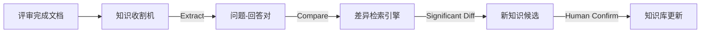

# PROPOSAL: Knowledge Feedback Loop (知识反馈闭环)

## 1. 痛点分析
目前的 RAG 方案是**单向**的：`知识库 -> 评审文档`。
然而，评审过程本身就是**新知识产生**的过程。如果 RAG 的建议（基于旧知识）与用户的最终决策（基于新需求）不一致，说明：
1.  **知识过时**：旧文档需要更新。
2.  **特例偏差**：新方案是特殊情况，需要记录为“变体”。

如果忽略这些差异，知识库会越来越陈旧，RAG 的准确率会随时间下降。

## 2. 解决方案：双向闭环 (Bi-Directional Loop)
在 **Stage 6 (Assess)** 阶段，增加一个 **Knowledge Harvester (知识收割机)** 模块。

### 2.1 工作流程
1.  **Diff Analysis (差异分析)**:
    - 扫描评审文档。
    - 对比 `**AI 参考建议**` (旧知识) 与 `**回答**` (用户最终决策)。
    - 计算语义相似度（或简单规则对比）。
2.  **Candidate Generation (候选生成)**:
    - 若两者存在显著差异（Conflict），或者 AI 无法回答（Missing），则将用户的 `**回答**` 标记为 **新知识候选 (Knowledge Candidate)**。
3.  **Update Proposal (更新提议)**:
    - 生成一份 `KNOWLEDGE_UPDATE_PROPOSAL.md`，列出建议更新到 RAGFlow 的条目。

## 3. 架构设计

## 4. 预期价值
- **自动维护**：评审即维护，无需专门安排时间更新文档。
- **越用越准**：RAG 系统随着项目迭代自动进化。
- **冲突预警**：防止新方案无意中破坏了系统的一致性。

## 5. 实现计划 (本次迭代)
- 新增 MCP 工具 `harvest_knowledge_candidates(file_path)`。
- 输出差异报告，展示“旧知识 vs 新决策”。
