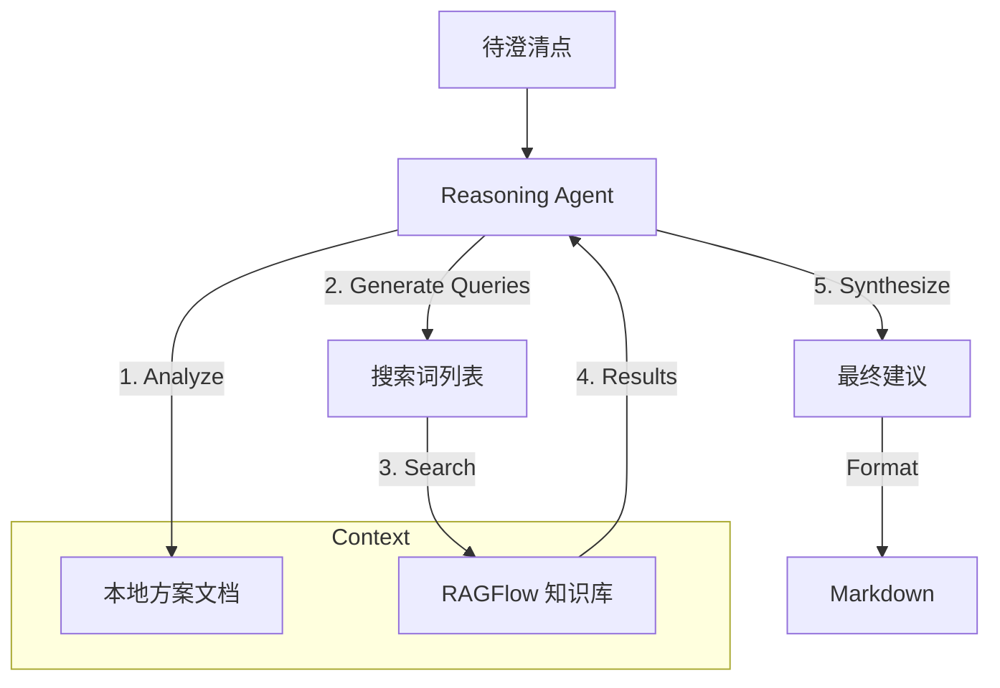

# OPTIMIZATION: GetInRAGFlow (Agentic Upgrade)

## 1. 现状审视
当前方案采用 **Naive RAG** 模式：
- **流程**：`拼接上下文 (Global + Local) -> RAG 检索 -> 规则过滤 -> 回填`。
- **缺陷**：
  1.  **检索噪音**：直接将长文本作为 Query 发送给 RAG，向量检索的精度会显著下降（Info Overload）。
  2.  **缺乏推理**：无法识别“新旧冲突”（例如：新方案定义的超时时间与旧系统文档不一致）。
  3.  **单次尝试**：如果第一次检索失败（如关键词不匹配），直接放弃。

## 2. 更优解：Agentic RAG (代理式 RAG)
引入一个轻量级的 **Reasoning Layer (推理层)**，将线性流程升级为动态流程。

### 2.1 核心改进点
1.  **Query Rewriting (查询重写)**:
    - 不直接发送上下文，而是由 LLM 分析上下文，生成 1-3 个 **精准的搜索关键词**。
    - *Example*: 
      - 原 Query: "Background: Payment System... Question: Timeout?"
      - 重写后 Query: ["Payment Gateway Timeout Config", "Transaction Timeout Default Value"]
2.  **Dual-Context Synthesis (双源合成)**:
    - **Local Context** (新方案) 与 **Remote Context** (旧文档) 分开处理。
    - LLM 负责对比两者： "旧文档说是 30s，但你的新方案 Align 文档里提到了 '高性能模式'，建议确认是否调整。"
3.  **Self-Correction (自修正)**:
    - 如果检索结果置信度低，自动尝试泛化搜索词（去掉限定词）重试一次。

## 3. 架构变更

## 4. 实施计划
1.  **升级 `RAGClient`**: 增加 `agentic_search` 方法，模拟/实现查询重写和多轮检索。
2.  **优化 `DocumentProcessor`**: 提供更结构化的本地上下文（区分“已定论”和“待澄清”）。
3.  **增强 `Prompt`**: 在生成答案时，显式要求指出“新旧资料的潜在冲突”。
