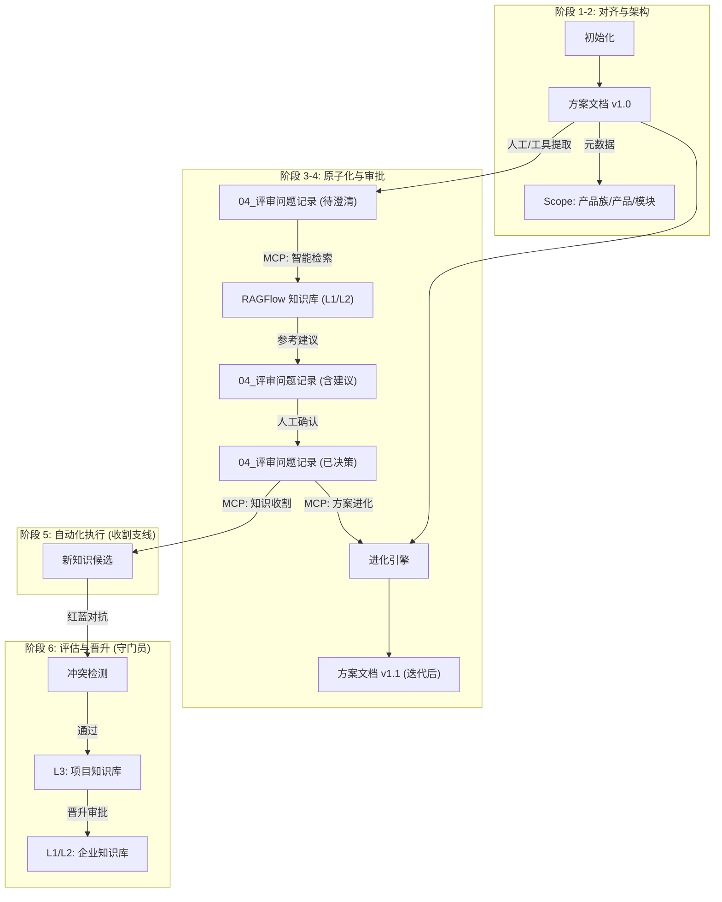

# 架构设计：GetInRAGFlow (基于 6A 工作流的统一架构) v2.0

## 1. 核心理念：评审即知识管理 (Review IS Knowledge Management)
本方案将分散的 RAG 增强、风险控制、知识沉淀等机制，统一整合进标准的 **6A 评审工作流** 中。
核心目标双线并行：
1.  **主线 (Main Quest)**: 帮助用户利用知识库澄清方案，并基于澄清结果**迭代进化**原方案文档。
2.  **支线 (Side Quest)**: 将评审过程中产生的新知识收纳、验证并更新回知识库。

两条线**完全解耦**，分别触发，但共享同一个 Markdown 持久化状态。

## 2. 统一架构视图


## 3. 详细节点设计 (5W1H)

### 节点 1: 元数据锚定 (Metadata Anchoring)
*   **Who**: 治理引擎 (Governance Engine)
*   **What**: 强制检查 `ALIGNMENT` 文档头部元数据。
*   **Why**: 解决多产品线相似但有差异的问题。
*   **How**: 
    *   采用分层元数据结构：
        *   `family`: "Payment" (产品族，对应 L2 通用知识)
        *   `product`: "GlobalPay" (具体产品，对应 L2 差异化知识)
        *   `module`: "Gateway" (模块)
    *   检索时优先匹配 `product`，其次匹配 `family`。

### 节点 2: 智能辅助检索 (Agentic Search) - **主线入口**
*   **Who**: 推理引擎 (Inference Engine)
*   **When**: 当 `04_评审问题记录.md` 生成后触发。**注意：不是从方案文档直接触发。**
*   **Input**: `04_评审问题记录.md` (包含待澄清点)。
*   **Output**: 更新后的 `04_评审问题记录.md` (填充 `**AI 参考建议**` 字段)。
*   **State**: Markdown Checkbox 状态流转 `[ ]` -> `[x]`。

### 节点 3: 方案进化 (Scheme Evolution) - **新增核心能力**
*   **Who**: 进化引擎 (Evolution Engine)
*   **What**: 基于已澄清的问题结论，自动修订原方案文档。
*   **When**: 用户确认澄清点答案后触发。
*   **Why**: 实现“继承迭代”，达到媲美人工修改的水平。
*   **How**: 
    *   读取 `04_评审问题记录.md` 中的 `**问题**` 和 `**回答**` (人工决策)。
    *   读取 `方案文档 v1.0`。
    *   Agent 分析差异，生成 `方案文档 v1.1` 的修订补丁。
    *   **持久化**: 直接修改 Markdown 文件，并记录修订日志。

### 节点 4: 知识收割 (Knowledge Harvest) - **支线入口**
*   **Who**: 生命周期引擎 (Lifecycle Engine)
*   **When**: 独立触发，通常在项目结项或阶段性里程碑时。
*   **Decoupling**: 与主线完全解耦，仅依赖 `04_评审问题记录.md` 的最终状态。
*   **How**: 提取已标记为 `[x]` 且有 `**回答**` 内容的条目。

### 节点 5: 知识分层与晋升 (Layering & Promotion)
*   **Who**: 治理引擎 & 生命周期引擎
*   **What**: 管理 L1/L2/L3 知识库。
*   **Structure**:
    *   **L1 (Global)**: 全公司通用 (e.g. 安全红线)。
    *   **L2 (Product Family)**: 产品族通用 (e.g. 支付系统通用协议)。
        *   *区分策略*: 在 L2 内部通过 Metadata (`product=GlobalPay`) 区分细微差异，而不是建立无数个小库。
    *   **L3 (Project)**: 项目临时知识 (Read-Write)。
*   **Why**: 避免知识碎片化，同时支持细微差异管理。

## 4. 模块整合方案
核心引擎扩展为四个：
1.  **推理引擎 (Inference Engine)**: 负责 搜索 & 建议。
2.  **进化引擎 (Evolution Engine)**: **[NEW]** 负责 方案文档的继承与迭代。
3.  **治理引擎 (Governance Engine)**: 负责 元数据 & 验证。
4.  **生命周期引擎 (Lifecycle Engine)**: 负责 收割, 整合 & 晋升。

## 5. 持久化与状态管理
**原则**: 所有的状态必须持久化在 Markdown 文档中。

### 5.1 澄清问题文档状态
```markdown
# 04_评审问题记录

## 问题 1: 支付接口协议
- [x] **状态**: 已澄清 (由 MCP 更新)
- **问题描述**: ...
- **AI 参考建议**: (Inference Engine 填充) ...
- **回答**: (人工填写) 确认使用 V2 协议。
```

### 5.2 方案文档迭代记录
```markdown
# 方案文档
...
## 修订记录 (由 Evolution Engine 维护)
- 2024-05-20: 根据 [问题1] 更新了接口协议部分。
...
```
