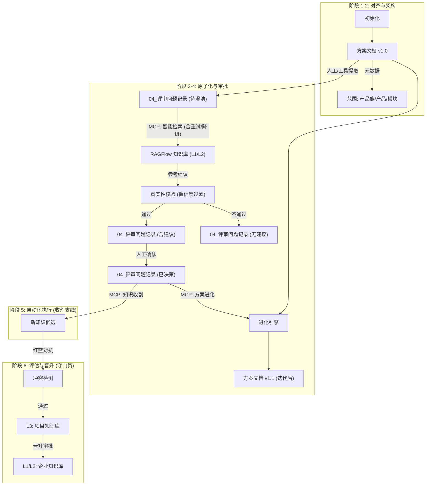

# 架构设计：GetInRAGFlow (基于 6A 工作流的统一架构) v2.1

## 1. 核心理念：评审即知识管理
本方案将分散的 RAG 增强、风险控制、知识沉淀等机制，统一整合进标准的 **6A 评审工作流** 中。
核心目标双线并行：
1.  **主线**: 帮助用户利用知识库澄清方案，并基于澄清结果**迭代进化**原方案文档。
2.  **支线**: 将评审过程中产生的新知识收纳、验证并更新回知识库。

两条线**完全解耦**，分别触发，但共享同一个 Markdown 持久化状态。

## 2. 统一架构视图


## 3. 详细节点设计 (5W1H)

### 节点 1: 元数据锚定 (Metadata Anchoring)
*   **责任方**: 治理引擎 (Governance Engine)
*   **功能**: 强制检查 `ALIGNMENT` 文档头部元数据。
*   **目的**: 解决多产品线相似但有差异的问题。
*   **实现**: 
    *   采用分层元数据结构：
        *   `family`: "Payment" (产品族，对应 L2 通用知识)
        *   `product`: "GlobalPay" (具体产品，对应 L2 差异化知识)
        *   `module`: "Gateway" (模块)
    *   检索时优先匹配 `product`，其次匹配 `family`。

### 节点 2: 智能辅助检索 (Agentic Search) - **主线入口**
*   **责任方**: 推理引擎 (Inference Engine)
*   **触发时机**: 当 `04_评审问题记录.md` 生成后触发。
*   **输入**: `04_评审问题记录.md` (包含待澄清点)。
*   **输出**: 更新后的 `04_评审问题记录.md` (填充 `**AI 参考建议**` 字段)。
*   **关键特性**:
    *   **自动重试**: 调用 RAG 接口失败时，指数退避重试 (Max=3)。
    *   **降级策略**: 若 RAG 持续失败，降级为“无建议”，不中断流程。
    *   **真实性校验**: 检查 RAG 返回的置信度 (Confidence Score)，低于阈值 (如 0.6) 则不展示建议或提示“未找到相关信息”。

### 节点 3: 方案进化 (Scheme Evolution) - **新增核心能力**
*   **责任方**: 进化引擎 (Evolution Engine)
*   **功能**: 基于已澄清的问题结论，自动修订原方案文档。
*   **触发时机**: 用户确认澄清点答案后触发。
*   **目的**: 实现“继承迭代”，达到媲美人工修改的水平。
*   **实现**: 
    *   读取 `04_评审问题记录.md` 中的 `**问题**` 和 `**回答**` (人工决策)。
    *   读取 `方案文档 v1.0`。
    *   Agent 分析差异，生成 `方案文档 v1.1` 的修订补丁。
    *   **持久化**: 直接修改 Markdown 文件，并记录修订日志。

### 节点 4: 知识收割与管理 (Knowledge Harvest & Management) - **支线入口**
*   **责任方**: 生命周期引擎 (Lifecycle Engine)
*   **功能**: 
    *   **知识收割**: 提取已标记为 `[x]` 且有 `**回答**` 内容的条目。
    *   **知识浏览**: 查询知识库列表及文件列表。
*   **触发时机**: 
    *   收割：通常在项目结项或阶段性里程碑时。
    *   浏览：用户主动查询时。
*   **解耦**: 与主线完全解耦。

### 节点 5: 知识分层与晋升 (Layering & Promotion)
*   **责任方**: 治理引擎 & 生命周期引擎
*   **功能**: 管理 L1/L2/L3 知识库。
*   **结构**:
    *   **L1 (全局)**: 全公司通用 (如 安全红线)。
    *   **L2 (产品族)**: 产品族通用 (如 支付系统通用协议)。
        *   *区分策略*: 在 L2 内部通过 Metadata (`product=GlobalPay`) 区分细微差异。
    *   **L3 (项目)**: 项目临时知识 (读写)。
*   **目的**: 避免知识碎片化，同时支持细微差异管理。

## 4. 模块整合方案
核心引擎扩展为四个：
1.  **推理引擎 (Inference Engine)**: 负责 搜索 & 建议 (含重试/降级/真实性校验)。
2.  **进化引擎 (Evolution Engine)**: **[NEW]** 负责 方案文档的继承与迭代。
3.  **治理引擎 (Governance Engine)**: 负责 元数据 & 验证。
4.  **生命周期引擎 (Lifecycle Engine)**: 负责 收割, 整合 & 晋升。

## 5. 鲁棒性与真实性设计

### 5.1 自动重试与降级 (Retry & Fallback)
```python
def safe_rag_query(query, context, retries=3):
    for i in range(retries):
        try:
            return rag_client.search(query, context)
        except Exception as e:
            wait_time = 2 ** i
            logger.warning(f"RAG 查询失败，{wait_time}秒后重试: {e}")
            time.sleep(wait_time)
    
    # 降级处理
    logger.error("RAG 查询最终失败，执行降级策略")
    return {"content": "服务暂时不可用，请人工查阅相关文档。", "confidence": 0.0}
```

### 5.2 真实性防幻觉 (Anti-Hallucination)
1.  **Prompt 约束**: "如果你无法根据提供的上下文找到确切答案，请直接回答'未找到相关信息'，严禁根据模型内部知识进行编造。"
2.  **置信度过滤**: 
    *   如果 `retrieved_docs` 为空，直接返回“无信息”。
    *   如果 `answer_confidence` < `THRESHOLD`，丢弃答案。

## 6. 持久化与状态管理
**原则**: 所有的状态必须持久化在 Markdown 文档中。

### 6.1 澄清问题文档状态
```markdown
# 04_评审问题记录

## 问题 1: 支付接口协议
- [x] **状态**: 已澄清 (由 MCP 更新)
- **问题描述**: ...
- **AI 参考建议**: (推理引擎填充，若置信度低则显示无建议) ...
- **回答**: (人工填写) 确认使用 V2 协议。
```

### 6.2 方案文档迭代记录
```markdown
# 方案文档
...
## 修订记录 (由 进化引擎 维护)
- 2024-05-20: 根据 [问题1] 更新了接口协议部分。
...
```
