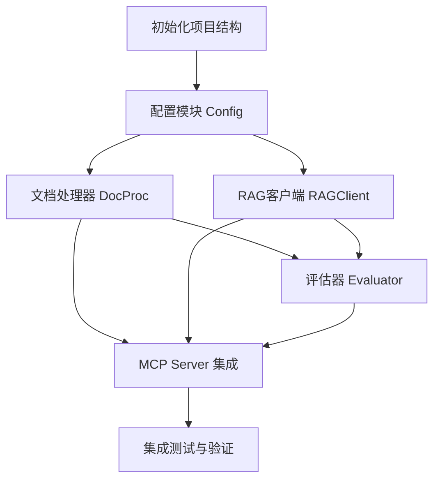

# TASK: GetInRAGFlow

## 1. 任务分解图

## 2. 原子任务清单

### Task 1: 初始化项目
- **输入**: 无
- **输出**: `src/apps/rag_flow_mcp/` 目录及空的 `__init__.py`, `server.py`.
- **标准**: 目录结构符合工厂规范。

### Task 2: 实现配置模块
- **输入**: `.env` 文件
- **输出**: `src/apps/rag_flow_mcp/config.py`
- **功能**: 加载 `RAGFLOW_API_KEY`, `RAGFLOW_HOST`, `RAG_DATASET_IDS`.

### Task 3: 实现文档处理器
- **输入**: Markdown 文件路径
- **输出**: `src/apps/rag_flow_mcp/core/doc_processor.py`
- **功能**: 
  - `extract_global_context(project_name)`: 读取 ALIGNMENT/CONSENSUS 等文档。
  - `parse_questions(content)` -> List[Dict] (需包含 question, local_context, existing_ai_answer)。
  - `inject_ai_answers(content, answers_map)`: 在 `**回答**` 字段前插入 `**AI 参考建议**`。
- **测试**: 单元测试覆盖解析和回写逻辑，确保不破坏原文档结构。

### Task 4: 实现 RAG 客户端与查询增强
- **输入**: Question string, Contexts
- **输出**: `src/apps/rag_flow_mcp/core/rag_client.py`
- **功能**: 
  - `refine_query(global_ctx, local_ctx, question)`: 调用 LLM (可使用 MCP 通用 LLM 能力) 生成搜索 Query。
  - `retrieve_and_answer(query)`: 调用 RAGFlow API。
  - 模拟/真实调用 RAGFlow API。

### Task 5: 实现质量评估器
- **输入**: Question, Answer
- **输出**: `src/apps/rag_flow_mcp/core/evaluator.py`
- **功能**: 返回 {score, reason}。简单实现可随机或基于规则。

### Task 6: MCP Server 集成
- **输入**: 各核心模块
- **输出**: `src/apps/rag_flow_mcp/server.py`
- **功能**: 定义 FastMCP 工具，串联逻辑。

### Task 7: 验证与交付
- **输入**: 测试文档 `test_questions.md`
- **输出**: 填充好答案的文档。
- **动作**: 运行 `verify_mcp`。
