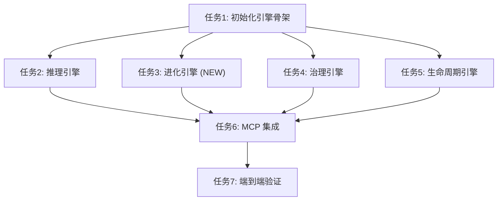

# 任务清单：GetInRAGFlow (统一版 v2.0)

## 1. 任务依赖图

## 2. 原子任务清单 (5W1H)

### 任务 1: 初始化核心引擎骨架 (Init Engine Scaffold)

* **Who**: 开发者
* **What**: 创建 `src/apps/rag_flow_mcp/engines/` 目录结构，并定义基类接口。
* **Where**: `src/apps/rag_flow_mcp/engines/` (`__init__.py`, `inference.py`, `evolution.py`, `governance.py`, `lifecycle.py`)。
* **Why**: 解耦模块，支持新增的“进化引擎”。
* **How**:
  1. 创建空文件。
  2. 重构 `config.py`。
  3. 定义 ABC。

### 任务 2: 实现推理引擎 (Implement Inference Engine)

* **Who**: 开发者
* **What**: 实现基于 RAGFlow 的智能检索与建议生成。
* **Where**: `src/apps/rag_flow_mcp/engines/inference.py`。
* **Why**: **主线能力**，提供澄清建议。
* **How**:
  1. 实现 `search(query, metadata_scope)`。
  2. 实现 `fill_clarification_doc(doc_path)`: 读取 Markdown，填充 `**AI 参考建议**`，更新 Checkbox 状态。

### 任务 3: 实现进化引擎 (Implement Evolution Engine) **[NEW]**

* **Who**: 开发者
* **What**: 基于澄清结果，自动迭代方案文档。
* **Where**: `src/apps/rag_flow_mcp/engines/evolution.py`。
* **Why**: **主线核心价值**，实现方案的自我进化。
* **How**:
  1. 实现 `evolve_scheme(doc_path, clarification_doc_path)`。
  2. Prompt 设计: "基于以下问答对，修改方案文档的对应章节..."。
  3. 实现 Markdown 文档的精确插入与修订记录更新。

### 任务 4: 实现治理引擎 (Implement Governance Engine)

* **Who**: 开发者
* **What**: 元数据管理与冲突检测。
* **Where**: `src/apps/rag_flow_mcp/engines/governance.py`。
* **Why**: 多产品线区分与防污染。
* **How**:
  1. 实现分层 Metadata 解析 (`family`, `product`, `module`)。
  2. 实现 `validate_conflict`。

### 任务 5: 实现生命周期引擎 (Implement Lifecycle Engine)

* **Who**: 开发者
* **What**: 知识收割与晋升。
* **Where**: `src/apps/rag_flow_mcp/engines/lifecycle.py`。
* **Why**: **支线能力**，沉淀知识。
* **How**:
  1. 实现 `harvest_candidates`: 仅提取 `[x]` 且含 `**回答**` 的条目。
  2. 实现 `promote_to_golden`。

### 任务 6: MCP Server 接口适配 (MCP Integration)

* **Who**: 开发者
* **What**: 注册 MCP Tools。
* **Where**: `src/apps/rag_flow_mcp/server.py`。
* **Tools**:
  1. `check_metadata_compliance` (Governance)
  2. `fill_clarification_suggestions` (Inference) **[Renamed]**
  3. `evolve_scheme_document` (Evolution) **[New]**
  4. `harvest_knowledge_candidates` (Lifecycle)
  5. `validate_knowledge_conflict` (Governance)
  6. `promote_knowledge` (Lifecycle)

### 任务 7: 端到端验证 (E2E Verification)

* **Who**: 开发者
* **What**: 验证主线（澄清->进化）和支线（收割->晋升）。
* **How**:
  1. **Case 1 (主线)**: 生成问题 -> AI 建议 -> 人工确认 -> 方案自动进化。
  2. **Case 2 (支线)**: 确认问题 -> 知识收割 -> 冲突检测 -> 晋升入库。
