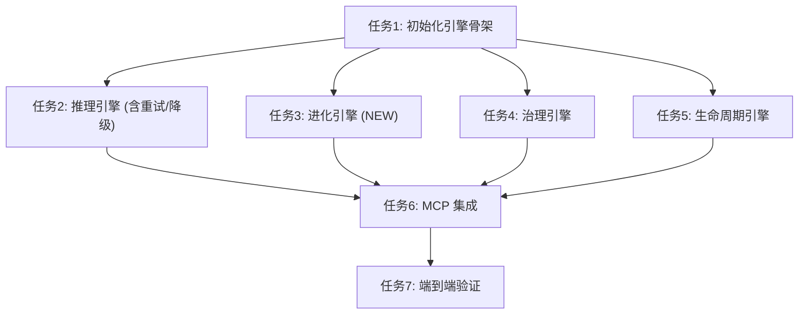

# 任务清单：GetInRAGFlow (统一版 v2.1)

## 1. 任务依赖图

## 2. 原子任务清单 (5W1H)

### 任务 1: 初始化核心引擎骨架 (Init Engine Scaffold)

* **责任人**: 开发者
* **内容**: 创建 `src/apps/rag_flow_mcp/engines/` 目录结构，并定义基类接口。
* **位置**: `src/apps/rag_flow_mcp/engines/` (`__init__.py`, `inference.py`, `evolution.py`, `governance.py`, `lifecycle.py`)。
* **目的**: 解耦模块，支持新增的“进化引擎”。
* **步骤**:
  1. 创建空文件结构。
  2. 重构 `config.py`，支持重试参数配置。
  3. 定义抽象基类 (ABC)。

### 任务 2: 实现推理引擎 (Implement Inference Engine)

* **责任人**: 开发者
* **内容**: 实现基于 RAGFlow 的智能检索与建议生成，**必须包含重试和降级逻辑**。
* **位置**: `src/apps/rag_flow_mcp/engines/inference.py`。
* **目的**: **主线能力**，提供澄清建议，并确保高可用和真实性。
* **步骤**:
  1. 实现 `search(query, metadata_scope)`:
     *   增加 **Retry 装饰器** (3次重试，指数退避)。
     *   增加 **Fallback 逻辑** (失败返回默认空结果)。
  2. 实现 `verify_truthfulness(results)`:
     *   检查置信度 (Confidence Score)。
     *   若低于阈值，标记为“无有效信息”。
  3. 实现 `fill_clarification_doc(doc_path)`: 读取 Markdown，填充 `**AI 参考建议**`，更新 Checkbox 状态。

### 任务 3: 实现进化引擎 (Implement Evolution Engine) **[NEW]**

* **责任人**: 开发者
* **内容**: 基于澄清结果，自动迭代方案文档。
* **位置**: `src/apps/rag_flow_mcp/engines/evolution.py`。
* **目的**: **主线核心价值**，实现方案的自我进化。
* **步骤**:
  1. 实现 `evolve_scheme(doc_path, clarification_doc_path)`。
  2. 提示词 (Prompt) 设计: "基于以下问答对，修改方案文档的对应章节..."。
  3. 实现 Markdown 文档的精确插入与修订记录更新。

### 任务 4: 实现治理引擎 (Implement Governance Engine)

* **责任人**: 开发者
* **内容**: 元数据管理与冲突检测。
* **位置**: `src/apps/rag_flow_mcp/engines/governance.py`。
* **目的**: 多产品线区分与防污染。
* **步骤**:
  1. 实现分层元数据解析 (`family`, `product`, `module`)。
  2. 实现 `validate_conflict`: 确保新知识不与现有知识库冲突。

### 任务 5: 实现生命周期引擎 (Implement Lifecycle Engine)

* **责任人**: 开发者
* **内容**: 知识收割与晋升。
* **位置**: `src/apps/rag_flow_mcp/engines/lifecycle.py`。
* **目的**: **支线能力**，沉淀知识。
* **步骤**:
  1. 实现 `harvest_candidates`: 仅提取 `[x]` 且含 `**回答**` 的条目。
  2. 实现 `promote_to_golden`: 将项目知识晋升到产品/企业知识库。

### 任务 6: MCP Server 接口适配 (MCP Integration)

* **责任人**: 开发者
* **内容**: 注册 MCP 工具。
* **位置**: `src/apps/rag_flow_mcp/server.py`。
* **工具列表**:
  1. `check_metadata_compliance` (治理: 检查元数据合规性)
  2. `fill_clarification_suggestions` (推理: 填充澄清建议)
  3. `evolve_scheme_document` (进化: 演进方案文档)
  4. `harvest_knowledge_candidates` (生命周期: 收割知识候选)
  5. `validate_knowledge_conflict` (治理: 验证知识冲突)
  6. `promote_knowledge` (生命周期: 晋升知识)

### 任务 7: 端到端验证 (E2E Verification)

* **责任人**: 开发者
* **内容**: 验证主线（澄清->进化）和支线（收割->晋升），以及容错能力。
* **步骤**:
  1. **场景 1 (主线)**: 生成问题 -> AI 建议 -> 人工确认 -> 方案自动进化。
  2. **场景 2 (支线)**: 确认问题 -> 知识收割 -> 冲突检测 -> 晋升入库。
  3. **场景 3 (容错)**: 模拟 RAG 服务断开，验证系统是否触发重试并优雅降级。
  4. **场景 4 (防幻觉)**: 提问无关问题，验证系统是否拒绝编造答案。
