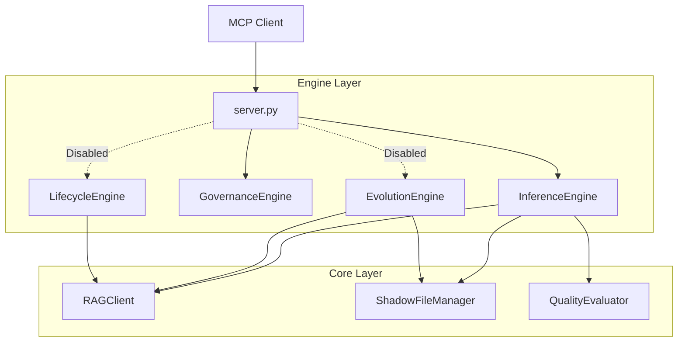

# RAG Flow MCP 架构与逻辑详解 (L2 - 逻辑实现级)

本文档面向 **架构师** 和 **高级开发者**，深入解析系统的内部架构、关键机制及数据流转逻辑。

> **注意**: 本版本仅聚焦 **“场景一：智能澄清与建议填充”**。其他引擎 (Evolution, Lifecycle) 的逻辑保留在文档中作为参考，但实际运行时已被禁用。

---

## 1. 系统分层架构

系统采用严格的四层架构设计，实现关注点分离。

| 层级 | 核心组件 | 职责 |
| :--- | :--- | :--- |
| **L1 Interface** | `server.py` | **协议适配**: 处理 MCP JSON-RPC 请求，参数校验，统一日志与异常捕获。 |
| **L2 Engine** | `engines/*.py` | **业务编排**: 重点实现 `InferenceEngine` 和 `GovernanceEngine`。 |
| **L3 Core** | `core/*.py` | **通用能力**: 提供 RAG 客户端、文件操作、AST 解析、质量评估等底层服务。 |
| **L4 Infra** | `RAGFlow`, `FS` | **基础设施**: 外部依赖的 RAG 服务和本地文件系统。 |

---

## 2. 核心机制详解

### 2.1 影子副本机制 (Shadow Copy Strategy) - [核心]

**目标**: 确保 AI 操作的安全性，防止不可逆的数据丢失。
**逻辑**:

1. **Read**: 读取原文件内容。
2. **Modify**: 在内存中进行修改。
3. **Write Shadow**: 将修改后的内容写入新文件 `*_ai_revision_<timestamp>.<ext>`。
4. **Generate Diff**: (可选) 对比原内容与新内容，生成 Unified Diff 格式的 Markdown 报告。
5. **Return**: 返回影子文件路径，由用户决定是否覆盖原文件。

### 2.2 代理式检索 (Agentic RAG Search) - [核心]

**目标**: 提高检索的准确性和鲁棒性。
**逻辑**:

1. **Strict Query**: 首次尝试使用严格的 Prompt（强调不幻觉）进行检索。
2. **Confidence Check**: 检查返回的 `score`。若 `< 0.5`，进入重试流程。
3. **Retry Strategy**:
   * 去除上下文中的噪声，提取核心关键词。
   * 放宽搜索条件进行二次检索。
4. **Synthesis**: 若本地上下文与 RAG 知识存在冲突（模拟），在答案中追加警告。

### [保留参考] 2.3 AST 文档进化
*(机制保留，暂未启用)*

---

## 3. 引擎工作流细节

### 3.1 推理引擎 (InferenceEngine) - [P0 核心]

* **输入**: 问题记录文档路径。
* **处理**:
  1. 正则提取 `## [index].[title]` 块。
  2. 提取文档 Header 元数据 (Product, Module) 构建上下文。
  3. 对每个问题调用 RAG 获取建议。
  4. 调用 `QualityEvaluator` 进行拒绝回答检测和置信度过滤。
* **输出**: 注入建议后的影子文档。

### 3.2 治理引擎 (GovernanceEngine) - [辅助]

* **处理**:
  1. 解析文档 YAML Front Matter。
  2. 校验必填字段 (`product`, `module`, `version`)。
  3. (模拟) 检索知识库，验证新内容是否与旧知识冲突。

### [保留参考] 3.3 进化引擎 & 生命周期引擎
*(逻辑保留，暂未启用)*

---

## 4. 异常处理与降级

* **RAG 服务不可用**: `RAGClient` 内置重试机制 (Retries=1)。若最终失败，返回“服务暂时不可用”的降级回答，不中断整个流程。
* **解析失败**: 若 LLM 返回的 JSON 格式错误，记录 Error Log 并跳过该条目的处理，继续执行后续任务。
* **文件不存在**: 快速失败，返回明确的错误信息。
