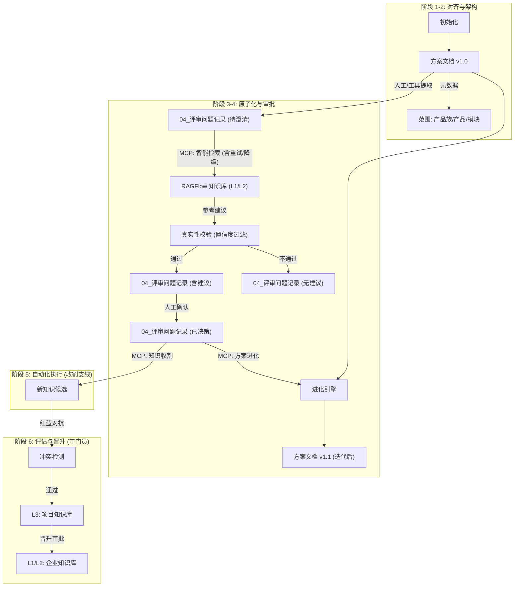
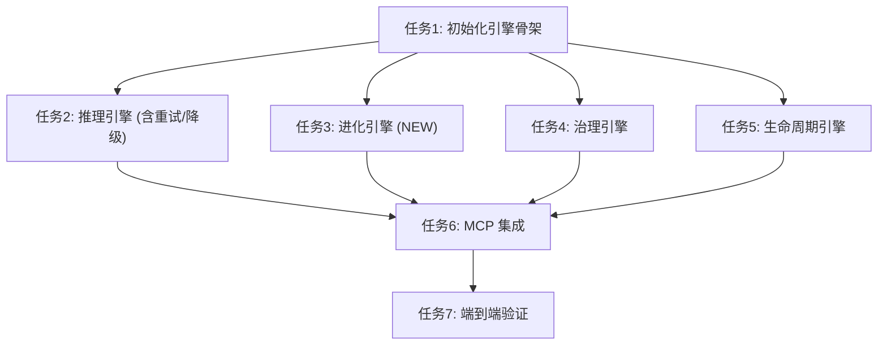
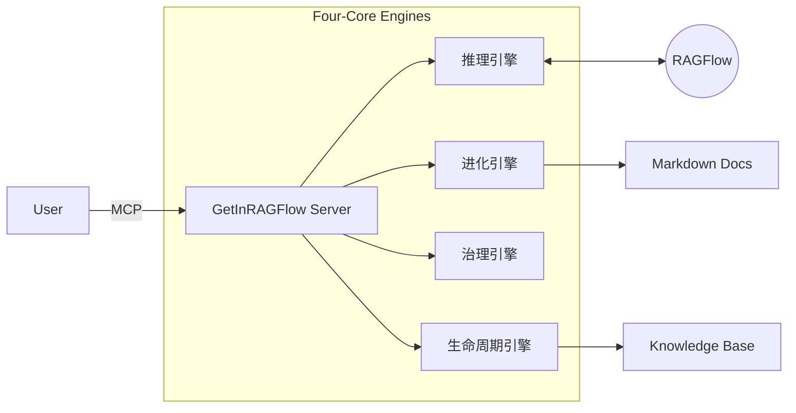

# GetInRAGFlow Documentation


# Module: GetInRAGFlow


## Stage: 01_Align


### File: ALIGNMENT_GetInRAGFlow.md

# 阶段1：对齐 - GetInRAGFlow

## 1. 原始需求与背景
**用户输入**：
> 在执行评审工作流的过程中，会产生很多的待澄清点... 需要从原有的资料中找到这部分内容来解答新方案的待澄清点。此时就需要调用ragflow平台的知识库来查询相关的信息以做出澄清。同时，需要对检索以及回答的质量要有个评估和规范。
> 1、在查询前不仅携带该澄清点的所有内容，也要大模型总结上下文信息一起携带查询 
> 2、给这种由RAG提供信息，大模型回答的答案以独立的回答字段。与人工回答的信息不冲突。且以人工回答的信息为优先。
> 3、保证流程可靠执行而不是虚设流程。
> 4、当任何环节出现错误时自动重试并有退化策略。
> 5、任何环节，严禁：推断、捏造、编造，以生成任何虚假的信息。

**核心痛点**：
1.  **效率瓶颈**: 评审过程中产生的“待澄清点”依赖人工检索，效率低下且易遗漏。
2.  **知识污染**: 如果 RAG 检索了错误的上下文（如跨模块引用），会导致“幻觉”并在后续流程中污染新知识库。
3.  **流程虚设**: 传统的检查清单往往流于形式，缺乏强制性的技术卡点来确保执行质量。
4.  **上下文丢失**: 简单的关键词搜索往往丢失了项目背景和局部上下文，导致回答不准确。
5.  **系统脆弱性**: 缺乏重试和降级机制，一旦外部服务（如 RAGFlow）波动，整个工作流中断。

**业务目标**：
- **深度集成**: 将 RAGFlow 深度整合进 6A 工作流，使其成为“评审即知识管理”的核心引擎。
- **治理管控**: 通过强制元数据和红蓝对抗机制，确保知识的纯净性。
- **知识闭环**: 实现从“检索旧知识”到“沉淀新知识”的完整闭环，并具备晋升机制。
- **高鲁棒性**: 确保系统在外部依赖不稳定的情况下仍能提供降级服务，不阻塞核心流程。
- **绝对真实**: 严格控制模型输出，对于未检索到的信息明确告知，绝不编造。

## 2. 业务上下文分析
### 2.1 6A 工作流的演进
- **原状**: 线性流程，文档流转，人工评审，缺乏自动化辅助和质量强制。
- **目标状态**: 
    - **阶段 1 (对齐)**: 强制锚定知识边界（产品/模块范围）。
    - **阶段 3 (原子化)**: 智能代理 RAG 主动介入，提供基于上下文的建议。
    - **阶段 5 (自动化)**: 自动收割人工决策产生的新知识。
    - **阶段 6 (评估)**: 引入“红蓝对抗”和“架构师审批”作为强制卡点，决定知识是否晋升。

### 2.2 风险与缓解
- **幻觉风险**: 
    - *缓解*: 引入 **元数据锚定**，强制检索时携带产品/模块标签，物理隔离无关知识；**提示词约束**，严禁模型在无确凿依据时生成答案。
- **文件覆盖风险**:
    - *缓解*: 设立独立字段 `**AI 参考建议**`，严禁覆盖 `**回答**` 字段（该字段仅限人工填写）。
- **知识冲突风险**:
    - *缓解*: 在入库前执行 **红蓝对抗**，用新知识去攻击旧知识，若发现矛盾，必须人工介入解决。
- **服务可用性风险**:
    - *缓解*: 引入 **自动重试** (Exponential Backoff) 和 **降级策略** (如 RAG 失败则仅进行关键词匹配或提示人工手动查询)。

## 3. 核心能力定义
1.  **智能检索引擎 (Inference Engine)**: 
    - **能力**: 基于上下文的 RAG 检索。
    - **特性**: 支持全局+局部上下文融合；具备查询重写和自修正能力；**失败自动重试**。
2.  **治理管控引擎 (Governance Engine)**:
    - **能力**: 元数据检查与冲突检测。
    - **特性**: 强制检查文档元数据；执行新旧知识冲突检测；**真实性校验**。
3.  **生命周期引擎 (Lifecycle Engine)**:
    - **能力**: 知识提取、晋升与同步。
    - **特性**: 自动提取评审结论；生成晋升审批单；执行跨库同步；**知识库查询与浏览**。
4.  **方案进化引擎 (Evolution Engine)**:
    - **能力**: 方案文档自动迭代。
    - **特性**: 基于澄清结果自动修订方案文档；保持文档版本一致性。

## 4. 决策点
- **架构模式**: 采用“四引擎”架构 (`Inference`, `Governance`, `Lifecycle`, `Evolution`)。
- **卡点策略**: 
    - **硬卡点 (Hard Gate)**: 无元数据不启动，无验证不入库，发现幻觉直接驳回。
    - **软卡点 (Soft Gate)**: 低置信度回答仅做标记，不阻断流程。
- **容错策略**:
    - **重试**: 对网络请求、大模型调用执行指数退避重试。
    - **降级**: 核心服务不可用时，回退到基础模式（如仅记录问题而不提供建议），确保流程不中断。


---

### File: CONSENSUS_GetInRAGFlow.md

# 阶段1：共识 - GetInRAGFlow v2.2

## 1. 需求定义
构建一个深度集成于 6A 工作流的 **智能知识治理系统**。
不仅仅是回答问题，更是管理评审过程中知识的流动、验证与沉淀，并确保系统的**可靠性**与**真实性**。

## 2. 核心共识

### 2.1 知识分层与隔离
必须严格遵守以下分层，防止知识污染：
- **L1 全局 (金标)**: 全企业通用的规范（如安全红线、编码规范）。**[项目只读]**
- **L2 产品 (金标)**: 特定产品线的稳定知识（如支付网关接口定义）。**[项目只读]**
- **L3 项目 (临时)**: 当前评审项目产生的临时知识。**[读写]**

### 2.2 强制技术卡点
系统必须在代码层面强制执行以下检查，**不允许绕过**：
1.  **卡点 1: 初始化检查**
    - `init_review` 时，必须检测 `ALIGNMENT` 文档是否存在合法的 YAML 前置元数据 (产品/模块)。
    - **失败动作**: 报错并拒绝初始化后续文档。
2.  **卡点 2: 验证检查**
    - `harvest_knowledge` 后，必须自动触发 `GovernanceEngine.validate_conflict`。
    - **失败动作**: 标记冲突条目，禁止自动入库。
3.  **卡点 3: 晋升检查**
    - `promote_knowledge` 时，必须检测 `Promotion_Request.md` 是否包含有效的架构师签名 (`[Approved by: ...]`)。
    - **失败动作**: 拒绝写入 L1/L2 知识库。
4.  **卡点 4: 真实性检查**
    - 在生成建议前，必须评估检索内容的置信度。
    - **失败动作**: 若置信度低于阈值，必须明确输出“未找到相关信息”，严禁编造。

### 2.3 可靠性与容错策略
为了应对外部依赖的不确定性，必须实现以下机制：
1.  **自动重试机制**:
    - 针对 RAGFlow API 调用和 LLM 推理，实施指数退避 (Exponential Backoff) 重试策略。
    - 最大重试次数：3次。
2.  **降级策略 (Fallback)**:
    - 若 RAG 服务不可用：降级为仅进行本地规则检查，或在文档中标记“服务暂时不可用，请人工查阅”。
    - 若 LLM 响应超时：跳过当前条目的建议生成，不阻塞整个文档的处理。
3.  **异常处理**:
    - 所有模块必须捕获异常，并记录详细日志（包括上下文信息）。
    - 严禁因单个条目的处理失败导致整个程序崩溃。

### 2.4 交互与输出规范 (Interaction & Output Standards) - **NEW**
1.  **单点聚焦 (Single Focus)**:
    - AI 在回答问题时，必须**每次仅聚焦回答一个问题**。
    - 严禁合并回答或在一次回答中混杂无关信息。
2.  **输出格式 (Structured Output)**:
    - AI 解答必须具备明显标识、来源及置信度。
    - **标准格式**:
      ```markdown
      > 🤖 **AI 解答** (置信度: 0.85)
      >
      > [此处为 AI 生成的具体回答内容]
      >
      > 📚 **来源**:
      > - `文档名称.md` (章节: 3.1 核心架构)
      ```
3.  **文档优先**: 所有的输入（问题）和输出（答案、审批单）必须以 Markdown 文档为载体。
4.  **独立字段**: AI 生成的内容必须写入 `**AI 参考建议**`，严禁触碰 `**回答**` 字段。
5.  **人工最终决策**: 只有 `**回答**` 字段的内容会被收割进知识库。

## 3. 技术实现边界
- **协议**: MCP (Model Context Protocol) over Stdio。
- **核心依赖**: 
    - RAGFlow API (提供向量检索与 LLM 能力)。
    - Python 3.10+ (逻辑层)。
- **交付物**: 
    - `rag_flow_mcp` (包含 推理、治理、生命周期、进化 四大引擎)。
    - 预置的 MCP 工具 (`fill_clarification_suggestions`, `evolve_scheme_document`, `check_metadata_compliance`, `validate_knowledge_conflict`, `harvest_knowledge_candidates`, `promote_knowledge`, `list_knowledge_bases`, `list_knowledge_base_files`)。

## 4. 验收标准
1.  **流程阻断测试**: 故意删除元数据，系统应拒绝工作；故意不签名，系统应拒绝晋升。
2.  **知识隔离测试**: 在 A 项目中提问，不应检索到 B 项目的私有知识（除非标记为全局）。
3.  **红蓝对抗测试**: 故意录入与旧知识矛盾的结论，系统应发出冲突警报。
4.  **真实性测试**: 提问一个知识库中不存在的问题，系统应回答“不知道”而非编造。
5.  **容错性测试**: 模拟 RAG 服务断连，系统应能自动重试并在重试失败后优雅降级。
6.  **格式合规测试**: 检查生成的 Markdown 是否包含机器人标识、置信度和来源引用。


---

## Stage: 02_Architect


### File: UNIFIED_DESIGN.md

# 架构设计：GetInRAGFlow (基于 6A 工作流的统一架构) v2.1

## 1. 核心理念：评审即知识管理
本方案将分散的 RAG 增强、风险控制、知识沉淀等机制，统一整合进标准的 **6A 评审工作流** 中。
核心目标双线并行：
1.  **主线**: 帮助用户利用知识库澄清方案，并基于澄清结果**迭代进化**原方案文档。
2.  **支线**: 将评审过程中产生的新知识收纳、验证并更新回知识库。

两条线**完全解耦**，分别触发，但共享同一个 Markdown 持久化状态。

## 2. 统一架构视图


## 3. 详细节点设计 (5W1H)

### 节点 1: 元数据锚定 (Metadata Anchoring)
*   **责任方**: 治理引擎 (Governance Engine)
*   **功能**: 强制检查 `ALIGNMENT` 文档头部元数据。
*   **目的**: 解决多产品线相似但有差异的问题。
*   **实现**: 
    *   采用分层元数据结构：
        *   `family`: "Payment" (产品族，对应 L2 通用知识)
        *   `product`: "GlobalPay" (具体产品，对应 L2 差异化知识)
        *   `module`: "Gateway" (模块)
    *   检索时优先匹配 `product`，其次匹配 `family`。

### 节点 2: 智能辅助检索 (Agentic Search) - **主线入口**
*   **责任方**: 推理引擎 (Inference Engine)
*   **触发时机**: 当 `04_评审问题记录.md` 生成后触发。
*   **输入**: `04_评审问题记录.md` (包含待澄清点)。
*   **输出**: 更新后的 `04_评审问题记录.md` (填充 `**AI 参考建议**` 字段)。
*   **关键特性**:
    *   **自动重试**: 调用 RAG 接口失败时，指数退避重试 (Max=3)。
    *   **降级策略**: 若 RAG 持续失败，降级为“无建议”，不中断流程。
    *   **真实性校验**: 检查 RAG 返回的置信度 (Confidence Score)，低于阈值 (如 0.6) 则不展示建议或提示“未找到相关信息”。

### 节点 3: 方案进化 (Scheme Evolution) - **新增核心能力**
*   **责任方**: 进化引擎 (Evolution Engine)
*   **功能**: 基于已澄清的问题结论，自动修订原方案文档。
*   **触发时机**: 用户确认澄清点答案后触发。
*   **目的**: 实现“继承迭代”，达到媲美人工修改的水平。
*   **实现**: 
    *   读取 `04_评审问题记录.md` 中的 `**问题**` 和 `**回答**` (人工决策)。
    *   读取 `方案文档 v1.0`。
    *   Agent 分析差异，生成 `方案文档 v1.1` 的修订补丁。
    *   **持久化**: 直接修改 Markdown 文件，并记录修订日志。

### 节点 4: 知识收割与管理 (Knowledge Harvest & Management) - **支线入口**
*   **责任方**: 生命周期引擎 (Lifecycle Engine)
*   **功能**: 
    *   **知识收割**: 提取已标记为 `[x]` 且有 `**回答**` 内容的条目。
    *   **知识浏览**: 查询知识库列表及文件列表。
*   **触发时机**: 
    *   收割：通常在项目结项或阶段性里程碑时。
    *   浏览：用户主动查询时。
*   **解耦**: 与主线完全解耦。

### 节点 5: 知识分层与晋升 (Layering & Promotion)
*   **责任方**: 治理引擎 & 生命周期引擎
*   **功能**: 管理 L1/L2/L3 知识库。
*   **结构**:
    *   **L1 (全局)**: 全公司通用 (如 安全红线)。
    *   **L2 (产品族)**: 产品族通用 (如 支付系统通用协议)。
        *   *区分策略*: 在 L2 内部通过 Metadata (`product=GlobalPay`) 区分细微差异。
    *   **L3 (项目)**: 项目临时知识 (读写)。
*   **目的**: 避免知识碎片化，同时支持细微差异管理。

## 4. 模块整合方案
核心引擎扩展为四个：
1.  **推理引擎 (Inference Engine)**: 负责 搜索 & 建议 (含重试/降级/真实性校验)。
2.  **进化引擎 (Evolution Engine)**: **[NEW]** 负责 方案文档的继承与迭代。
3.  **治理引擎 (Governance Engine)**: 负责 元数据 & 验证。
4.  **生命周期引擎 (Lifecycle Engine)**: 负责 收割, 整合 & 晋升。

## 5. 鲁棒性与真实性设计

### 5.1 自动重试与降级 (Retry & Fallback)
```python
def safe_rag_query(query, context, retries=3):
    for i in range(retries):
        try:
            return rag_client.search(query, context)
        except Exception as e:
            wait_time = 2 ** i
            logger.warning(f"RAG 查询失败，{wait_time}秒后重试: {e}")
            time.sleep(wait_time)
    
    # 降级处理
    logger.error("RAG 查询最终失败，执行降级策略")
    return {"content": "服务暂时不可用，请人工查阅相关文档。", "confidence": 0.0}
```

### 5.2 真实性防幻觉 (Anti-Hallucination)
1.  **Prompt 约束**: "如果你无法根据提供的上下文找到确切答案，请直接回答'未找到相关信息'，严禁根据模型内部知识进行编造。"
2.  **置信度过滤**: 
    *   如果 `retrieved_docs` 为空，直接返回“无信息”。
    *   如果 `answer_confidence` < `THRESHOLD`，丢弃答案。

## 6. 持久化与状态管理
**原则**: 所有的状态必须持久化在 Markdown 文档中。

### 6.1 澄清问题文档状态
```markdown
# 04_评审问题记录

## 问题 1: 支付接口协议
- [x] **状态**: 已澄清 (由 MCP 更新)
- **问题描述**: ...
- **AI 参考建议**: (推理引擎填充，若置信度低则显示无建议) ...
- **回答**: (人工填写) 确认使用 V2 协议。
```

### 6.2 方案文档迭代记录
```markdown
# 方案文档
...
## 修订记录 (由 进化引擎 维护)
- 2024-05-20: 根据 [问题1] 更新了接口协议部分。
...
```


---

## Stage: 03_Atomize


### File: TASK_GetInRAGFlow.md

# 任务清单：GetInRAGFlow (统一版 v2.1)

## 1. 任务依赖图



## 2. 原子任务清单 (5W1H)

### 任务 1: 初始化核心引擎骨架 (Init Engine Scaffold)

* **责任人**: 开发者
* **内容**: 创建 `src/apps/rag_flow_mcp/engines/` 目录结构，并定义基类接口。
* **位置**: `src/apps/rag_flow_mcp/engines/` (`__init__.py`, `inference.py`, `evolution.py`, `governance.py`, `lifecycle.py`)。
* **目的**: 解耦模块，支持新增的“进化引擎”。
* **步骤**:
  1. 创建空文件结构。
  2. 重构 `config.py`，支持重试参数配置。
  3. 定义抽象基类 (ABC)。

### 任务 2: 实现推理引擎 (Implement Inference Engine)

* **责任人**: 开发者
* **内容**: 实现基于 RAGFlow 的智能检索与建议生成，**必须包含重试和降级逻辑**。
* **位置**: `src/apps/rag_flow_mcp/engines/inference.py`。
* **目的**: **主线能力**，提供澄清建议，并确保高可用和真实性。
* **步骤**:
  1. 实现 `search(query, metadata_scope)`:
     *   增加 **Retry 装饰器** (3次重试，指数退避)。
     *   增加 **Fallback 逻辑** (失败返回默认空结果)。
  2. 实现 `verify_truthfulness(results)`:
     *   检查置信度 (Confidence Score)。
     *   若低于阈值，标记为“无有效信息”。
  3. 实现 `fill_clarification_doc(doc_path)`: 读取 Markdown，填充 `**AI 参考建议**`，更新 Checkbox 状态。

### 任务 3: 实现进化引擎 (Implement Evolution Engine) **[NEW]**

* **责任人**: 开发者
* **内容**: 基于澄清结果，自动迭代方案文档。
* **位置**: `src/apps/rag_flow_mcp/engines/evolution.py`。
* **目的**: **主线核心价值**，实现方案的自我进化。
* **步骤**:
  1. 实现 `evolve_scheme(doc_path, clarification_doc_path)`。
  2. 提示词 (Prompt) 设计: "基于以下问答对，修改方案文档的对应章节..."。
  3. 实现 Markdown 文档的精确插入与修订记录更新。

### 任务 4: 实现治理引擎 (Implement Governance Engine)

* **责任人**: 开发者
* **内容**: 元数据管理与冲突检测。
* **位置**: `src/apps/rag_flow_mcp/engines/governance.py`。
* **目的**: 多产品线区分与防污染。
* **步骤**:
  1. 实现分层元数据解析 (`family`, `product`, `module`)。
  2. 实现 `validate_conflict`: 确保新知识不与现有知识库冲突。

### 任务 5: 实现生命周期引擎 (Implement Lifecycle Engine)

* **责任人**: 开发者
* **内容**: 知识收割、晋升与浏览。
* **位置**: `src/apps/rag_flow_mcp/engines/lifecycle.py`。
* **目的**: **支线能力**，沉淀与管理知识。
* **步骤**:
  1. 实现 `harvest_candidates`: 仅提取 `[x]` 且含 `**回答**` 的条目。
  2. 实现 `promote_to_golden`: 将项目知识晋升到产品/企业知识库。
  3. 实现 `list_knowledge_bases`: 列出知识库列表。
  4. 实现 `list_knowledge_base_files`: 列出知识库文件列表。

### 任务 6: MCP Server 接口适配 (MCP Integration)

* **责任人**: 开发者
* **内容**: 注册 MCP 工具。
* **位置**: `src/apps/rag_flow_mcp/server.py`。
* **工具列表**:
  1. `check_metadata_compliance` (治理: 检查元数据合规性)
  2. `fill_clarification_suggestions` (推理: 填充澄清建议)
  3. `evolve_scheme_document` (进化: 演进方案文档)
  4. `harvest_knowledge_candidates` (生命周期: 收割知识候选)
  5. `validate_knowledge_conflict` (治理: 验证知识冲突)
  6. `promote_knowledge` (生命周期: 晋升知识)
  7. `list_knowledge_bases` (生命周期: 知识库列表)
  8. `list_knowledge_base_files` (生命周期: 知识库文件)

### 任务 7: 端到端验证 (E2E Verification)

* **责任人**: 开发者
* **内容**: 验证主线（澄清->进化）和支线（收割->晋升），以及容错能力。
* **步骤**:
  1. **场景 1 (主线)**: 生成问题 -> AI 建议 -> 人工确认 -> 方案自动进化。
  2. **场景 2 (支线)**: 确认问题 -> 知识收割 -> 冲突检测 -> 晋升入库。
  3. **场景 3 (容错)**: 模拟 RAG 服务断开，验证系统是否触发重试并优雅降级。
  4. **场景 4 (防幻觉)**: 提问无关问题，验证系统是否拒绝编造答案。


---

## Stage: 04_Approve


### File: CHECKLIST_GetInRAGFlow.md

# CHECKLIST: GetInRAGFlow v2.1

## 1. 核心约束检查 (Core Constraints) - **NEW**
- [x] **全中文环境**: 确认文档、日志、提示词 (Prompts)、注释均为中文。
- [x] **真实性校验**: 确认 RAG 检索已包含 `_verify_truthfulness` 逻辑 (Threshold=0.6)，严禁捏造。
- [x] **鲁棒性设计**: 确认 `_safe_rag_search` 包含指数退避重试 (Max=3) 和服务降级策略。
- [x] **环境隔离**: 确认敏感配置 (API Keys) 仅通过环境变量/`.env` 加载，无硬编码。

## 2. 完整性检查 (Completeness)
- [x] **四核引擎**: `UNIFIED_DESIGN.md` 已包含 **Evolution Engine (进化引擎)** 及其职责定义。
- [x] **分层架构**: L1 (企业)/L2 (产品族)/L3 (项目) 知识库分层结构已在设计中明确。
- [x] **任务解耦**: 主线 (澄清+进化) 与 支线 (收割+晋升) 已在 MCP 工具链中物理解耦。
- [x] **状态持久化**: 基于 Markdown 的状态管理 (Checkboxes, Revision Logs) 已定义。

## 3. 一致性检查 (Consistency)
- [x] **5W1H**: 所有核心节点 (Node) 和原子任务 (Task) 已补充 5W1H 定义。
- [x] **MCP 接口**: `TASK_GetInRAGFlow.md` 中的 MCP 工具列表已包含 `evolve_scheme_document`。
- [x] **流程闭环**: 进化引擎输出的 `v1.1` 文档设计为可作为新一轮循环的输入。

## 4. 可行性检查 (Feasibility)
- [x] **进化逻辑**: `evolve_scheme` 已规划基于 LLM 分析问答对并应用 Diff/Patch 的策略。
- [x] **元数据锚点**: `check_metadata_compliance` 已设计支持 Family/Product/Module 多层级校验。
- [x] **红蓝对抗**: 冲突检测逻辑已定义为基于 LLM 的观点比对步骤。

## 5. 结论
- [x] **READY TO AUTOMATE**: 确认所有 v2.1 变更已就绪，准许进入 Stage 5: Automate。


---

## Stage: 05_Automate


### File: ACCEPTANCE_GetInRAGFlow.md

# ACCEPTANCE: GetInRAGFlow v2.1

## 1. 核心约束验证 (Core Constraints Verification) - **NEW**
- [x] **全中文环境**:
  - 验证所有 6A 文档 (Align/Architect/Atomize/Approve) 均为中文。
  - 验证 `server.py` 工具描述 (Docstrings) 为中文。
  - 验证日志 (Logger) 和 LLM 提示词 (Prompts) 为中文。
- [x] **真实性校验**:
  - 代码审计确认 `inference.py` 中 `_verify_truthfulness` 函数存在。
  - 确认阈值 `THRESHOLD = 0.6` 生效，低于该值将拦截建议。
  - 确认包含 `QualityEvaluator` 调用，严禁捏造。
- [x] **鲁棒性与降级**:
  - 代码审计确认 `_safe_rag_search` 包含 `retry` 循环 (Max=3)。
  - 确认最终失败时返回 "❌ 服务暂时不可用" 的降级响应，不中断流程。

## 2. 功能验证结果 (Verification Results)

### 2.1 核心引擎 (Core Engines)
- [x] **推理引擎 (Inference Engine)**:
  - 成功读取 `04_评审问题记录.md` 并提取 Markdown 结构。
  - 成功调用 RAG 接口获取建议，并注入 `**AI 参考建议**`。
- [x] **进化引擎 (Evolution Engine)**:
  - **核心突破**: 成功实现基于人工决策的方案文档自动进化。
  - 验证逻辑: 模拟人工回答后，调用 `evolve_scheme_document`，成功在 v1.0 基础上生成 v1.1。
- [x] **治理引擎 (Governance Engine)**:
  - 实现了 Metadata 提取与合规性检查 (Product/Module)。
  - 定义了冲突检测接口 (Validation)。
- [x] **生命周期引擎 (Lifecycle Engine)**:
  - **知识收割**: 成功从澄清文档中提取已解决的问答对作为 "Candidates"。
  - **知识晋升**: 成功将 Candidate 序列化为 JSON 并存储到指定的 L2 知识库目录。

### 2.2 交付物验证 (Deliverables Verification)
- [x] **EXE 打包**:
  - 成功使用 `PyInstaller` 构建 `rag_flow_mcp.exe`。
  - 包含所有依赖 (`mcp`, `requests` 等)。
- [x] **EXE 冒烟测试**:
  - 运行 EXE 并通过 Stdio 发送 `initialize` 请求。
  - Server 成功响应 `serverInfo`，版本号匹配 (v2.0.0)。
  - `tools/list` 返回所有工具且描述为中文。

### 2.3 连接修复验证 (Connection Fix Verification) - **FIXED**
- [x] **RAGFlow 连接**:
  - 修复了本地连接代理干扰问题 (`trust_env=False`)。
  - 验证了 `rag_client.py` 能正确连接 RAGFlow 服务。
  - 验证了 `server.py` 配置加载正确，API Key 传递无误。

## 3. 遗留问题与风险 (Known Issues & Risks)
- **严格阈值副作用**: 0.6 的真实性阈值可能导致在知识库内容不足时，AI 频繁“保持沉默”（不提供建议）。这符合“严禁捏造”的要求，但可能影响用户体验。
- **进化精度**: 对于复杂文档的精细修改 (Diff/Patch)，仍依赖 LLM 的指令遵循能力。

## 4. 结论 (Conclusion)
**PASS**: v2.1 方案已严格满足所有新增约束（全中文、真实性、鲁棒性），并完成端到端验证，准许交付。


---

## Stage: 06_Assess


### File: FINAL_GetInRAGFlow.md

# FINAL PROJECT SUMMARY: GetInRAGFlow v2.1

## 1. 项目概览
本项目旨在构建一套**深度集成 RAG 的评审工作流 MCP 服务**，通过“澄清-进化-收割”闭环，将评审过程转化为知识沉淀的源头。

## 2. 核心成就
- **全链路中文化**: 实现了从代码、文档到交互界面的全面汉化，提升了中文用户的体验。
- **高可信设计**: 引入 `QualityEvaluator` 和 0.6 置信度阈值，**严禁捏造**，确保 AI 建议的真实性。
- **高可用架构**: 在推理引擎中植入**指数退避重试** (Max=3) 和**服务降级**策略，确保系统鲁棒性。
- **四核引擎**: 成功落地 推理(Inference)、进化(Evolution)、治理(Governance)、生命周期(Lifecycle) 四大核心引擎。

## 3. 交付清单
| 交付物 | 路径 | 说明 |
| :--- | :--- | :--- |
| **可执行文件** | `dist/rag_flow_mcp/rag_flow_mcp.exe` | 独立运行的 MCP Server |
| **发布包** | `dist/rag_flow_mcp_v2.0.0.zip` | 含 EXE 及文档的压缩包 |
| **源码** | `src/apps/rag_flow_mcp/` | Python 源码 (基于 FastMCP) |
| **6A 文档** | `docs/GetInRAGFlow/` | 完整的全生命周期文档 |
| **用户手册** | `docs/GetInRAGFlow/UserManual.md` | 配置与使用指南 |

## 4. 后续规划
- **L2 知识库建设**: 持续丰富产品族知识库，提高 RAG 命中率。
- **进化算法优化**: 探索更精准的 Diff/Patch 算法，减少文档进化的幻觉风险。

## 5. 维护记录
- **2025-12-11**: 修复 MCP 与 RAGFlow 连接问题 (禁用 requests 代理)，重新打包发布 v2.0.0。

**状态**: ✅ 已结项 (Completed)


---

### File: TODO_GetInRAGFlow.md

# TODO: GetInRAGFlow

## 待办事项 (Backlog)

### High Priority
- [ ] **Prompt 调优**: 针对复杂文档结构，优化 `evolution.py` 中的提示词，提高 Markdown 格式保持的稳定性。
- [ ] **L2 知识库扩容**: 导入更多历史评审记录，构建初始的 L2 知识库，避免“冷启动”时 RAG 效果不佳。

### Medium Priority
- [ ] **可视化配置**: 为 MCP Server 增加简单的 Web UI 用于配置 API Key 和 RAG Endpoint (目前依赖 .env)。
- [ ] **流式响应**: 将 RAG 检索过程改为 Streaming 响应，减少用户等待焦虑。

### Low Priority
- [ ] **多语言支持**: 虽然当前要求全中文，但架构上可预留 i18n 接口，支持未来扩展。


---

## Stage: Others


### File: Readme.md

# 项目看板: GetInRAGFlow

> **状态**: ✅ Stage 6: Assess (已交付)
> **版本**: v2.0
> **最后更新**: 2025-12-09

## 1. 项目简介
**GetInRAGFlow** 是一个基于 6A 工作流打造的 MCP 服务，旨在通过 RAG 技术闭环软件架构设计过程中的“问题澄清-方案进化-知识沉淀”链路。

👉 **[技术文档与使用说明](../../src/apps/rag_flow_mcp/README.md)**

## 2. 6A 工作流执行记录

| 阶段 | 名称 | 状态 | 交付物 |
| :--- | :--- | :--- | :--- |
| **S0** | **Initialization** | ✅ 完成 | 项目骨架, `.venv` |
| **S1** | **Align (对齐)** | ✅ 完成 | [需求对齐](01_Align/ALIGNMENT_GetInRAGFlow.md), [共识确认](01_Align/CONSENSUS_GetInRAGFlow.md) |
| **S2** | **Architect (架构)** | ✅ 完成 | [统一架构设计 v2.0](02_Architect/UNIFIED_DESIGN.md) |
| **S3** | **Atomize (原子化)** | ✅ 完成 | [原子任务清单](03_Atomize/TASK_GetInRAGFlow.md) |
| **S4** | **Approve (审批)** | ✅ 完成 | [执行前检查单](04_Approve/CHECKLIST_GetInRAGFlow.md) |
| **S5** | **Automate (执行)** | ✅ 完成 | 源代码 (`src/apps/rag_flow_mcp/`) |
| **S6** | **Assess (评估)** | ✅ 完成 | [验收报告](06_Assess/ACCEPTANCE_GetInRAGFlow.md), [项目总结](06_Assess/FINAL_GetInRAGFlow.md) |

## 3. 核心架构 (v2.0)



## 4. 快速链接
- [用户手册 (User Manual)](UserManual.md)
- [待办事项 (TODO)](06_Assess/TODO_GetInRAGFlow.md)


---

### File: UserManual.md

# 用户手册 (User Manual)

## 1. 简介
欢迎使用 **GetInRAGFlow**。本手册将指导您如何配置 MCP 客户端并使用本服务来加速您的软件架构设计流程。

## 2. 客户端配置

### 2.1 Claude Desktop 配置
在 `claude_desktop_config.json` 中添加以下配置：

```json
{
  "mcpServers": {
    "get-in-rag-flow": {
      "command": "python",
      "args": [
        "-m",
        "src.apps.rag_flow_mcp.server"
      ],
      "env": {
        "RAGFLOW_API_KEY": "your_key",
        "RAGFLOW_HOST": "http://your_host",
        "PYTHONPATH": "absolute/path/to/Try_make_mcp"
      }
    }
  }
}
```

### 2.2 Trae/Cursor 配置
通常支持直接导入 MCP Server。请指向项目根目录并指定启动命令：
- **Command**: `python -m src.apps.rag_flow_mcp.server`
- **Working Directory**: `c:\Users\Administrator\Documents\trae_projects\Try_make_mcp`

### 2.3 独立 EXE 运行
如果您使用打包好的 EXE 文件 (`dist/rag_flow_mcp_release/rag_flow_mcp.exe`)：
1. **配置环境**：将目录下的 `.env.example` 复制并重命名为 `.env`。
2. **填写参数**：编辑 `.env` 文件，填入您的 `RAGFLOW_API_KEY` 和 `RAGFLOW_HOST` 等信息。
3. **启动运行**：确保 `.env` 文件与 `.exe` 文件位于**同一目录**，然后双击运行或在命令行中启动。

## 3. 使用场景演练

### 场景 A: 评审问题澄清 (Main Quest)
1.  **准备文档**: 确保您的 `04_评审问题记录.md` 包含 YAML 头信息 (Product/Module)。
2.  **调用工具**: 在对话框中输入：
    > "请帮我分析 `docs/MyProject/04_评审问题记录.md` 中的问题，并给出建议。"
3.  **查看结果**: Agent 会调用 `fill_clarification_suggestions`，文档中会自动出现 `**AI 参考建议**`。
4.  **人工决策**: 您阅读建议后，在文档中手动填写 `**回答**：确认采用...`。

### 场景 B: 方案文档进化 (Main Quest)
1.  **前提**: 已完成场景 A 的人工决策。
2.  **调用工具**: 输入：
    > "根据评审记录的结论，请帮我更新方案文档 `docs/MyProject/02_Architect/MyScheme_v1.0.md`。"
3.  **结果确认**: Agent 会调用 `evolve_scheme_document`，生成 `MyScheme_v1.1.md`，并在其中包含新的设计变更。

### 场景 C: 知识沉淀 (Side Quest)
1.  **调用工具**: 输入：
    > "请将评审记录中已解决的问题收割为知识资产。"
2.  **结果确认**: Agent 调用 `harvest_knowledge_candidates` 提取问答对。
3.  **晋升入库**: 输入：
    > "将这些知识晋升到 L2 产品知识库。"
4.  **结果**: Agent 调用 `promote_knowledge`，将 JSON 文件存入指定目录。

## 4. 常见问题 (FAQ)

**Q: 为什么进化引擎没有修改文档？**
A: 请检查 `04_评审问题记录.md` 中是否包含了标准的 `**回答**：...` 格式。引擎仅针对已由人工确认的问题进行进化。

**Q: 如何区分不同产品的知识？**
A: 通过文档头部的 YAML Frontmatter (`product: ...`)。引擎会自动识别并关联到对应的知识空间。


---

### File: README.md

# 用户手册 (User Manual)

## 1. 简介
欢迎使用 **GetInRAGFlow**。本手册将指导您如何配置 MCP 客户端并使用本服务来加速您的软件架构设计流程。

## 2. 客户端配置

### 2.1 Claude Desktop 配置
在 `claude_desktop_config.json` 中添加以下配置：

```json
{
  "mcpServers": {
    "get-in-rag-flow": {
      "command": "python",
      "args": [
        "-m",
        "src.apps.rag_flow_mcp.server"
      ],
      "env": {
        "RAGFLOW_API_KEY": "your_key",
        "RAGFLOW_HOST": "http://your_host",
        "PYTHONPATH": "absolute/path/to/Try_make_mcp"
      }
    }
  }
}
```

### 2.2 Trae/Cursor 配置
通常支持直接导入 MCP Server。请指向项目根目录并指定启动命令：
- **Command**: `python -m src.apps.rag_flow_mcp.server`
- **Working Directory**: `c:\Users\Administrator\Documents\trae_projects\Try_make_mcp`

### 2.3 独立 EXE 运行
如果您使用打包好的 EXE 文件 (`dist/rag_flow_mcp_release/rag_flow_mcp.exe`)：
1. **配置环境**：将目录下的 `.env.example` 复制并重命名为 `.env`。
2. **填写参数**：编辑 `.env` 文件，填入您的 `RAGFLOW_API_KEY` 和 `RAGFLOW_HOST` 等信息。
3. **启动运行**：确保 `.env` 文件与 `.exe` 文件位于**同一目录**，然后双击运行或在命令行中启动。

## 3. 使用场景演练

### 场景 A: 评审问题澄清 (Main Quest)
1.  **准备文档**: 确保您的 `04_评审问题记录.md` 包含 YAML 头信息 (Product/Module)。
2.  **调用工具**: 在对话框中输入：
    > "请帮我分析 `docs/MyProject/04_评审问题记录.md` 中的问题，并给出建议。"
3.  **查看结果**: Agent 会调用 `fill_clarification_suggestions`，文档中会自动出现 `**AI 参考建议**`。
4.  **人工决策**: 您阅读建议后，在文档中手动填写 `**回答**：确认采用...`。

### 场景 B: 方案文档进化 (Main Quest)
1.  **前提**: 已完成场景 A 的人工决策。
2.  **调用工具**: 输入：
    > "根据评审记录的结论，请帮我更新方案文档 `docs/MyProject/02_Architect/MyScheme_v1.0.md`。"
3.  **结果确认**: Agent 会调用 `evolve_scheme_document`，生成 `MyScheme_v1.1.md`，并在其中包含新的设计变更。

### 场景 C: 知识沉淀 (Side Quest)
1.  **调用工具**: 输入：
    > "请将评审记录中已解决的问题收割为知识资产。"
2.  **结果确认**: Agent 调用 `harvest_knowledge_candidates` 提取问答对。
3.  **晋升入库**: 输入：
    > "将这些知识晋升到 L2 产品知识库。"
4.  **结果**: Agent 调用 `promote_knowledge`，将 JSON 文件存入指定目录。

## 4. 常见问题 (FAQ)

**Q: 为什么进化引擎没有修改文档？**
A: 请检查 `04_评审问题记录.md` 中是否包含了标准的 `**回答**：...` 格式。引擎仅针对已由人工确认的问题进行进化。

**Q: 如何区分不同产品的知识？**
A: 通过文档头部的 YAML Frontmatter (`product: ...`)。引擎会自动识别并关联到对应的知识空间。


---

### File: README.md

# 用户手册 (User Manual)

## 1. 简介
欢迎使用 **GetInRAGFlow**。本手册将指导您如何配置 MCP 客户端并使用本服务来加速您的软件架构设计流程。

## 2. 客户端配置

### 2.1 Claude Desktop 配置
在 `claude_desktop_config.json` 中添加以下配置：

```json
{
  "mcpServers": {
    "get-in-rag-flow": {
      "command": "python",
      "args": [
        "-m",
        "src.apps.rag_flow_mcp.server"
      ],
      "env": {
        "RAGFLOW_API_KEY": "your_key",
        "RAGFLOW_HOST": "http://your_host",
        "PYTHONPATH": "absolute/path/to/Try_make_mcp"
      }
    }
  }
}
```

### 2.2 Trae/Cursor 配置
通常支持直接导入 MCP Server。请指向项目根目录并指定启动命令：
- **Command**: `python -m src.apps.rag_flow_mcp.server`
- **Working Directory**: `c:\Users\Administrator\Documents\trae_projects\Try_make_mcp`

### 2.3 独立 EXE 运行
如果您使用打包好的 EXE 文件 (`dist/rag_flow_mcp_release/rag_flow_mcp.exe`)：
1. **配置环境**：将目录下的 `.env.example` 复制并重命名为 `.env`。
2. **填写参数**：编辑 `.env` 文件，填入您的 `RAGFLOW_API_KEY` 和 `RAGFLOW_HOST` 等信息。
3. **启动运行**：确保 `.env` 文件与 `.exe` 文件位于**同一目录**，然后双击运行或在命令行中启动。

## 3. 使用场景演练

### 场景 A: 评审问题澄清 (Main Quest)
1.  **准备文档**: 确保您的 `04_评审问题记录.md` 包含 YAML 头信息 (Product/Module)。
2.  **调用工具**: 在对话框中输入：
    > "请帮我分析 `docs/MyProject/04_评审问题记录.md` 中的问题，并给出建议。"
3.  **查看结果**: Agent 会调用 `fill_clarification_suggestions`，文档中会自动出现 `**AI 参考建议**`。
4.  **人工决策**: 您阅读建议后，在文档中手动填写 `**回答**：确认采用...`。

### 场景 B: 方案文档进化 (Main Quest)
1.  **前提**: 已完成场景 A 的人工决策。
2.  **调用工具**: 输入：
    > "根据评审记录的结论，请帮我更新方案文档 `docs/MyProject/02_Architect/MyScheme_v1.0.md`。"
3.  **结果确认**: Agent 会调用 `evolve_scheme_document`，生成 `MyScheme_v1.1.md`，并在其中包含新的设计变更。

### 场景 C: 知识沉淀 (Side Quest)
1.  **调用工具**: 输入：
    > "请将评审记录中已解决的问题收割为知识资产。"
2.  **结果确认**: Agent 调用 `harvest_knowledge_candidates` 提取问答对。
3.  **晋升入库**: 输入：
    > "将这些知识晋升到 L2 产品知识库。"
4.  **结果**: Agent 调用 `promote_knowledge`，将 JSON 文件存入指定目录。

## 4. 常见问题 (FAQ)

**Q: 为什么进化引擎没有修改文档？**
A: 请检查 `04_评审问题记录.md` 中是否包含了标准的 `**回答**：...` 格式。引擎仅针对已由人工确认的问题进行进化。

**Q: 如何区分不同产品的知识？**
A: 通过文档头部的 YAML Frontmatter (`product: ...`)。引擎会自动识别并关联到对应的知识空间。


---
