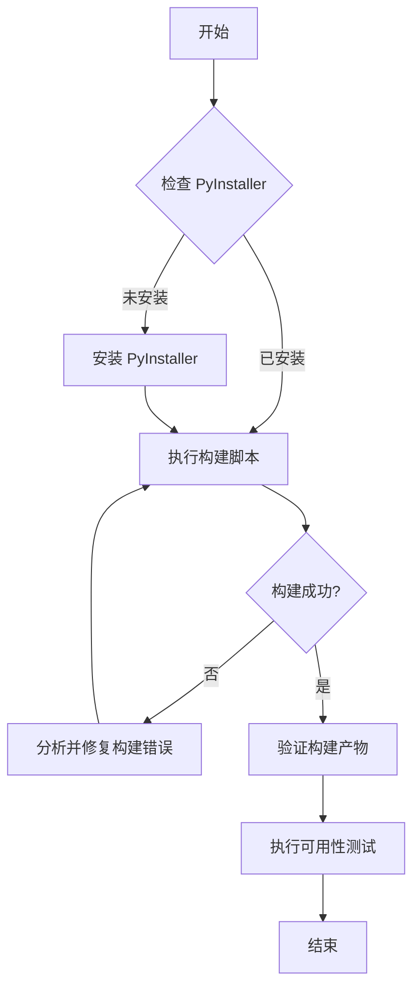

# 任务：MCP 可用性检查 - 架构设计 (DESIGN)

## 1. 整体流程

## 2. 关键操作定义

### 2.1 依赖检查
使用 `python -m pip show pyinstaller` 检查是否安装。
如未安装，使用 `python -m pip install pyinstaller`。

### 2.2 构建执行
命令: `python -m src.factory.build_app rag_flow_mcp`
输入: `src/apps/rag_flow_mcp` 源码
输出: `dist/rag_flow_mcp_release` 目录及 `rag_flow_mcp.exe`

### 2.3 验证与测试
- **文件验证**: 检查 `rag_flow_mcp.exe` 是否存在。
- **运行验证**: 尝试运行 `rag_flow_mcp.exe --version` 或启动后手动终止，观察是否有报错。

## 3. 依赖关系
- 必须在项目根目录下运行。
- 必须激活虚拟环境。
- `src/factory/build_app.py` 依赖 `src/factory/verify_mcp.py` 进行构建后验证。
