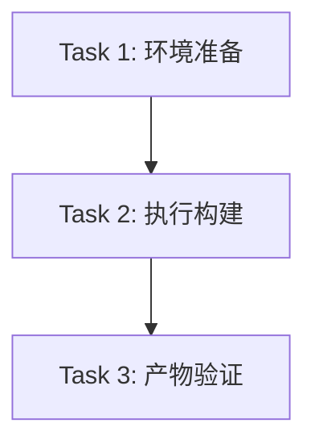

# 任务：MCP 可用性检查 - 任务分解 (TASK)

## 任务概览
修复 `rag_flow_mcp` 发布缺失问题并验证其可用性。

## 原子任务列表

### Task 1: 环境准备
- **描述**: 检查并确保 `pyinstaller` 已安装。
- **输入**: Python 环境
- **输出**: `pyinstaller` 可用
- **验收标准**: `python -m pip show pyinstaller` 返回信息。

### Task 2: 执行构建
- **描述**: 运行项目构建脚本生成发布包。
- **输入**: `src/apps/rag_flow_mcp`, `src/factory/build_app.py`
- **输出**: `dist/rag_flow_mcp_release/rag_flow_mcp.exe`
- **命令**: `python -m src.factory.build_app rag_flow_mcp`
- **验收标准**: 构建脚本执行成功 (Exit Code 0)，且输出 "EXE 打包成功"。

### Task 3: 产物验证
- **描述**: 验证生成的 EXE 文件是否存在且可运行。
- **输入**: `dist/rag_flow_mcp_release/rag_flow_mcp.exe`
- **输出**: 验证结果
- **验收标准**: 
    1. 文件存在。
    2. 运行无立即崩溃（或通过 `verify_mcp_exe` 自动验证）。

## 依赖图

