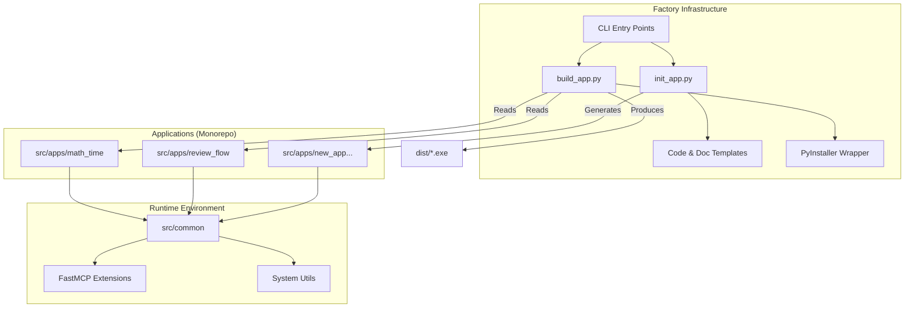

# 架构设计：MCP生产工厂

## 1. 系统架构图 (Mermaid)



## 2. 详细模块设计

### 2.1 目录结构重构
| 原路径 | 新路径 | 说明 |
| :--- | :--- | :--- |
| `src/server.py` | `src/apps/math_time/server.py` | 基础示例 |
| `src/review_flow.py` | `src/apps/review_flow/server.py` | 复杂示例 |
| `src/client_demo.py` | `src/apps/demo_client/main.py` | 客户端示例 (独立为一个App或Tool) |
| `src/__init__.py` | `src/__init__.py` | 保留 |
| N/A | `src/common/` | 新增公共库 |
| N/A | `src/factory/` | 新增工厂工具 |

### 2.2 工厂工具设计

#### 2.2.1 `init_app.py`
*   **输入**:
    *   `app_name` (英文，如 `todo_list`)
    *   `display_name` (中文，如 `待办清单服务`)
*   **动作**:
    1.  检查 `src/apps/{app_name}` 是否存在，防止覆盖。
    2.  创建目录 `src/apps/{app_name}`。
    3.  写入 `__init__.py` 和 `server.py` (基于模板)。
    4.  创建目录 `docs/{display_name}`。
    5.  写入 `docs/{display_name}/01_Align/` 等 6A 目录结构。
    6.  写入 `docs/{display_name}/Readme.md`。

#### 2.2.2 `build_app.py`
*   **输入**:
    *   `app_name` (可选，不传则列出所有供选择)
*   **动作**:
    1.  扫描 `src/apps/*`。
    2.  定位目标 App 的入口文件 (默认为 `server.py`)。
    3.  生成临时的 `.spec` 文件 (或使用通用 spec 模板)。
    4.  调用 `PyInstaller` 进行打包。
    5.  清理临时文件。
    6.  将产物输出到 `dist/{app_name}.exe`。

### 2.3 模板设计

#### 代码模板 (`server_template.py`)
```python
from mcp.server.fastmcp import FastMCP
from src.common.utils import get_app_logger

# 初始化
mcp = FastMCP("{app_name}")
logger = get_app_logger("{app_name}")

@mcp.tool()
def hello_world() -> str:
    """
    测试工具
    """
    return "Hello from {display_name}!"

if __name__ == "__main__":
    mcp.run()
```

## 3. 数据流与接口
*   **Common 库**: 提供日志、配置读取等基础功能，所有 App 均可导入 `src.common`。
*   **依赖管理**: 统一使用根目录 `.venv`，构建脚本自动探测依赖。

## 4. 异常处理
*   **构建失败**: `build_app.py` 需捕获 PyInstaller 的 stderr，并以中文友好提示。
*   **命名冲突**: `init_app.py` 需检测目录是否存在。
