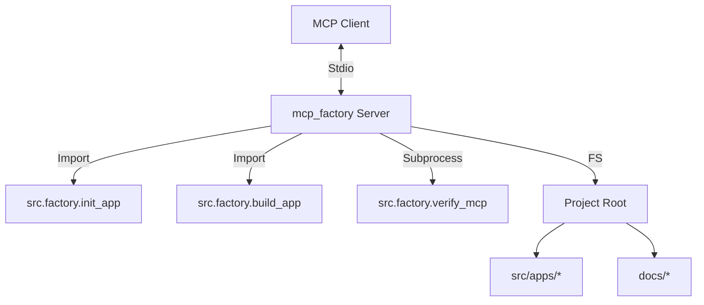

# MCP生产工厂 - 架构设计 (Architect)

## 1. 整体架构

## 2. 接口定义 (Tools)

| 工具名称 | 描述 | 参数 | 返回值 |
| :--- | :--- | :--- | :--- |
| `init_project` | 初始化一个新的 MCP 项目 | `app_name`: str `display_name`: str | 成功消息字符串 |
| `build_project` | 构建指定 MCP 项目为 EXE | `app_name`: str | 构建结果消息 (含路径) |
| `verify_project` | 验证指定 MCP 项目的 EXE | `app_name`: str | 验证日志字符串 |
| `list_projects` | 列出所有已存在的 MCP 项目 | 无 | JSON 格式的项目列表 |

## 3. 核心逻辑设计

### 3.1 路径解析
Server 必须知道 Project Root 在哪里。
*   默认假设 Server 运行在 `src/apps/mcp_factory/server.py`。
*   Project Root = `../../..` (相对于 server.py)。
*   使用 `pathlib` 确保跨平台兼容性。

### 3.2 依赖调用
*   **Init**: 直接导入 `src.factory.init_app.create_app` 并调用。需要捕获 stdout/stderr 重定向到 MCP 返回值，或者修改 `create_app` 返回字符串 (目前 `create_app` 使用 print，可能需要重构或捕获)。
    *   *决策*: 使用 `io.StringIO` 捕获 `create_app` 的 stdout。
*   **Build**: 直接导入 `src.factory.build_app.build_app` 并调用。同样捕获 stdout。
*   **Verify**: 由于 `verify_mcp` 是一个脚本且可能设计为独立运行，可以使用 `subprocess` 调用 `python -m src.factory.verify_mcp` 以确保隔离性，或者也导入调用。考虑到 verify 需要启动 EXE，使用 subprocess 可能更稳健。
*   **List**: 扫描 `src/apps` 目录下的子目录，排除 `__pycache__`。

## 4. 错误处理
*   所有操作均需包裹在 `try-except` 块中。
*   返回明确的错误信息给 Client。
