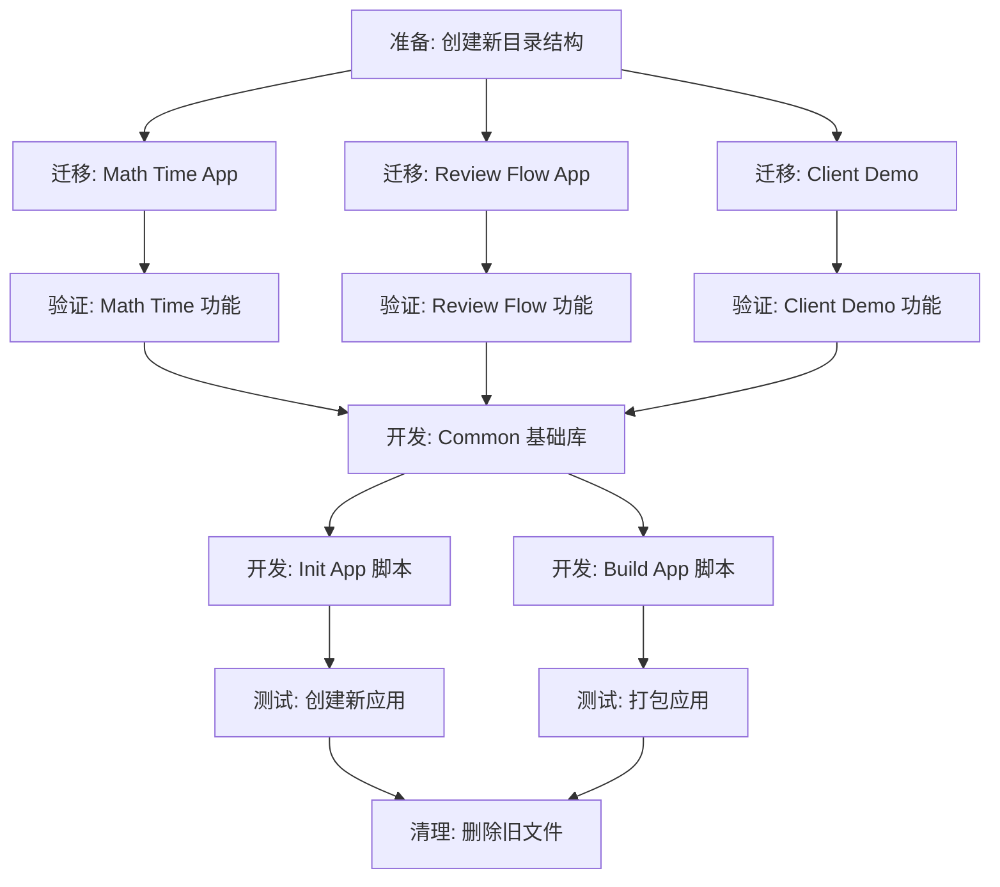

# 任务分解：MCP生产工厂

## 任务依赖图 (Mermaid)

## 原子任务列表

### 1. 结构重组 (Refactor)
- [ ] **T0_CreateStructure**: 创建 `src/apps`, `src/common`, `src/factory`, `scripts` 目录。
- [ ] **T1_Migrate_MathTime**: 将 `src/server.py` 移动至 `src/apps/math_time/server.py`，并修复导入（如有）。
- [ ] **T2_Migrate_ReviewFlow**: 将 `src/review_flow.py` 移动至 `src/apps/review_flow/server.py`，修复 `import` 和文件路径（如 `review_flow_state.json` 的路径处理）。
- [ ] **T3_Migrate_Demo**: 将 `src/client_demo.py` 移动至 `src/apps/demo_client/main.py`。

### 2. 工厂工具开发 (Factory Dev)
- [ ] **T7_Dev_Common**: 创建 `src/common/__init__.py`，提取基础工具（如果有）。目前主要是确保路径导入正常。
- [ ] **T8_Dev_InitScript**: 实现 `src/factory/init_app.py`。
    -   支持输入英文名、中文名。
    -   生成 6A 文档结构。
    -   生成代码模板。
- [ ] **T9_Dev_BuildScript**: 实现 `src/factory/build_app.py`。
    -   自动查找 `src/apps` 下的子目录。
    -   调用 PyInstaller。

### 3. 清理与验证 (Cleanup & Verify)
- [ ] **T10_Test_Init**: 运行 `init_app.py` 创建一个 `test_app`，验证结构是否正确。
- [ ] **T11_Test_Build**: 运行 `build_app.py` 打包 `math_time`，验证生成的 exe 是否可用。
- [ ] **T12_Cleanup**: 删除根目录下旧的 `server.py`, `review_flow.py` 等，删除旧的 `.spec` 文件。

## 验收标准
所有任务完成后，根目录应整洁，且能通过脚本一键创建和打包应用。
