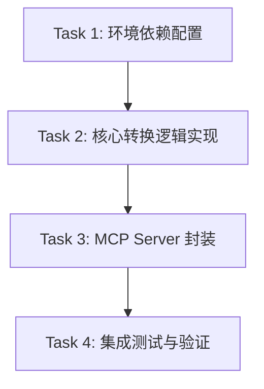

# TASK_MD转多格式MCP

## 1. 任务依赖图 (Mermaid)

## 2. 原子任务列表

### Task 1: 环境依赖配置
- **Input**: `requirements.txt`
- **Action**: 
  - 添加 `markdown`, `python-docx`, `xhtml2pdf`, `openpyxl`, `beautifulsoup4`。
  - 执行 `pip install`。
- **Output**: 更新后的 `requirements.txt` 和安装好的环境。
- **Verification**: `pip list` 包含新增库。

### Task 2: 核心转换逻辑实现 (`src/apps/md_converter/converters.py`)
- **Input**: 设计文档中的逻辑描述。
- **Action**:
  - 创建 `src/apps/md_converter/` 目录。
  - 实现 `MarkdownToWord`: MD -> HTML -> docx (处理基本标签: h1-h6, p, ul/ol, table, code)。
  - 实现 `MarkdownToPDF`: MD -> HTML (带中文字体 CSS) -> PDF。
  - 实现 `MarkdownToExcel`: MD -> HTML -> 提取 Table -> Excel。
- **Output**: `src/apps/md_converter/converters.py`。
- **Verification**: 编写单元测试脚本，转换示例文本并检查输出文件是否存在且可打开。

### Task 3: MCP Server 封装 (`src/apps/md_converter/server.py`)
- **Input**: `converters.py`
- **Action**:
  - 使用 `FastMCP` 初始化 Server。
  - 暴露 `convert_to_word`, `convert_to_pdf`, `convert_to_excel` 工具。
  - 增加文件路径校验和异常处理。
- **Output**: `src/apps/md_converter/server.py`。
- **Verification**: 启动 server 并不报错。

### Task 4: 集成测试与验证
- **Input**: 完整的 Server 代码。
- **Action**:
  - 创建 `tests/test_md_converter.py` (或手动测试脚本)。
  - 准备一个包含标题、列表、表格、中文的 `test.md`。
  - 模拟 MCP 调用或直接运行 Server 函数进行转换。
  - 验证生成的 Word, PDF, Excel 内容正确性。
- **Output**: 测试报告/截图。
- **Verification**: 所有格式均成功生成且无乱码。
