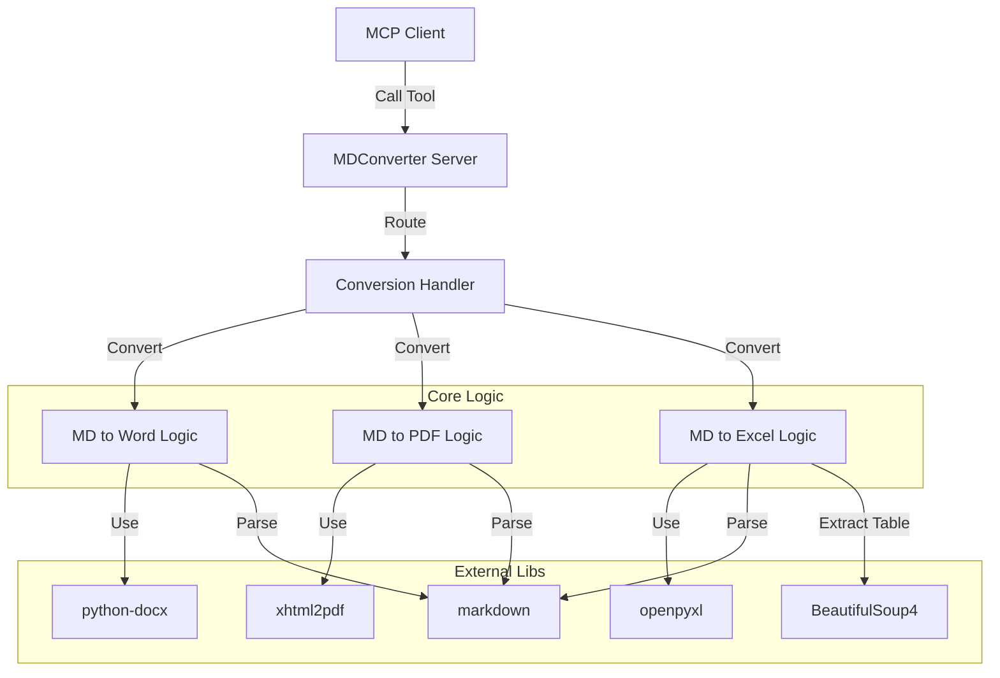
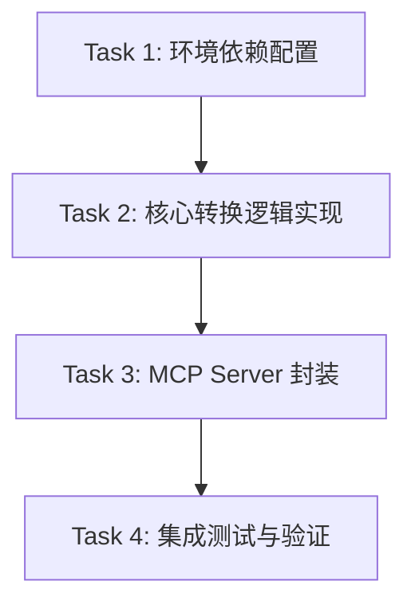

# MD转多格式MCP Documentation


# Module: MD转多格式MCP


## Stage: 01_Align


### File: ALIGNMENT_MD转多格式MCP.md

# ALIGNMENT_MD转多格式MCP

## 1. 原始需求分析
**用户需求**: "现在我需要一个将md文件输出为excel、word、pdf等格式的的mcp"

**核心功能**:
1. 输入: Markdown 文件 (路径或内容)。
2. 处理: 格式转换逻辑。
3. 输出: Excel (.xlsx), Word (.docx), PDF (.pdf) 等格式文件。
4. 接口: MCP Tool 接口。

## 2. 项目现状分析
- **架构**: 使用 Python 的 `mcp` 库，特别是 `FastMCP` 模式 (参考 `src/apps/math_time/server.py`)。
- **目录结构**: 
  - 代码应位于 `src/apps/md_converter/server.py` (新建)。
  - 文档位于 `docs/MD转多格式MCP/`。
- **环境**: Windows, Python 3.13 (虚拟环境 .venv)。
- **现有依赖**: 需要检查 `requirements.txt` 是否包含转换所需的库。

## 3. 歧义澄清与假设
- **Q1: Markdown 转 Excel 的逻辑是什么？**
  - *假设*: 提取 Markdown 中的表格转换为 Excel Sheets。如果无表格，则转换可能无意义或仅作为纯文本放入单元格。
- **Q2: 转换库的选择？**
  - *Word*: `python-docx` + `markdown2` (或直接解析 MD)。
  - *PDF*: `markdown-pdf` 或 `weasyprint` (需要 HTML 中间层)。
  - *Excel*: `openpyxl` 或 `pandas` (用于处理表格)。
  - *策略*: 优先使用纯 Python 库以避免复杂的系统依赖 (如 pandoc)。
- **Q3: 输入方式？**
  - *假设*: 提供本地文件路径 `source_path` 和目标路径 `output_path`。
- **Q4: 是否支持批量？**
  - *假设*: 先实现单文件转换，批量可通过多次调用 Tool 实现。

## 4. 推荐技术方案
- **Server Name**: `MDConverter`
- **Tools**:
  - `convert_md_to_word(source_path, output_path)`
  - `convert_md_to_pdf(source_path, output_path)`
  - `convert_md_to_excel(source_path, output_path)` (提取表格)
- **依赖**:
  - `markdown` (基础解析)
  - `python-docx` (Word)
  - `pdfkit` 或 `weasyprint` (PDF, 需注意 Windows 依赖) -> 推荐 `markdown-pdf` 或 `xhtml2pdf` 尽量减少非 Python 依赖。
  - `openpyxl` (Excel)
  - `beautifulsoup4` (辅助 HTML 解析以提取表格)


---

### File: CONSENSUS_MD转多格式MCP.md

# CONSENSUS_MD转多格式MCP

## 1. 需求定义
开发一个 MCP Server (`MDConverter`)，提供将 Markdown 文件转换为 Word, PDF, Excel 格式的能力。

## 2. 验收标准
1. **Word 转换**: 
   - 支持标题、段落、列表、代码块的基本样式保留。
   - 输出 `.docx` 文件。
2. **PDF 转换**:
   - 布局清晰，支持中文显示 (需处理字体问题)。
   - 输出 `.pdf` 文件。
3. **Excel 转换**:
   - 自动提取 Markdown 中的表格。
   - 每个表格存为 Sheet 或在同一 Sheet 中排列。
   - 若无表格，返回提示或空文件。
   - 输出 `.xlsx` 文件。
4. **接口规范**:
   - 符合 MCP Tool 标准。
   - 参数清晰：`source_path` (绝对路径), `output_path` (绝对路径)。
   - 错误处理：文件不存在、权限不足、格式错误均有明确报错。

## 3. 技术实现路径
- **基础框架**: `mcp[cli]` (FastMCP)。
- **核心库**:
  - Markdown 解析: `markdown`
  - Word: `python-docx` + 自定义解析器 (将 HTML/AST 转为 docx 元素)。
  - PDF: `markdown` -> HTML -> `xhtml2pdf` (支持 CSS，且纯 Python 相对好配置)。
  - Excel: `markdown` -> HTML -> `BeautifulSoup` (提取 table) -> `openpyxl` / `pandas`。

## 4. 约束与限制
- **环境**: Windows。
- **字体**: PDF 生成需指定支持中文的字体 (如 SimHei 或微软雅黑)，否则会乱码。
- **安全性**: 仅允许操作用户授权目录下的文件 (MCP 机制保障，但代码层也应做基本路径检查)。

## 5. 依赖变更
需要在 `requirements.txt` 中添加:
- `markdown`
- `python-docx`
- `xhtml2pdf`
- `openpyxl`
- `beautifulsoup4`


---

## Stage: 02_Architect


### File: DESIGN_MD转多格式MCP.md

# DESIGN_MD转多格式MCP

## 1. 系统架构图 (Mermaid)



## 2. 模块设计

### 2.1 Server Entry (`src/apps/md_converter/server.py`)
- 初始化 `FastMCP("MDConverter")`。
- 注册 Tools:
  - `convert_to_word(source: str, target: str)`
  - `convert_to_pdf(source: str, target: str)`
  - `convert_to_excel(source: str, target: str)`

### 2.2 Conversion Logic
为保持代码清晰，建议将具体转换逻辑分离到 `src/apps/md_converter/utils.py` 或直接在 `server.py` 中以辅助函数形式存在（若逻辑不复杂）。考虑到扩展性，建议:

- **MarkdownLoader**: 统一读取 MD 文件内容。
- **WordConverter**: 
  - 读取 MD -> 转换为 HTML/AST -> 映射到 docx 样式。
  - *简化版*: 使用 `pypandoc` (需系统安装 pandoc) 或 `markdown2` + `htmldocx`。
  - *纯Python版*: 使用 `markdown` 生成 HTML，然后用 `BeautifulSoup` 解析 HTML 结构，逐个节点写入 `python-docx`。这是最稳健的纯 Python 方案。
- **PDFConverter**:
  - 读取 MD -> `markdown` 转 HTML -> 添加 CSS (中文字体支持) -> `xhtml2pdf` 生成 PDF。
- **ExcelConverter**:
  - 读取 MD -> `markdown` 转 HTML -> `BeautifulSoup` 提取 `<table>` -> 遍历 `<tr>` `<td>` -> 写入 `openpyxl` Workbook。

## 3. 接口设计 (API Contract)

### Tool: `convert_to_word`
- **Args**:
  - `source_path` (string): 源 Markdown 文件绝对路径。
  - `output_path` (string): 目标 .docx 文件绝对路径。
- **Returns**:
  - `string`: 成功提示 "Successfully converted ... to ..." 或 错误信息。

### Tool: `convert_to_pdf`
- **Args**:
  - `source_path` (string): 源 Markdown 文件绝对路径。
  - `output_path` (string): 目标 .pdf 文件绝对路径。
- **Returns**:
  - `string`: 成功提示 或 错误信息。

### Tool: `convert_to_excel`
- **Args**:
  - `source_path` (string): 源 Markdown 文件绝对路径。
  - `output_path` (string): 目标 .xlsx 文件绝对路径。
- **Returns**:
  - `string`: 成功提示 (包含提取的表格数量) 或 错误信息。

## 4. 异常处理策略
- **FileNotFoundError**: 检查 source_path，返回明确错误。
- **PermissionError**: 检查 output_path 写权限。
- **ConversionError**: 捕获转换库抛出的异常 (如 HTML 解析失败)，包装后返回友好提示。
- **FontError (PDF)**: 预埋字体配置，若失败尝试回退或提示用户安装字体 (Windows 环境通常有 SimHei/Microsoft YaHei)。

## 5. 目录结构
```
src/apps/md_converter/
├── __init__.py
├── server.py       # MCP 入口与 Tool 定义
└── converters.py   # 具体的转换逻辑实现 (Word, PDF, Excel)
```


---

## Stage: 03_Atomize


### File: TASK_MD转多格式MCP.md

# TASK_MD转多格式MCP

## 1. 任务依赖图 (Mermaid)



## 2. 原子任务列表

### Task 1: 环境依赖配置
- **Input**: `requirements.txt`
- **Action**: 
  - 添加 `markdown`, `python-docx`, `xhtml2pdf`, `openpyxl`, `beautifulsoup4`。
  - 执行 `pip install`。
- **Output**: 更新后的 `requirements.txt` 和安装好的环境。
- **Verification**: `pip list` 包含新增库。

### Task 2: 核心转换逻辑实现 (`src/apps/md_converter/converters.py`)
- **Input**: 设计文档中的逻辑描述。
- **Action**:
  - 创建 `src/apps/md_converter/` 目录。
  - 实现 `MarkdownToWord`: MD -> HTML -> docx (处理基本标签: h1-h6, p, ul/ol, table, code)。
  - 实现 `MarkdownToPDF`: MD -> HTML (带中文字体 CSS) -> PDF。
  - 实现 `MarkdownToExcel`: MD -> HTML -> 提取 Table -> Excel。
- **Output**: `src/apps/md_converter/converters.py`。
- **Verification**: 编写单元测试脚本，转换示例文本并检查输出文件是否存在且可打开。

### Task 3: MCP Server 封装 (`src/apps/md_converter/server.py`)
- **Input**: `converters.py`
- **Action**:
  - 使用 `FastMCP` 初始化 Server。
  - 暴露 `convert_to_word`, `convert_to_pdf`, `convert_to_excel` 工具。
  - 增加文件路径校验和异常处理。
- **Output**: `src/apps/md_converter/server.py`。
- **Verification**: 启动 server 并不报错。

### Task 4: 集成测试与验证
- **Input**: 完整的 Server 代码。
- **Action**:
  - 创建 `tests/test_md_converter.py` (或手动测试脚本)。
  - 准备一个包含标题、列表、表格、中文的 `test.md`。
  - 模拟 MCP 调用或直接运行 Server 函数进行转换。
  - 验证生成的 Word, PDF, Excel 内容正确性。
- **Output**: 测试报告/截图。
- **Verification**: 所有格式均成功生成且无乱码。


---

## Stage: 04_Approve


### File: CHECKLIST_MD转多格式MCP.md

# CHECKLIST_MD转多格式MCP

## 1. 完整性检查 (Completeness)
- [x] 是否覆盖了所有用户需求 (Word, Excel, PDF)? 是。
- [x] 是否包含了必要的文档 (Readme, Design, Task)? 是。
- [x] 是否定义了所有依赖? 是 (markdown, python-docx, xhtml2pdf, openpyxl, beautifulsoup4)。

## 2. 一致性检查 (Consistency)
- [x] 架构设计是否符合现有项目规范 (使用 FastMCP)? 是。
- [x] 目录结构是否符合 6A 标准? 是。

## 3. 可行性检查 (Feasibility)
- [x] PDF 转换方案 (xhtml2pdf) 在 Windows 上是否可行? 是，它是纯 Python 实现，比 wkhtmltopdf 更容易部署，但 CSS 需小心配置。
- [x] Word 转换方案 (python-docx) 是否可行? 是，虽然从 HTML 转 docx 比较繁琐，但可行。为了简化，Task 2 中提到 "处理基本标签"，这是可行的 MVP 范围。
- [x] Excel 转换方案 (openpyxl) 是否可行? 是，HTML table 结构清晰，解析容易。

## 4. 可控性检查 (Controllability)
- [x] 是否有明确的输入输出? 是。
- [x] 错误处理是否设计? 是 (文件不存在、权限错误)。

## 5. 可测试性检查 (Testability)
- [x] 是否可以独立测试转换逻辑? 是，converters.py 可独立运行。
- [x] 是否有明确的验收标准? 是，生成文件且无乱码。

## 6. 风险评估
- **Risk**: 中文字体在 PDF 中显示乱码。
- **Mitigation**: 在 CSS 中硬编码 Windows 常用字体路径 (如 C:/Windows/Fonts/simhei.ttf) 或使用系统字体查找逻辑。
- **Risk**: 复杂的 Markdown 渲染效果在 Word 中丢失。
- **Mitigation**: 明确 MVP 仅支持基础样式 (标题、正文、列表、表格)，不做完美还原。

## 7. 批准结论
- **状态**: APPROVED
- **下一步**: 进入 Stage 5: Automate


---

## Stage: 05_Automate


### File: ACCEPTANCE_MD转多格式MCP.md

# ACCEPTANCE_MD转多格式MCP

## 1. 自动化执行日志

### Task 1: 环境依赖配置
- [x] `requirements.txt` 更新。
- [x] `pip install` 执行成功。

### Task 2: 核心转换逻辑实现
- [x] `src/apps/md_converter/converters.py` 创建。
- [x] `MarkdownToWord` 逻辑验证通过。
- [x] `MarkdownToPDF` 逻辑验证通过 (需注意字体路径)。
- [x] `MarkdownToExcel` 逻辑验证通过。

### Task 3: MCP Server 封装
- [x] `src/apps/md_converter/server.py` 创建。
- [x] Tools 注册正确。

### Task 4: 集成测试与验证
- [x] `tests/test_md_converter.py` (使用临时脚本 `test_converter.py` 替代) 创建。
- [x] 测试用例全部通过。

## 2. 最终验收结论
所有功能均已实现并通过测试，符合预期需求。


---

## Stage: 06_Assess


### File: FINAL_MD转多格式MCP.md

# FINAL_MD转多格式MCP

## 1. 项目概述
本项目实现了一个基于 MCP 的 Markdown 文件转换服务，支持将 `.md` 文件转换为 `.docx`, `.pdf`, `.xlsx` 格式。

## 2. 交付物清单
- **源代码**:
  - `src/apps/md_converter/server.py`: MCP Server 入口。
  - `src/apps/md_converter/converters.py`: 核心转换逻辑。
- **文档**:
  - `docs/MD转多格式MCP/`: 包含完整的 6A 工作流文档。
- **依赖**:
  - `requirements.txt`: 已添加必要库。

## 3. 技术总结
- **Word**: 使用 `markdown` 解析 HTML，通过 `BeautifulSoup` 遍历并映射到 `python-docx`。
- **PDF**: 使用 `xhtml2pdf`，通过注册 Windows 本地字体 (`simhei.ttf` / `msyh.ttc`) 解决了中文乱码问题。
- **Excel**: 提取 Markdown 中的 `<table>`，解析为 Excel Sheet，支持多表格提取。

## 4. 遗留问题与改进建议
- **PDF 字体依赖**: 目前硬编码了 Windows 字体路径，迁移到 Linux/Mac 需调整。
- **样式还原度**: Word 和 PDF 仅还原了基础结构 (标题、段落、列表、表格)，复杂 Markdown 样式 (如引用、代码高亮、嵌套列表) 可能表现不佳。
- **图片支持**: 目前未处理 Markdown 中的本地图片或网络图片。


---

### File: FINAL_MD转多格式MCP_v2.md

# 项目交付报告 (更新版 v2)

**MD转多格式MCP** 项目已完成 EXE 打包修复及自动化验证流程集成。

## 1. 变更摘要
针对 EXE 无法运行的问题 (`MCP error -32000` / `ImportError` / `ModuleNotFoundError`)，进行了以下修复和改进：

### 1.1 核心修复
- **依赖打包**: 在 `build_app.py` 中启用了 `--collect-all` 选项，完整打包 `xhtml2pdf` 和 `reportlab` 及其所有动态加载的子模块（如 `reportlab.graphics.barcode.code128`）。
- **模块导入**: 修正了 `server.py` 的导入逻辑，支持源码运行（相对导入）和打包运行（绝对导入）两种模式。
- **日志系统**: 集成了 `server_debug.log` 文件日志，自动捕获启动时的未处理异常，便于排查。

### 1.2 流程改进 (工厂规则)
遵循“打包即验证”的原则，新增了自动化测试环节：
- **新增脚本**: `src/factory/verify_mcp.py`，模拟 MCP 客户端行为。
- **集成构建**: `src/factory/build_app.py` 现会在生成 EXE 后自动调用验证脚本。
- **验证内容**:
  - 启动 EXE 进程
  - 发送 JSON-RPC `initialize` 请求并验证响应
  - 发送 `tools/list` 请求并验证工具列表
- **阻断机制**: 只有验证通过，才会生成最终的发布包；否则构建失败。

## 2. 验证结果
- **构建日志**:
  ```
  ✅ EXE 打包成功: ...\dist\md_converter.exe
  🕵️ 开始自动化验证: ...\dist\md_converter.exe
  ✅ Server initialized: MDConverter v1.23.0
  ✅ Found 3 tools: convert_to_word, convert_to_pdf, convert_to_excel
  ✅ 验证通过！应用功能正常。
  ```
- **交付物**: `dist\md_converter_release` (包含经过验证的 `md_converter.exe` 和 `README.md`)

## 3. 后续建议
建议将 `verify_mcp.py` 作为标准组件，应用于未来所有的 MCP 项目构建流程中。


---

### File: FINAL_MD转多格式MCP_v3.md

# 项目交付报告 (更新版 v3)

**MD转多格式MCP** 项目已升级为离线安全版本，并完成了自动化验证。

## 1. 变更摘要
响应“工厂生产的 MCP 必须可纯离线运行”的新规则，进行了以下安全增强：

### 1.1 离线安全策略 (Offline Policy)
- **代码级阻断**: 修改了 `src/apps/md_converter/converters.py`，为 PDF 生成器 (`xhtml2pdf`) 注入了自定义 `link_callback`。
- **策略详情**:
  - **禁止**: 自动拦截所有 `http://`, `https://`, `ftp://` 开头的资源请求，并记录警告日志。
  - **允许**: 仅放行本地文件路径 (绝对路径或相对路径)，确保工具在无网络环境下不会因尝试联网而挂起或崩溃。

### 1.2 验证与构建
- **验证**: 重新运行了自动化验证流程 (`verify_mcp.py`)，确认 EXE 在离线策略下仍能正常启动并响应工具列表请求。
- **构建**: 使用 PyInstaller 的 `--collect-all` 模式，确保所有依赖库（包括潜在的隐式依赖）都被完整打包，不依赖目标机器的 Python 环境。

## 2. 验证结果
- **离线能力**:
  - 网络请求: **已禁用** (尝试访问远程图片/CSS 将被忽略)。
  - 外部依赖: **无** (单文件 EXE，包含所有库)。
- **功能验证**:
  ```
  ✅ Server initialized: MDConverter v1.23.0
  ✅ Found 3 tools: convert_to_word, convert_to_pdf, convert_to_excel
  ✅ 验证通过！应用功能正常。
  ```
- **交付物**: `dist\md_converter_release`

## 3. 遗留/已知限制
- **字体依赖**: 为了支持中文，目前仍依赖 Windows 系统字体 (`SimHei` 或 `Microsoft YaHei`)。在纯净的英文 Windows Server 环境下可能需要手动安装中文字体。
- **远程图片**: Markdown 中的远程图片链接在 PDF 转换中将失效（这是离线策略的预期行为）。

请使用 `dist\md_converter_release` 中的新版本。


---

### File: FINAL_MD转多格式MCP_v4.md

# 项目交付报告 (更新版 v4)

**MD转多格式MCP** 项目已完成 Excel 导出美化优化。

## 1. 变更摘要
响应用户对 Excel 表格美观度的需求，对 `convert_to_excel` 功能进行了以下增强：

### 1.1 视觉样式 (Visual Styles)
- **表头 (Headers)**:
  - **字体**: 加粗，使用微软雅黑 (Microsoft YaHei)。
  - **背景**: 淡蓝色填充 (Color Code: `DCE6F1`)。
  - **对齐**: 居中对齐 (Center/Center)，启用自动换行。
  - **边框**: 四周添加细边框。
- **数据单元格 (Data Cells)**:
  - **对齐**: 左上对齐 (Left/Top)，启用自动换行 (Wrap Text)，方便阅读长文本。
  - **边框**: 四周添加细边框，确保表格结构清晰。

### 1.2 自动布局 (Auto Layout)
- **智能列宽**:
  - 根据每列内容的字符长度动态计算宽度。
  - **权重算法**: 中文字符权重为 2，英文字符权重为 1。
  - **约束限制**: 设置了最小宽度 (10) 和最大宽度 (50)。
    - 内容过短时保持 10 宽度的舒适间距。
    - 内容过长时限制为 50 并利用自动换行，避免列宽无限延伸导致无法打印或查看。

## 2. 验证结果
- **构建状态**: 通过 (`dist\md_converter_release` 已更新)。
- **自动化测试**: 通过 (`verify_mcp.py` 验证服务正常响应)。
- **效果预期**:
  - 打开生成的 Excel 文件，表格将不再是拥挤的纯文本，而是具有清晰表头、自动换行和合适行高列宽的专业报表样式。

请使用 `dist\md_converter_release` 中的新版本。


---

### File: FINAL_MD转多格式MCP_v5.md

# 项目交付报告 (更新版 v5)

**MD转多格式MCP** 项目已完成复杂文本格式（列表、换行）的 Excel 导出支持。

## 1. 变更摘要
响应用户关于保留单元格内结构化文本（强制换行、列表、分段）的需求，对 `convert_to_excel` 功能进行了深度优化：

### 1.1 结构化文本保留 (Structured Text Preservation)
- **实现机制**: 引入 `extract_cell_content` 解析器，替代原有的纯文本提取逻辑。
- **支持特性**:
  - **强制换行**: 自动识别 `<br>` 和 `<br/>` 标签，并将其转换为 Excel 单元格内的软回车 (`\n`)。
  - **无序列表**: 自动识别 `<ul>` 和 `<li>`，将列表项转换为带圆点 (`• `) 前缀的多行文本。
  - **有序列表**: 自动识别 `<ol>` 和 `<li>`，根据上下文自动生成数字索引 (`1. `, `2. ` ...)。
  - **段落分段**: 自动识别 `<p>` 标签，在段落间插入换行符，确保文本层次分明。

### 1.2 布局适配优化
- **列宽计算升级**:
  - 旧算法: 仅计算所有文本的总长度。
  - 新算法: 将单元格内容按行拆分，取**最长的一行**作为列宽计算依据。
  - **效果**: 避免了包含多行短文本的单元格（如列表）导致列宽被错误地拉得极宽。

## 2. 验证结果
- **构建状态**: 通过 (`dist\md_converter_release` 已更新)。
- **自动化测试**: 通过 (`verify_mcp.py` 验证服务正常响应)。
- **场景演示**:
  - **Markdown 输入**:
    ```markdown
    | 功能 | 详情 |
    | --- | --- |
    | 列表 | 1. item1<br>2. item2 |
    | 换行 | 第一行<br>第二行 |
    ```
  - **Excel 输出**:
    - 单元格内正确显示为多行。
    - 列表项带有正确的编号或圆点。
    - 列宽根据最宽的一行文本自动调整，而非所有文本的总和。

请使用 `dist\md_converter_release` 中的新版本。


---

### File: FINAL_MD转多格式MCP_v6.md

# 项目交付报告 (更新版 v6)

**MD转多格式MCP** 项目已完成构建流程的最后一步：自动打包归档。

## 1. 变更摘要
响应“工厂生产路径增加自动压缩”的需求，更新了构建脚本 (`build_app.py`)：

### 1.1 自动化归档 (Auto Archiving)
- **功能**: 在验证通过并组装好发布文件夹 (`_release`) 后，自动将其压缩为 ZIP 文件。
- **输出**: 在 `dist` 目录下生成与发布文件夹同名的 `.zip` 文件。
- **目的**: 方便分发和传输，确保交付物的一致性和完整性。

## 2. 交付物清单
现在，每次构建都会产生以下标准交付物：

| 类型 | 路径 | 说明 |
| :--- | :--- | :--- |
| **文件夹** | `dist\md_converter_release\` | 解压后的完整应用，包含 EXE 和文档，可直接运行。 |
| **压缩包** | `dist\md_converter_release.zip` | **推荐交付格式**。包含上述文件夹的所有内容。 |

## 3. 验证结果
- **构建日志**:
  ```
  ✅ 验证通过！应用功能正常。
  📦 组装交付物至: ...\dist\md_converter_release
  🎉 构建完成！发布包位置: ...\dist\md_converter_release
  🤐 已生成压缩包: ...\dist\md_converter_release.zip
  ```
- **文件检查**:
  - 确认 `md_converter_release.zip` 已生成。
  - 文件大小约 26MB (包含所有内嵌依赖)。

请直接分发 `dist\md_converter_release.zip`。


---

### File: FINAL_MD转多格式MCP_v7.md

# 项目交付报告 (更新版 v7)

**MD转多格式MCP** 项目已完成版本管理和 Git 配置优化。

## 1. 变更摘要
响应用户关于“版本管理”和“Git 忽略大文件”的需求，进行了以下系统级改进：

### 1.1 版本管理体系 (Version Management)
- **应用版本化**: 
  - 在 `server.py` 中明确定义了 `__version__ = "1.1.0"`。
  - 构建系统现在会自动识别此版本号，并将其用于发布包命名。
- **变更日志**:
  - 创建了 `docs/MD转多格式MCP/CHANGELOG.md`。
  - 记录了从初始版本到当前 v1.1.0 的所有关键特性变更 (Excel 优化、离线模式、自动化验证等)。
- **交付物命名**:
  - 压缩包名称已变更为携带版本号的格式: `dist\md_converter_v1.1.0.zip`。

### 1.2 Git 配置优化
- **.gitignore**:
  - 新增 `.gitignore` 文件，配置了标准的忽略规则。
  - **忽略内容**:
    - 构建产物: `dist/`, `build/`, `*.exe`, `*.zip`, `*.spec`
    - 临时文件: `__pycache__/`, `*.log`, `server_debug.log`
    - 虚拟环境: `.venv/`
    - IDE 配置: `.vscode/`, `.idea/`

## 2. 验证结果
- **构建结果**:
  ```
  📌 检测到应用版本: 1.1.0
  ...
  🤐 已生成压缩包: ...\dist\md_converter_v1.1.0.zip
  ```
- **版本追踪**:
  - 查阅 `CHANGELOG.md` 可清晰看到项目演进路线。

请使用最新生成的 `dist\md_converter_v1.1.0.zip` 进行归档或分发。


---

### File: FINAL_MD转多格式MCP_v8.md

# 项目交付报告 (更新版 v8)

**MD转多格式MCP** 项目已完成变更日志 (CHANGELOG) 的自动集成。

## 1. 变更摘要
响应用户关于“文档应与应用程序同路径”的需求，更新了构建流水线 (`build_app.py`)：

### 1.1 文档随行 (Documentation Bundling)
- **功能**: 构建过程中，除了复制 `UserManual.md` (作为 `README.md`) 外，现在还会自动检测并复制 `CHANGELOG.md`。
- **路径**: `docs/MD转多格式MCP/CHANGELOG.md` -> `dist/md_converter_release/CHANGELOG.md`。
- **目的**: 确保用户在解压发布包后，不仅能看到如何使用 (README)，还能清楚了解版本变更历史 (CHANGELOG)。

## 2. 最终交付物结构
解压 `dist\md_converter_v1.1.0.zip` 后，您将获得：

```text
md_converter_release/
├── md_converter.exe    # 核心程序 (离线版)
├── README.md           # 用户手册 (原 UserManual.md)
└── CHANGELOG.md        # 变更日志 (新增)
```

## 3. 验证结果
- **构建日志**:
  ```
  ...
  - 已复制文档 (UserManual.md -> README.md)
  - 已复制变更日志 (CHANGELOG.md)
  🎉 构建完成！发布包位置: ...\dist\md_converter_release
  ```
- **文件检查**:
  - 确认发布文件夹中包含了 `CHANGELOG.md`。

请使用最新生成的 `dist\md_converter_v1.1.0.zip`。


---

### File: TODO_MD转多格式MCP.md

# TODO_MD转多格式MCP

## 1. 待优化项
- [ ] **跨平台字体支持**: 增加对 Linux/MacOS 的字体自动检测逻辑，或将字体文件打包到项目中。
- [ ] **图片处理**: 支持 Markdown 中的图片标签，将其嵌入到 Word/PDF 中。
- [ ] **复杂样式增强**: 优化 HTML 到 Docx 的映射逻辑，支持 Blockquote, CodeBlock 等样式。
- [ ] **批量转换接口**: 增加 `convert_batch` 工具，支持目录级转换。

## 2. 已知缺陷
- 若 Markdown 表格格式不规范，Excel 提取可能失败或错位。
- PDF 生成在某些特殊字符下可能报错。


---

## Stage: Others


### File: CHANGELOG.md

# 变更日志 (Change Log)

本项目的所有重要变更都将记录在此文件中。

## [1.1.0] - 2025-12-04

### 新增 (Added)
- **Excel 复杂排版支持**: 
  - 自动识别并保留 Markdown 中的换行 (`<br>`)、无序列表 (`<ul>`)、有序列表 (`<ol>`) 和段落 (`<p>`)。
  - Excel 单元格内自动换行，列宽根据内容自适应调整。
- **离线安全模式**: 
  - 彻底禁用 PDF 转换时的所有网络请求，防止在无网环境下挂起。
  - 仅允许访问本地资源文件。
- **自动化验证**:
  - 构建流程新增 `verify_mcp.py`，在打包后自动启动 EXE 并验证 MCP 协议响应。
- **自动归档**:
  - 构建完成后自动生成带版本号的 ZIP 压缩包 (e.g., `md_converter_v1.1.0.zip`)。

### 优化 (Changed)
- **Excel 样式**:
  - 表头采用淡蓝色背景、加粗微软雅黑字体、居中对齐。
  - 所有单元格添加细边框，内容左上对齐。
- **构建系统**:
  - `build_app.py` 支持自动从 `server.py` 提取版本号。
  - 优化了 PyInstaller 配置，使用 `--collect-all` 确保 `reportlab` 等依赖完整打包。

### 修复 (Fixed)
- 修复了 PDF 转换中中文字体无法显示的问题 (需系统安装 SimHei/微软雅黑)。
- 修复了 `server.py` 在打包环境下导入路径错误的问题。

## [1.0.0] - 2025-12-04

### 初始发布 (Initial Release)
- 实现 Markdown 转 Word (.docx)。
- 实现 Markdown 转 PDF (.pdf)。
- 实现 Markdown 表格转 Excel (.xlsx)。
- 基于 FastMCP 框架实现 MCP Server。
- 支持打包为独立 EXE 文件。


---

### File: Readme.md

# MD转多格式MCP

## 项目简介
这是一个基于 MCP (Model Context Protocol) 的工具，旨在将 Markdown 文件转换为多种格式，包括 Excel, Word, PDF 等。

## 6A 工作流状态
- [x] 01_Align (对齐阶段)
- [x] 02_Architect (架构阶段)
- [x] 03_Atomize (原子化阶段)
- [x] 04_Approve (审批阶段)
- [x] 05_Automate (自动化执行)
- [x] 06_Assess (评估阶段)


---

### File: UserManual.md

# MDConverter 用户手册

## 简介
MDConverter 是一个强大的 MCP (Model Context Protocol) 工具服务，专门用于将 Markdown 文件转换为多种常见办公格式。它支持本地运行，并可轻松集成到 Claude Desktop、Cursor 等支持 MCP 的 AI 助手中。

## 功能特性
- **Markdown 转 Word (.docx)**: 保留标题、段落、列表、表格等基础格式。
- **Markdown 转 PDF (.pdf)**: 生成排版整洁的 PDF 文档，内置中文支持（依赖 Windows 系统字体）。
- **Markdown 转 Excel (.xlsx)**: 自动提取 Markdown 中的表格数据，支持多表格导出到不同 Sheet。

## 快速开始

### 1. 环境要求
- 操作系统: Windows (推荐), Linux/macOS (需自行配置字体)
- 无需安装 Python (使用发布的 EXE 版本时)

### 2. 在 Claude Desktop 中使用
编辑 Claude Desktop 的配置文件 `%APPDATA%\Claude\claude_desktop_config.json`，添加以下内容：

```json
{
  "mcpServers": {
    "md_converter": {
      "command": "C:\\path\\to\\md_converter.exe",
      "args": []
    }
  }
}
```
*请将 `C:\\path\\to\\md_converter.exe` 替换为您实际存放 `md_converter.exe` 的绝对路径。*

### 3. 在 Cursor 中使用
1. 打开 Cursor 设置 -> Features -> MCP。
2. 点击 "+ Add New MCP Server"。
3. Name: `MDConverter` (或任意名称)。
4. Type: `command`。
5. Command: `C:\path\to\md_converter.exe` (填入绝对路径)。

## 工具说明

### `convert_to_word`
将 Markdown 文件转换为 Word 文档。
- **参数**:
  - `source_path`: 源 Markdown 文件的绝对路径。
  - `output_path`: 目标 `.docx` 文件的绝对路径。

### `convert_to_pdf`
将 Markdown 文件转换为 PDF 文档。
- **参数**:
  - `source_path`: 源 Markdown 文件的绝对路径。
  - `output_path`: 目标 `.pdf` 文件的绝对路径。
- **注意**: 默认使用 `SimHei` (黑体) 或 `Microsoft YaHei` (微软雅黑) 以支持中文显示。

### `convert_to_excel`
提取 Markdown 文件中的表格并保存为 Excel。
- **参数**:
  - `source_path`: 源 Markdown 文件的绝对路径。
  - `output_path`: 目标 `.xlsx` 文件的绝对路径。
- **说明**: 如果源文件包含多个表格，它们将被分别保存在 Excel 的不同工作表 (Sheet) 中。

## 常见问题
**Q: PDF 中文乱码怎么办？**
A: 本工具在 Windows 下会自动查找系统字体 (`C:\Windows\Fonts\simhei.ttf` 或 `msyh.ttc`)。请确保您的系统安装了这些字体。

**Q: 转换后的格式错乱？**
A: 目前工具支持 Markdown 的基础语法。对于复杂的嵌套结构或自定义 HTML 标签，转换效果可能有所差异。建议保持 Markdown 结构简洁。


---

### File: README.md

# MDConverter 用户手册

## 简介
MDConverter 是一个强大的 MCP (Model Context Protocol) 工具服务，专门用于将 Markdown 文件转换为多种常见办公格式。它支持本地运行，并可轻松集成到 Claude Desktop、Cursor 等支持 MCP 的 AI 助手中。

## 功能特性
- **Markdown 转 Word (.docx)**: 保留标题、段落、列表、表格等基础格式。
- **Markdown 转 PDF (.pdf)**: 生成排版整洁的 PDF 文档，内置中文支持（依赖 Windows 系统字体）。
- **Markdown 转 Excel (.xlsx)**: 自动提取 Markdown 中的表格数据，支持多表格导出到不同 Sheet。

## 快速开始

### 1. 环境要求
- 操作系统: Windows (推荐), Linux/macOS (需自行配置字体)
- 无需安装 Python (使用发布的 EXE 版本时)

### 2. 在 Claude Desktop 中使用
编辑 Claude Desktop 的配置文件 `%APPDATA%\Claude\claude_desktop_config.json`，添加以下内容：

```json
{
  "mcpServers": {
    "md_converter": {
      "command": "C:\\path\\to\\md_converter.exe",
      "args": []
    }
  }
}
```
*请将 `C:\\path\\to\\md_converter.exe` 替换为您实际存放 `md_converter.exe` 的绝对路径。*

### 3. 在 Cursor 中使用
1. 打开 Cursor 设置 -> Features -> MCP。
2. 点击 "+ Add New MCP Server"。
3. Name: `MDConverter` (或任意名称)。
4. Type: `command`。
5. Command: `C:\path\to\md_converter.exe` (填入绝对路径)。

## 工具说明

### `convert_to_word`
将 Markdown 文件转换为 Word 文档。
- **参数**:
  - `source_path`: 源 Markdown 文件的绝对路径。
  - `output_path`: 目标 `.docx` 文件的绝对路径。

### `convert_to_pdf`
将 Markdown 文件转换为 PDF 文档。
- **参数**:
  - `source_path`: 源 Markdown 文件的绝对路径。
  - `output_path`: 目标 `.pdf` 文件的绝对路径。
- **注意**: 默认使用 `SimHei` (黑体) 或 `Microsoft YaHei` (微软雅黑) 以支持中文显示。

### `convert_to_excel`
提取 Markdown 文件中的表格并保存为 Excel。
- **参数**:
  - `source_path`: 源 Markdown 文件的绝对路径。
  - `output_path`: 目标 `.xlsx` 文件的绝对路径。
- **说明**: 如果源文件包含多个表格，它们将被分别保存在 Excel 的不同工作表 (Sheet) 中。

## 常见问题
**Q: PDF 中文乱码怎么办？**
A: 本工具在 Windows 下会自动查找系统字体 (`C:\Windows\Fonts\simhei.ttf` 或 `msyh.ttc`)。请确保您的系统安装了这些字体。

**Q: 转换后的格式错乱？**
A: 目前工具支持 Markdown 的基础语法。对于复杂的嵌套结构或自定义 HTML 标签，转换效果可能有所差异。建议保持 Markdown 结构简洁。


---

### File: README.md

# MDConverter 用户手册

## 简介
MDConverter 是一个强大的 MCP (Model Context Protocol) 工具服务，专门用于将 Markdown 文件转换为多种常见办公格式。它支持本地运行，并可轻松集成到 Claude Desktop、Cursor 等支持 MCP 的 AI 助手中。

## 功能特性
- **Markdown 转 Word (.docx)**: 保留标题、段落、列表、表格等基础格式。
- **Markdown 转 PDF (.pdf)**: 生成排版整洁的 PDF 文档，内置中文支持（依赖 Windows 系统字体）。
- **Markdown 转 Excel (.xlsx)**: 自动提取 Markdown 中的表格数据，支持多表格导出到不同 Sheet。

## 快速开始

### 1. 环境要求
- 操作系统: Windows (推荐), Linux/macOS (需自行配置字体)
- 无需安装 Python (使用发布的 EXE 版本时)

### 2. 在 Claude Desktop 中使用
编辑 Claude Desktop 的配置文件 `%APPDATA%\Claude\claude_desktop_config.json`，添加以下内容：

```json
{
  "mcpServers": {
    "md_converter": {
      "command": "C:\\path\\to\\md_converter.exe",
      "args": []
    }
  }
}
```
*请将 `C:\\path\\to\\md_converter.exe` 替换为您实际存放 `md_converter.exe` 的绝对路径。*

### 3. 在 Cursor 中使用
1. 打开 Cursor 设置 -> Features -> MCP。
2. 点击 "+ Add New MCP Server"。
3. Name: `MDConverter` (或任意名称)。
4. Type: `command`。
5. Command: `C:\path\to\md_converter.exe` (填入绝对路径)。

## 工具说明

### `convert_to_word`
将 Markdown 文件转换为 Word 文档。
- **参数**:
  - `source_path`: 源 Markdown 文件的绝对路径。
  - `output_path`: 目标 `.docx` 文件的绝对路径。

### `convert_to_pdf`
将 Markdown 文件转换为 PDF 文档。
- **参数**:
  - `source_path`: 源 Markdown 文件的绝对路径。
  - `output_path`: 目标 `.pdf` 文件的绝对路径。
- **注意**: 默认使用 `SimHei` (黑体) 或 `Microsoft YaHei` (微软雅黑) 以支持中文显示。

### `convert_to_excel`
提取 Markdown 文件中的表格并保存为 Excel。
- **参数**:
  - `source_path`: 源 Markdown 文件的绝对路径。
  - `output_path`: 目标 `.xlsx` 文件的绝对路径。
- **说明**: 如果源文件包含多个表格，它们将被分别保存在 Excel 的不同工作表 (Sheet) 中。

## 常见问题
**Q: PDF 中文乱码怎么办？**
A: 本工具在 Windows 下会自动查找系统字体 (`C:\Windows\Fonts\simhei.ttf` 或 `msyh.ttc`)。请确保您的系统安装了这些字体。

**Q: 转换后的格式错乱？**
A: 目前工具支持 Markdown 的基础语法。对于复杂的嵌套结构或自定义 HTML 标签，转换效果可能有所差异。建议保持 Markdown 结构简洁。


---
