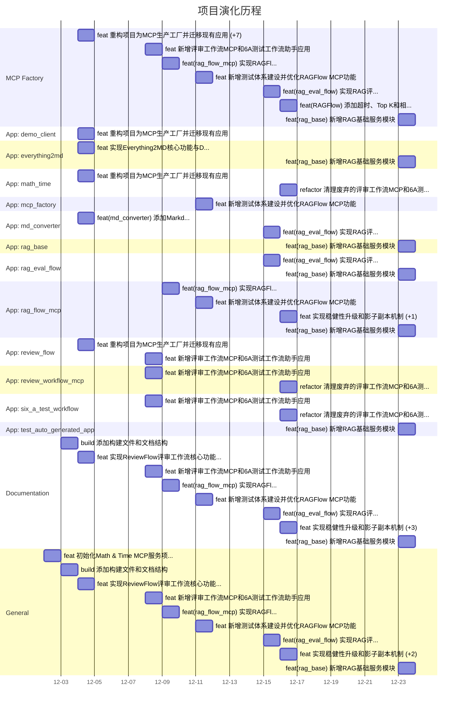

# 项目编年史 (Project Chronicle)

> 本文档由脚本自动生成，展示了 MCP 工厂及各应用的演化历程。

## 演化时间轴 (Evolution Timeline)

## 详细变更记录 (Detailed Changelog)
### MCP Factory
- **2025-12-23**
  - feat(rag_base): 新增RAG基础服务模块
- **2025-12-16**
  - feat(RAGFlow): 添加超时、Top K和相似度阈值配置参数
- **2025-12-15**
  - feat(rag_eval_flow): 实现RAG评估工作流的核心功能
- **2025-12-11**
  - feat: 新增测试体系建设并优化RAGFlow MCP功能
- **2025-12-09**
  - feat(rag_flow_mcp): 实现RAGFlow集成与评审文档自动处理功能
  - feat: 新增安防APP知识库文档及构建优化
- **2025-12-08**
  - feat: 新增评审工作流MCP和6A测试工作流助手应用
- **2025-12-04**
  - feat: 重构项目为MCP生产工厂并迁移现有应用
  - feat(md_converter): 添加Markdown转Word/PDF/Excel功能
  - feat(md_converter): 添加MD转换器发布文件及文档
  - fix(build): 修复PyInstaller打包问题并增强离线安全性
  - feat(converter): 增强Excel导出功能，支持复杂文本格式和自动样式
  - feat(build): 添加版本管理并优化构建流程
  - feat(build): 自动复制变更日志到发布目录
  - feat(everything2md): 添加配置文件支持并优化构建流程

### App: demo_client
- **2025-12-04**
  - feat: 重构项目为MCP生产工厂并迁移现有应用

### App: everything2md
- **2025-12-23**
  - feat(rag_base): 新增RAG基础服务模块
- **2025-12-04**
  - feat: 实现Everything2MD核心功能与Docker支持
  - feat(Everything2MD): 添加OCR支持并实现构建自动化
  - feat(everything2md): 添加配置文件支持并优化构建流程

### App: math_time
- **2025-12-16**
  - refactor: 清理废弃的评审工作流MCP和6A测试工作流相关代码及文档
- **2025-12-04**
  - feat: 重构项目为MCP生产工厂并迁移现有应用

### App: mcp_factory
- **2025-12-11**
  - feat: 新增测试体系建设并优化RAGFlow MCP功能

### App: md_converter
- **2025-12-15**
  - feat(rag_eval_flow): 实现RAG评估工作流的核心功能
- **2025-12-04**
  - feat(md_converter): 添加Markdown转Word/PDF/Excel功能
  - feat(md_converter): 添加MD转换器发布文件及文档
  - fix(build): 修复PyInstaller打包问题并增强离线安全性
  - feat(converter): 增强Excel导出功能，支持复杂文本格式和自动样式
  - feat(build): 添加版本管理并优化构建流程

### App: rag_base
- **2025-12-23**
  - feat(rag_base): 新增RAG基础服务模块

### App: rag_eval_flow
- **2025-12-23**
  - feat(rag_base): 新增RAG基础服务模块
- **2025-12-15**
  - feat(rag_eval_flow): 实现RAG评估工作流的核心功能
  - refactor(rag_eval_flow): 合并业务逻辑到server.py并重构代码结构

### App: rag_flow_mcp
- **2025-12-23**
  - feat(rag_base): 新增RAG基础服务模块
- **2025-12-16**
  - feat: 实现稳健性升级和影子副本机制
  - feat(RAGFlow): 添加超时、Top K和相似度阈值配置参数
- **2025-12-11**
  - feat: 新增测试体系建设并优化RAGFlow MCP功能
- **2025-12-09**
  - feat(rag_flow_mcp): 实现RAGFlow集成与评审文档自动处理功能
  - feat(rag_flow_mcp): 实现RAGFlow API集成并添加环境变量支持
  - feat: 实现RAGFlow MCP服务的四核引擎架构
  - feat: 新增安防APP知识库文档及构建优化
  - refactor: 重构RAGFlow MCP服务代码和文档
  - feat(RAG): 支持独立EXE运行并优化问答格式

### App: review_flow
- **2025-12-08**
  - feat: 新增评审工作流MCP和6A测试工作流助手应用
- **2025-12-04**
  - feat: 重构项目为MCP生产工厂并迁移现有应用

### App: review_workflow_mcp
- **2025-12-16**
  - refactor: 清理废弃的评审工作流MCP和6A测试工作流相关代码及文档
- **2025-12-08**
  - feat: 新增评审工作流MCP和6A测试工作流助手应用

### App: six_a_test_workflow
- **2025-12-16**
  - refactor: 清理废弃的评审工作流MCP和6A测试工作流相关代码及文档
- **2025-12-08**
  - feat: 新增评审工作流MCP和6A测试工作流助手应用

### App: test_auto_generated_app
- **2025-12-23**
  - feat(rag_base): 新增RAG基础服务模块

### Documentation
- **2025-12-23**
  - feat(rag_base): 新增RAG基础服务模块
- **2025-12-16**
  - feat: 实现稳健性升级和影子副本机制
  - feat(RAGFlow): 添加超时、Top K和相似度阈值配置参数
  - refactor: 清理废弃的评审工作流MCP和6A测试工作流相关代码及文档
  - docs(Git_Push_Fix): 添加验收报告和项目总结文档
- **2025-12-15**
  - feat(rag_eval_flow): 实现RAG评估工作流的核心功能
  - docs: 新增多个模块的文档文件
  - refactor(docs): 重构文档目录结构并更新内容
- **2025-12-11**
  - feat: 新增测试体系建设并优化RAGFlow MCP功能
- **2025-12-09**
  - feat(rag_flow_mcp): 实现RAGFlow集成与评审文档自动处理功能
  - feat: 实现RAGFlow MCP服务的四核引擎架构
  - feat: 新增安防APP知识库文档及构建优化
  - refactor: 重构RAGFlow MCP服务代码和文档
  - feat(RAG): 支持独立EXE运行并优化问答格式
- **2025-12-08**
  - feat: 新增评审工作流MCP和6A测试工作流助手应用
- **2025-12-04**
  - feat: 实现ReviewFlow评审工作流核心功能
  - feat: 实现Everything2MD核心功能与Docker支持
  - feat(Everything2MD): 添加OCR支持并实现构建自动化
  - feat(everything2md): 添加配置文件支持并优化构建流程
- **2025-12-03**
  - build: 添加构建文件和文档结构

### General
- **2025-12-23**
  - feat(rag_base): 新增RAG基础服务模块
- **2025-12-16**
  - feat: 实现稳健性升级和影子副本机制
  - feat(RAGFlow): 添加超时、Top K和相似度阈值配置参数
  - refactor: 清理废弃的评审工作流MCP和6A测试工作流相关代码及文档
- **2025-12-15**
  - feat(rag_eval_flow): 实现RAG评估工作流的核心功能
  - docs: 新增多个模块的文档文件
  - refactor(docs): 重构文档目录结构并更新内容
- **2025-12-11**
  - feat: 新增测试体系建设并优化RAGFlow MCP功能
- **2025-12-09**
  - feat(rag_flow_mcp): 实现RAGFlow集成与评审文档自动处理功能
  - feat(rag_flow_mcp): 实现RAGFlow API集成并添加环境变量支持
  - feat: 新增安防APP知识库文档及构建优化
  - refactor: 重构RAGFlow MCP服务代码和文档
- **2025-12-08**
  - feat: 新增评审工作流MCP和6A测试工作流助手应用
- **2025-12-04**
  - feat: 实现ReviewFlow评审工作流核心功能
  - feat: 重构项目为MCP生产工厂并迁移现有应用
  - feat(md_converter): 添加Markdown转Word/PDF/Excel功能
  - feat(md_converter): 添加MD转换器发布文件及文档
  - fix(build): 修复PyInstaller打包问题并增强离线安全性
  - feat(converter): 增强Excel导出功能，支持复杂文本格式和自动样式
  - feat(build): 添加版本管理并优化构建流程
  - feat(build): 自动复制变更日志到发布目录
  - feat(Everything2MD): 添加OCR支持并实现构建自动化
  - docs: 更新项目规则文档格式并删除旧架构设计文档
- **2025-12-03**
  - build: 添加构建文件和文档结构
- **2025-12-02**
  - feat: 初始化Math & Time MCP服务项目结构
  - feat: 添加减法工具并将时间获取从资源改为工具
