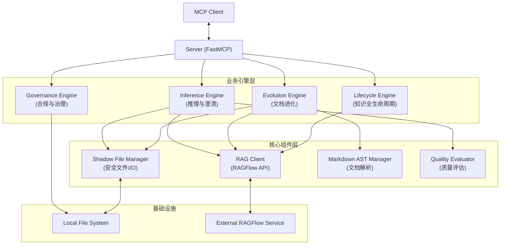

# 架构设计文档：RAG基础服务 (Design)

## 1. 总体架构 (L1: System Level)

本系统采用 **Engine-Centric (引擎为中心)** 的架构设计 (v2.0)，将核心业务逻辑拆分为四个独立的引擎，由 Server 层统一路由，底层共享 Core 组件和 Infrastructure。

## 2. 模块详细设计 (L2: Logic Implementation Level)

### 2.1 协议层 (src/apps/rag_flow_mcp/server.py)
- **框架**: `fastmcp`
- **职责**: 初始化四大引擎，注册 MCP Tools。
- **主要路由**:
  - `inference/*`: 澄清建议相关 (如 `fill_clarification_suggestions`)
  - `evolution/*`: 文档进化相关 (如 `evolve_scheme_document`)
  - `lifecycle/*`: 知识库管理 (如 `harvest_knowledge_candidates`)
  - `governance/*`: 合规检查 (如 `check_metadata_compliance`)

### 2.2 引擎层 (src/apps/rag_flow_mcp/engines/)

#### 2.2.1 推理引擎 (InferenceEngine)
- **职责**: 处理场景一（智能澄清）。
- **核心逻辑**:
  - `fill_clarification_suggestions`: 编排 RAG 检索与建议生成。
  - **流程**:
    1. 读取并解析问题文档。
    2. 提取 Context (Product/Module)。
    3. 调用 `RAGClient` 进行检索。
    4. 依赖 `QualityEvaluator` 进行结果评分。
    5. 生成建议并写入 Shadow File。

#### 2.2.2 进化引擎 (EvolutionEngine)
- **职责**: 处理文档的自动化演进。
- **核心逻辑**:
  - `evolve_scheme_document`: 基于澄清结果更新方案文档。
  - **流程**:
    1. 解析澄清文档中的决策点。
    2. 使用 `MarkdownASTManager` 定位原方案文档中的目标章节。
    3. 调用 LLM 生成新内容。
    4. 更新文档结构。

#### 2.2.3 生命周期引擎 (LifecycleEngine)
- **职责**: 知识库 CRUD 与收割。
- **核心逻辑**:
  - `harvest_knowledge_candidates`: 从文档中提取问答对，生成候选知识。
  - `promote_knowledge`: 将候选知识正式入库 (L1/L2)。

#### 2.2.4 治理引擎 (GovernanceEngine)
- **职责**: 质量门禁与合规。
- **核心逻辑**:
  - `check_metadata_compliance`: 检查文档是否包含必要的元数据 (Product, Module, Version)。
  - `validate_knowledge_conflict`: (规划中) 使用红蓝对抗机制检测新知识是否与旧知识冲突。

### 2.3 核心层 (src/apps/rag_flow_mcp/core/)
- **RAGClient**: 统一封装 RAGFlow API，支持重试、降级 (Exponential Backoff)。
- **ShadowFileManager**: 强制执行 `_ai_revision` 副本机制，保障原文件安全。
- **MarkdownASTManager**: 提供 AST 级别的文档读写能力，支持精准的章节替换。
- **QualityEvaluator**: 提供检索结果和生成内容的质量打分。

## 3. 数据流向 (Data Flow)

1. **Request**: MCP Client 调用 Tool (e.g., `fill_clarification_suggestions`).
2. **Server**: 路由至 `InferenceEngine`.
3. **Engine**: 
   - 读取 LocalFS 文件。
   - 调用 `RAGClient` 请求 RAGFlow。
4. **RAGClient**: HTTP 请求 RAGFlow API，获取 Chunks/Answers。
5. **Engine**: 处理业务逻辑 (评分、格式化)。
6. **Core**: `ShadowFileManager` 写入结果到 LocalFS。
7. **Response**: 返回 JSON 结果给 MCP Client。

## 4. 异常处理
- **初始化失败**: 若任一引擎初始化失败，Server 启动时记录 Error 但不崩溃，相关 Tool 不可用。
- **API 异常**: `RAGClient` 捕获所有 HTTP 异常，返回统一的 Error 结构。
- **文件冲突**: `ShadowFileManager` 确保文件名唯一，避免覆盖。
