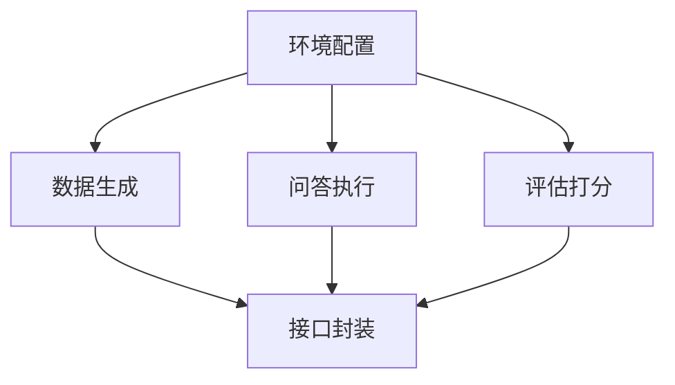

# 任务分解文档 (Task Document)

## 1. 任务列表

### 任务 1: 环境与依赖配置
*   **输入**: `pyproject.toml` / `requirements.txt`
*   **输出**: 安装必要的 Python 包 (`pandas`, `litellm` 等)。
*   **依赖**: 无

### 任务 2: 实现核心逻辑 - 数据生成 (`DataGenerator`)
*   **输入**: 知识库路径。
*   **输出**: `logic.py` 中的 `generate_qa_pairs` 函数。
*   **要求**: 
    *   读取文件内容。
    *   调用 LLM 构造 Prompt。
    *   解析 LLM 返回的 JSON/CSV 格式并保存。

### 任务 3: 实现核心逻辑 - 问答执行 (`QARunner`)
*   **输入**: 问题 CSV, 知识库路径。
*   **输出**: `logic.py` 中的 `run_rag_simulation` 函数。
*   **要求**:
    *   实现简单的上下文组装。
    *   并发调用 LLM 加速生成 (可选，先串行)。
    *   保存结果到 CSV。

### 任务 4: 实现核心逻辑 - 评估打分 (`Evaluator`)
*   **输入**: 两个 CSV 文件。
*   **输出**: `logic.py` 中的 `evaluate_results` 函数。
*   **要求**:
    *   合并两个 CSV (Key: Question)。
    *   调用 LLM 打分。
    *   保存最终 CSV。

### 任务 5: MCP Server 接口封装
*   **输入**: `logic.py`
*   **输出**: `server.py`
*   **要求**: 将上述函数封装为 `fastmcp` 工具。

## 2. 依赖关系图

