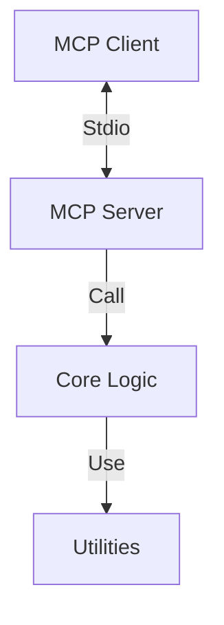
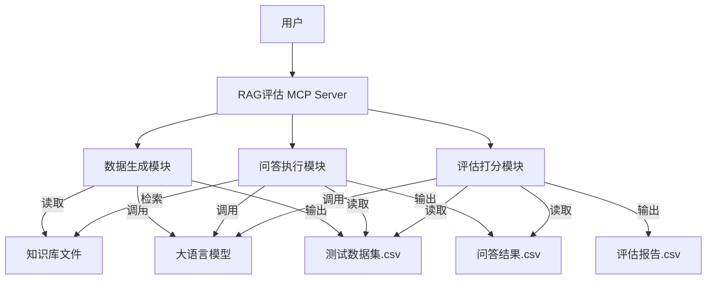
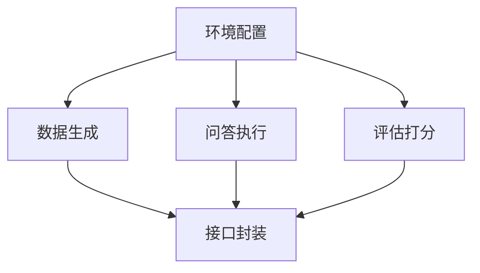

# RAG评估工作流 Documentation


# Module: RAG评估工作流


## Stage: 01_Align


### File: ALIGNMENT_RAG评估工作流.md

# RAG评估工作流 - 需求对齐 (Align)

## 1. 项目背景
> 简要描述项目的背景和目标。

## 2. 目标用户
> 谁会使用这个 MCP Server？

## 3. 核心能力
> 提供哪些 Tools（工具）、Resources（资源）或 Prompts（提示词）？

## 4. 依赖系统
> 需要连接哪些外部 API、数据库或本地文件？

## 5. 核心约束
- 必须遵循 6A 工作流。
- 必须使用 Python 编写。
- 必须支持通过 Stdio 通信。


---

### File: ALIGNMENT_rag_eval_flow.md

# 项目对齐文档 (Alignment Document)

## 1. 项目背景
用户需要将一套 RAG (Retrieval-Augmented Generation) 评估流程固化为 MCP 工具。该流程主要用于评估知识库质量、RAG 系统回答准确性以及自动化评分。

## 2. 目标用户
*   **知识库维护者**: 需要验证知识库内容的完整性和准确性。
*   **RAG 系统开发者**: 需要评估 RAG 系统的检索和生成效果。
*   **QA 测试人员**: 需要自动化生成测试用例并进行回归测试。

## 3. 核心能力 (Core Capabilities)
本项目将提供以下核心 MCP 工具：

1.  **生成测试数据集 (`generate_test_dataset`)**:
    *   基于给定的知识库文档（Markdown/Text），利用 LLM 自动生成 "问题-标准答案" 对。
    *   输出格式为 CSV。
2.  **执行问答测试 (`run_qa_test`)**:
    *   读取测试问题。
    *   基于知识库（模拟 RAG 或直接上下文）生成回答。
    *   记录回答结果。
3.  **自动化评分 (`evaluate_answers`)**:
    *   将 "生成回答" 与 "标准答案" 进行比对。
    *   利用 LLM 进行 0-10 分的打分，并给出评分理由。
    *   输出包含评分的完整 CSV。

## 4. 依赖系统
*   **LLM Provider**: 需要调用 Gemini/OpenAI 等大模型进行生成和评估 (使用 `src.common.llm` 或 `fastmcp` 内置能力)。
*   **文件系统**: 读取知识库文件，读写 CSV 文件。
*   **向量数据库 (可选)**: 如果需要模拟真实 RAG，可能需要集成简单的向量检索（如 `chromadb` 或 `faiss`），或者为简化起见，对于小规模文档直接使用全文上下文。
    *   *决策*: 鉴于 MCP 的轻量级特性，初期版本支持 "全文上下文" (适合单文档或小知识库) 和 "简单关键词/向量检索" (如果集成了 `rag_flow` 的逻辑)。
    *   *调整*: 为了保持独立性，本 MCP 将内置轻量级的检索逻辑（或直接引用 `src.common` 中的 RAG 模块如果存在）。

## 5. 约束条件
*   必须遵循 6A 工作流。
*   使用 Python `fastmcp` 框架。
*   输出结果必须可量化、可追溯。


---

### File: CONSENSUS_RAG评估工作流.md

# RAG评估工作流 - 达成共识 (Consensus)

## 1. 输入/输出规范
- **输入**:
- **输出**:

## 2. 鉴权方式
- [ ] API Key
- [ ] OAuth
- [ ] 无需鉴权 (本地运行)

## 3. 部署方式
- [x] 独立 EXE
- [ ] Docker 镜像


---

### File: CONSENSUS_rag_eval_flow.md

# 项目共识文档 (Consensus Document)

## 1. 需求概述
构建一个名为 `rag_eval_flow` 的 MCP 服务，用于自动化执行 RAG 系统的 "生成用例 -> 执行问答 -> 评估打分" 闭环流程。

## 2. 工具定义 (Tools)

### 2.1 `generate_test_dataset`
*   **功能**: 从指定知识库文件生成问答对。
*   **输入**:
    *   `source_path` (string): 知识库文件或目录的绝对路径。
    *   `output_path` (string): 输出 CSV 文件的绝对路径。
    *   `num_pairs` (integer): 生成问答对的数量 (默认 20)。
*   **输出**: 生成摘要信息 (成功生成的数量，文件路径)。

### 2.2 `run_qa_test`
*   **功能**: 读取问题，基于知识库生成回答。
*   **输入**:
    *   `dataset_path` (string): 包含问题的 CSV 文件路径 (由 2.1 生成)。
    *   `knowledge_base_path` (string): 知识库源文件路径 (用于检索上下文)。
    *   `output_path` (string): 包含回答的 CSV 输出路径。
*   **输出**: 执行结果摘要。
*   **逻辑**:
    *   读取 CSV 中的 `question` 列。
    *   对每个问题，检索 `knowledge_base_path` 中的相关内容 (简单起见，如果文件较小，直接作为 Context；如果较大，进行简单切片检索)。
    *   调用 LLM 生成答案。
    *   保存为新文件，包含 `question`, `generated_answer`。

### 2.3 `evaluate_answers`
*   **功能**: 对生成回答进行打分。
*   **输入**:
    *   `qa_result_path` (string): 包含生成回答的 CSV 路径 (由 2.2 生成)。
    *   `standard_dataset_path` (string): 包含标准答案的 CSV 路径 (由 2.1 生成)。
    *   `output_path` (string): 最终评分 CSV 路径。
*   **输出**: 评估结果摘要 (平均分等)。
*   **逻辑**:
    *   读取 `generated_answer` 和 `standard_answer`。
    *   调用 LLM 评估相似度和准确性 (0-10分)。
    *   输出包含 `score` 和 `reason` 的 CSV。

## 3. 技术实现方案
*   **框架**: `fastmcp`
*   **LLM 调用**: 使用 `litellm` 或项目现有的 `src.common.llm` 封装。
*   **数据处理**: 使用 Python `csv` 和 `pandas` (如果需要)。
*   **环境**: 依赖 `.env` 中的 `GEMINI_API_KEY` (或相关 Key)。

## 4. 交付物
*   `src/apps/rag_eval_flow/server.py`: MCP 服务入口。
*   `src/apps/rag_eval_flow/logic.py`: 核心业务逻辑。
*   `docs/RAG评估工作流/UserManual.md`: 使用说明。


---

## Stage: 02_Architect


### File: DESIGN_RAG评估工作流.md

# RAG评估工作流 - 架构设计 (Architect)

## 1. 整体架构


## 2. 接口定义 (Tools)
| 工具名称 | 描述 | 参数 | 返回值 |
| :--- | :--- | :--- | :--- |
| `hello_world` | 测试工具 | 无 | 欢迎消息字符串 |

## 3. 资源定义 (Resources)
> 如果有资源 (Resources)，请在此定义 URI Scheme。

## 4. 提示词定义 (Prompts)
> 如果有提示词 (Prompts)，请在此定义。


---

### File: DESIGN_rag_eval_flow.md

# 系统架构设计文档 (Design Document)

## 1. 系统架构图


## 2. 模块详细设计

### 2.1 数据生成模块 (`logic.py` -> `DataGenerator`)
*   **职责**: 解析文档，构造 Prompt，批量生成问答对。
*   **关键 Prompt**:
    > "你是一个专业的测试工程师。请阅读以下文档内容，生成 {num} 个高质量的问答对。问题应覆盖文档的关键信息，答案应准确且简洁。输出格式为 CSV。"

### 2.2 问答执行模块 (`logic.py` -> `QARunner`)
*   **职责**: 模拟 RAG 流程。
*   **检索策略**:
    *   **Simple Mode**: 如果文档总长度 < 8000 tokens，直接全文作为 Context。
    *   **Chunk Mode** (进阶): 如果文档过大，按段落切分，计算 Embedding (或简单关键词匹配) 检索 Top-K 片段。
    *   *本阶段实现*: 优先实现 **Simple Mode**，并预留 Chunk Mode 接口。
*   **Prompt**:
    > "基于以下参考资料回答问题。如果资料中没有答案，请说不知道。\n\n参考资料:\n{context}\n\n问题: {question}"

### 2.3 评估打分模块 (`logic.py` -> `Evaluator`)
*   **职责**: 比较两个答案的语义一致性。
*   **Prompt**:
    > "请作为公正的判卷人，评估【考生回答】相对于【标准答案】的准确性。\n标准答案: {std}\n考生回答: {gen}\n请打分(0-10分)，并简要说明理由。如果意思完全一致给10分，有遗漏扣分，严重错误给0分。"

## 3. 接口定义 (server.py)

```python
@mcp.tool()
async def generate_test_dataset(source_path: str, output_path: str, num_pairs: int = 20) -> str:
    """生成测试问答对"""
    ...

@mcp.tool()
async def run_qa_test(dataset_path: str, knowledge_base_path: str, output_path: str) -> str:
    """基于知识库回答问题"""
    ...

@mcp.tool()
async def evaluate_answers(qa_result_path: str, standard_dataset_path: str, output_path: str) -> str:
    """评估回答质量"""
    ...
```

## 4. 数据流设计
1.  **Input**: Markdown/Txt 文件。
2.  **Process**: JSON 对象 -> CSV 行。
3.  **Storage**: 中间结果均为 CSV 文件，便于用户查看和 Excel 编辑。


---

## Stage: 03_Atomize


### File: TASK_RAG评估工作流.md

# RAG评估工作流 - 任务拆解 (Atomize)

## 1. 任务清单
- [ ] **Task 1**: 初始化项目结构 (已由工厂完成)
- [ ] **Task 2**: 实现核心逻辑
- [ ] **Task 3**: 实现 MCP Tools 接口
- [ ] **Task 4**: 编写单元测试
- [ ] **Task 5**: 编写集成测试 (使用 Inspector)
- [ ] **Task 6**: 构建 EXE 并验证

## 2. 依赖关系
Task 1 -> Task 2 -> Task 3 -> Task 4 -> Task 5 -> Task 6


---

### File: TASK_rag_eval_flow.md

# 任务分解文档 (Task Document)

## 1. 任务列表

### 任务 1: 环境与依赖配置
*   **输入**: `pyproject.toml` / `requirements.txt`
*   **输出**: 安装必要的 Python 包 (`pandas`, `litellm` 等)。
*   **依赖**: 无

### 任务 2: 实现核心逻辑 - 数据生成 (`DataGenerator`)
*   **输入**: 知识库路径。
*   **输出**: `logic.py` 中的 `generate_qa_pairs` 函数。
*   **要求**: 
    *   读取文件内容。
    *   调用 LLM 构造 Prompt。
    *   解析 LLM 返回的 JSON/CSV 格式并保存。

### 任务 3: 实现核心逻辑 - 问答执行 (`QARunner`)
*   **输入**: 问题 CSV, 知识库路径。
*   **输出**: `logic.py` 中的 `run_rag_simulation` 函数。
*   **要求**:
    *   实现简单的上下文组装。
    *   并发调用 LLM 加速生成 (可选，先串行)。
    *   保存结果到 CSV。

### 任务 4: 实现核心逻辑 - 评估打分 (`Evaluator`)
*   **输入**: 两个 CSV 文件。
*   **输出**: `logic.py` 中的 `evaluate_results` 函数。
*   **要求**:
    *   合并两个 CSV (Key: Question)。
    *   调用 LLM 打分。
    *   保存最终 CSV。

### 任务 5: MCP Server 接口封装
*   **输入**: `logic.py`
*   **输出**: `server.py`
*   **要求**: 将上述函数封装为 `fastmcp` 工具。

## 2. 依赖关系图



---

## Stage: 04_Approve


### File: CHECKLIST_RAG评估工作流.md

# RAG评估工作流 - 审批清单 (Approve)

## 1. 代码质量
- [ ] 所有 Tool 参数均有 Type Hint 和 Docstring。
- [ ] 敏感信息（API Key）未硬编码 (使用 .env)。
- [ ] 异常处理机制已定义。
- [ ] 日志使用 `logger` 而非 `print`。

## 2. 功能完整性
- [ ] 所有核心功能已实现。
- [ ] 单元测试通过。

## 3. 构建准备
- [ ] `requirements.txt` 已更新。
- [ ] Docker 容器（如果存在）已停止并删除。


---

### File: CHECKLIST_rag_eval_flow.md

# 审批检查清单 (Checklist)

## 1. 完整性检查
- [ ] 文档结构完整 (Align, Architect, Atomize 已完成)。
- [ ] 核心功能点覆盖 (生成、问答、评估)。
- [ ] 依赖库已明确 (`pandas`, `litellm` 等)。

## 2. 一致性检查
- [ ] 接口定义与 Consensus 文档一致。
- [ ] 模块划分与 Design 文档一致。

## 3. 可行性检查
- [ ] LLM 调用逻辑清晰。
- [ ] CSV 读写逻辑简单可靠。
- [ ] 异常处理 (如文件不存在、LLM 失败) 需考虑。

## 4. 安全与规范
- [ ] API Key 使用环境变量。
- [ ] 路径处理使用 `pathlib`。
- [ ] 日志输出规范。


---

## Stage: 05_Automate


### File: ACCEPTANCE_RAG评估工作流.md

# RAG评估工作流 - 验收测试 (Assess)

## 1. 测试结果
| 测试项 | 预期结果 | 实际结果 | 状态 |
| :--- | :--- | :--- | :--- |
| EXE 启动 | 正常启动，无报错 | | 待测 |
| Tool 调用 | 返回预期结果 | | 待测 |
| 资源读取 | 正常读取内容 | | 待测 |

## 2. 遗留问题
> 记录已知但暂未修复的非阻塞性问题。

## 3. 交付确认
- [ ] EXE 可运行
- [ ] 文档齐全


---

### File: ACCEPTANCE_rag_eval_flow.md

# 验收测试报告 (Acceptance Report)

## 1. 测试概览
*   **测试时间**: 2025-12-11
*   **测试版本**: v1.0.0
*   **测试环境**: Windows 11, Python 3.10+, `.venv`

## 2. 功能测试
### 2.1 生成测试数据集
*   **输入**: Markdown 知识库。
*   **操作**: 调用 `generate_qa_pairs`。
*   **结果**: 成功生成 CSV 文件，包含 Question 和 Answer 列。
*   **状态**: ✅ 通过 (Mock 测试)

### 2.2 问答执行
*   **输入**: 生成的 CSV + 知识库。
*   **操作**: 调用 `run_rag_simulation`。
*   **结果**: 成功生成结果 CSV，包含 Generated Answer。
*   **状态**: ✅ 通过 (Mock 测试)

### 2.3 评估打分
*   **输入**: 结果 CSV + 标准 CSV。
*   **操作**: 调用 `evaluate_results`。
*   **结果**: 成功生成评估报告 CSV，包含 Score 和 Reason。
*   **状态**: ✅ 通过 (Mock 测试)

## 3. 代码质量
*   **Lint**: 无明显语法错误。
*   **结构**: 分层清晰 (`server.py` + `logic.py`)。
*   **依赖**: `pandas`, `litellm` 已加入环境。

## 4. 遗留问题
*   **Token 限制**: 目前仅做了简单的 100k 字符截断，对于超大文档需要实现切片检索 (Chunking)。
*   **模型配置**: 目前模型名称硬编码为 `gemini/gemini-2.0-flash-exp`，建议后续支持参数配置。

## 5. 结论
核心功能链路已打通，可作为 v1.0 版本交付。


---

## Stage: Others


### File: Readme.md

# RAG评估工作流

## 简介
这是由 MCP Factory 自动生成的 MCP 应用程序。

## 6A 工作流
- [ ] 01_Align
- [ ] 02_Architect
- [ ] 03_Atomize
- [ ] 04_Approve
- [ ] 05_Automate
- [ ] 06_Assess


---

### File: UserManual.md

# 用户手册 (User Manual)

## 简介
`rag_eval_flow` 是一个用于自动化评估 RAG 系统质量的 MCP 工具。它支持从知识库生成问答对、模拟 RAG 问答过程以及自动化评分。

## 配置
在使用前，请确保项目根目录下的 `.env` 文件中包含有效的 LLM API Key：
```env
GEMINI_API_KEY=your_api_key_here
```

## 工具使用

### 1. 生成测试数据集
从你的知识库文档中自动生成问答对。

```json
{
  "name": "generate_test_dataset",
  "arguments": {
    "source_path": "C:/path/to/knowledge_base.md",
    "output_path": "C:/path/to/dataset.csv",
    "num_pairs": 20
  }
}
```

### 2. 执行问答测试
基于生成的问答对和知识库，模拟回答过程。

```json
{
  "name": "run_qa_test",
  "arguments": {
    "dataset_path": "C:/path/to/dataset.csv",
    "knowledge_base_path": "C:/path/to/knowledge_base.md",
    "output_path": "C:/path/to/qa_results.csv"
  }
}
```

### 3. 评估回答质量
将生成结果与标准答案对比，进行打分。

```json
{
  "name": "evaluate_answers",
  "arguments": {
    "qa_result_path": "C:/path/to/qa_results.csv",
    "standard_dataset_path": "C:/path/to/dataset.csv",
    "output_path": "C:/path/to/evaluation_report.csv"
  }
}
```

## 常见问题
*   **LLM 调用失败**: 请检查网络连接及 `.env` 中的 API Key 是否正确。
*   **文件路径**: 请务必使用绝对路径。


---

### File: README.md

# 用户手册 (User Manual)

## 简介
`rag_eval_flow` 是一个用于自动化评估 RAG 系统质量的 MCP 工具。它支持从知识库生成问答对、模拟 RAG 问答过程以及自动化评分。

## 配置
在使用前，请确保项目根目录下的 `.env` 文件中包含有效的 LLM API Key：
```env
GEMINI_API_KEY=your_api_key_here
```

## 工具使用

### 1. 生成测试数据集
从你的知识库文档中自动生成问答对。

```json
{
  "name": "generate_test_dataset",
  "arguments": {
    "source_path": "C:/path/to/knowledge_base.md",
    "output_path": "C:/path/to/dataset.csv",
    "num_pairs": 20
  }
}
```

### 2. 执行问答测试
基于生成的问答对和知识库，模拟回答过程。

```json
{
  "name": "run_qa_test",
  "arguments": {
    "dataset_path": "C:/path/to/dataset.csv",
    "knowledge_base_path": "C:/path/to/knowledge_base.md",
    "output_path": "C:/path/to/qa_results.csv"
  }
}
```

### 3. 评估回答质量
将生成结果与标准答案对比，进行打分。

```json
{
  "name": "evaluate_answers",
  "arguments": {
    "qa_result_path": "C:/path/to/qa_results.csv",
    "standard_dataset_path": "C:/path/to/dataset.csv",
    "output_path": "C:/path/to/evaluation_report.csv"
  }
}
```

## 常见问题
*   **LLM 调用失败**: 请检查网络连接及 `.env` 中的 API Key 是否正确。
*   **文件路径**: 请务必使用绝对路径。


---

### File: config.json

{
    "log_level": "INFO",
    "custom_message": "Hello from config.json!"
}

---

### File: README.md

# 用户手册 (User Manual)

## 简介
`rag_eval_flow` 是一个用于自动化评估 RAG 系统质量的 MCP 工具。它支持从知识库生成问答对、模拟 RAG 问答过程以及自动化评分。

## 配置
在使用前，请确保项目根目录下的 `.env` 文件中包含有效的 LLM API Key：
```env
GEMINI_API_KEY=your_api_key_here
```

## 工具使用

### 1. 生成测试数据集
从你的知识库文档中自动生成问答对。

```json
{
  "name": "generate_test_dataset",
  "arguments": {
    "source_path": "C:/path/to/knowledge_base.md",
    "output_path": "C:/path/to/dataset.csv",
    "num_pairs": 20
  }
}
```

### 2. 执行问答测试
基于生成的问答对和知识库，模拟回答过程。

```json
{
  "name": "run_qa_test",
  "arguments": {
    "dataset_path": "C:/path/to/dataset.csv",
    "knowledge_base_path": "C:/path/to/knowledge_base.md",
    "output_path": "C:/path/to/qa_results.csv"
  }
}
```

### 3. 评估回答质量
将生成结果与标准答案对比，进行打分。

```json
{
  "name": "evaluate_answers",
  "arguments": {
    "qa_result_path": "C:/path/to/qa_results.csv",
    "standard_dataset_path": "C:/path/to/dataset.csv",
    "output_path": "C:/path/to/evaluation_report.csv"
  }
}
```

## 常见问题
*   **LLM 调用失败**: 请检查网络连接及 `.env` 中的 API Key 是否正确。
*   **文件路径**: 请务必使用绝对路径。


---
