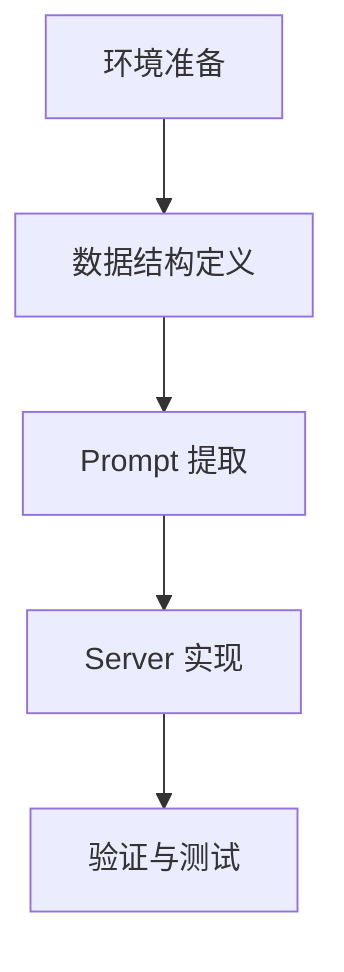

# TASK_ReviewFlow: 任务拆解

## 依赖图

## 原子任务清单

### Task 1: 环境与依赖确认
- [x] 确认 `mcp[cli]` 已安装
- [x] 确认 `python 3.13` 环境
- [ ] 确认 `src/review_flow.py` 文件位置

### Task 2: 数据结构定义 (src/review_flow.py)
- **Input**: 无
- **Output**: `ReviewState` Enum, `ReviewContext` Pydantic Model
- **Constraints**: 包含所有 `6a.md` 阶段

### Task 3: 6A 规则 Prompt 提取
- **Input**: `6a.md`
- **Output**: `STAGES_PROMPTS` 字典
- **Constraints**: 将 markdown 文本硬编码或加载到 Server 中，按阶段索引

### Task 4: Server 核心逻辑实现
- **Input**: FastMCP 框架
- **Output**: `review_flow.py` 包含 4 个核心 Tool
- **Subtasks**:
  - `start_review`: 初始化目录和 JSON
  - `get_current_instruction`: 查表返回 Prompt
  - `submit_work`: 检查文件存在性 -> 切换状态
  - `check_human_response`: 检查 06 文件内容 -> 切换状态

### Task 5: 本地验证
- **Input**: Client (Inspector or simple script)
- **Output**: 成功跑通一个 Happy Path
- **Acceptance Criteria**: 能够从 Stage 0 走到 Completed，状态流转正确
