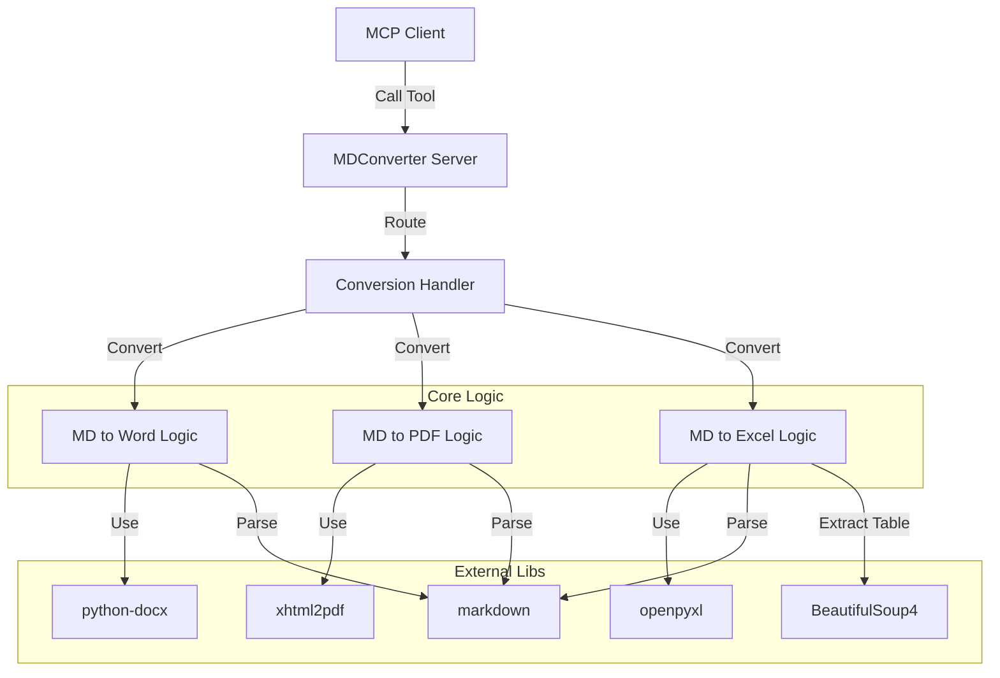

# DESIGN_MD转多格式MCP

## 1. 系统架构图 (Mermaid)



## 2. 模块设计

### 2.1 Server Entry (`src/apps/md_converter/server.py`)
- 初始化 `FastMCP("MDConverter")`。
- 注册 Tools:
  - `convert_to_word(source: str, target: str)`
  - `convert_to_pdf(source: str, target: str)`
  - `convert_to_excel(source: str, target: str)`

### 2.2 Conversion Logic
为保持代码清晰，建议将具体转换逻辑分离到 `src/apps/md_converter/utils.py` 或直接在 `server.py` 中以辅助函数形式存在（若逻辑不复杂）。考虑到扩展性，建议:

- **MarkdownLoader**: 统一读取 MD 文件内容。
- **WordConverter**: 
  - 读取 MD -> 转换为 HTML/AST -> 映射到 docx 样式。
  - *简化版*: 使用 `pypandoc` (需系统安装 pandoc) 或 `markdown2` + `htmldocx`。
  - *纯Python版*: 使用 `markdown` 生成 HTML，然后用 `BeautifulSoup` 解析 HTML 结构，逐个节点写入 `python-docx`。这是最稳健的纯 Python 方案。
- **PDFConverter**:
  - 读取 MD -> `markdown` 转 HTML -> 添加 CSS (中文字体支持) -> `xhtml2pdf` 生成 PDF。
- **ExcelConverter**:
  - 读取 MD -> `markdown` 转 HTML -> `BeautifulSoup` 提取 `<table>` -> 遍历 `<tr>` `<td>` -> 写入 `openpyxl` Workbook。

## 3. 接口设计 (API Contract)

### Tool: `convert_to_word`
- **Args**:
  - `source_path` (string): 源 Markdown 文件绝对路径。
  - `output_path` (string): 目标 .docx 文件绝对路径。
- **Returns**:
  - `string`: 成功提示 "Successfully converted ... to ..." 或 错误信息。

### Tool: `convert_to_pdf`
- **Args**:
  - `source_path` (string): 源 Markdown 文件绝对路径。
  - `output_path` (string): 目标 .pdf 文件绝对路径。
- **Returns**:
  - `string`: 成功提示 或 错误信息。

### Tool: `convert_to_excel`
- **Args**:
  - `source_path` (string): 源 Markdown 文件绝对路径。
  - `output_path` (string): 目标 .xlsx 文件绝对路径。
- **Returns**:
  - `string`: 成功提示 (包含提取的表格数量) 或 错误信息。

## 4. 异常处理策略
- **FileNotFoundError**: 检查 source_path，返回明确错误。
- **PermissionError**: 检查 output_path 写权限。
- **ConversionError**: 捕获转换库抛出的异常 (如 HTML 解析失败)，包装后返回友好提示。
- **FontError (PDF)**: 预埋字体配置，若失败尝试回退或提示用户安装字体 (Windows 环境通常有 SimHei/Microsoft YaHei)。

## 5. 目录结构
```
src/apps/md_converter/
├── __init__.py
├── server.py       # MCP 入口与 Tool 定义
└── converters.py   # 具体的转换逻辑实现 (Word, PDF, Excel)
```
