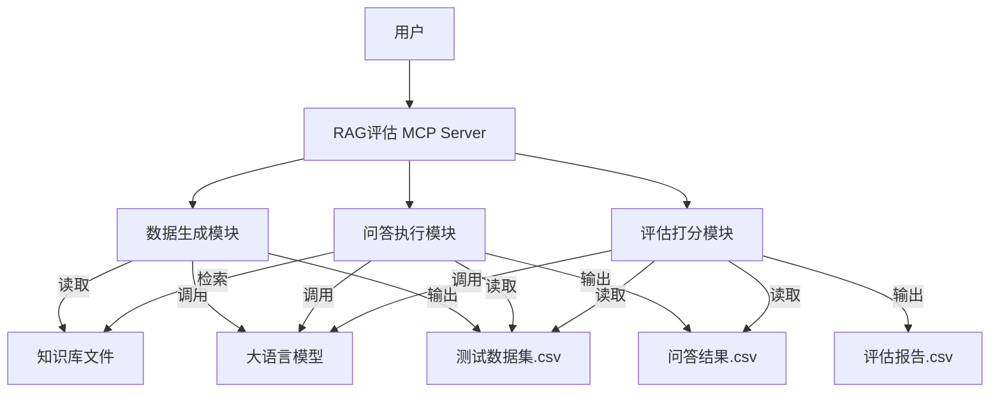

# 系统架构设计文档 (Design Document)

## 1. 系统架构图


## 2. 模块详细设计

### 2.1 数据生成模块 (`logic.py` -> `DataGenerator`)
*   **职责**: 解析文档，构造 Prompt，批量生成问答对。
*   **关键 Prompt**:
    > "你是一个专业的测试工程师。请阅读以下文档内容，生成 {num} 个高质量的问答对。问题应覆盖文档的关键信息，答案应准确且简洁。输出格式为 CSV。"

### 2.2 问答执行模块 (`logic.py` -> `QARunner`)
*   **职责**: 模拟 RAG 流程。
*   **检索策略**:
    *   **Simple Mode**: 如果文档总长度 < 8000 tokens，直接全文作为 Context。
    *   **Chunk Mode** (进阶): 如果文档过大，按段落切分，计算 Embedding (或简单关键词匹配) 检索 Top-K 片段。
    *   *本阶段实现*: 优先实现 **Simple Mode**，并预留 Chunk Mode 接口。
*   **Prompt**:
    > "基于以下参考资料回答问题。如果资料中没有答案，请说不知道。\n\n参考资料:\n{context}\n\n问题: {question}"

### 2.3 评估打分模块 (`logic.py` -> `Evaluator`)
*   **职责**: 比较两个答案的语义一致性。
*   **Prompt**:
    > "请作为公正的判卷人，评估【考生回答】相对于【标准答案】的准确性。\n标准答案: {std}\n考生回答: {gen}\n请打分(0-10分)，并简要说明理由。如果意思完全一致给10分，有遗漏扣分，严重错误给0分。"

## 3. 接口定义 (server.py)

```python
@mcp.tool()
async def generate_test_dataset(source_path: str, output_path: str, num_pairs: int = 20) -> str:
    """生成测试问答对"""
    ...

@mcp.tool()
async def run_qa_test(dataset_path: str, knowledge_base_path: str, output_path: str) -> str:
    """基于知识库回答问题"""
    ...

@mcp.tool()
async def evaluate_answers(qa_result_path: str, standard_dataset_path: str, output_path: str) -> str:
    """评估回答质量"""
    ...
```

## 4. 数据流设计
1.  **Input**: Markdown/Txt 文件。
2.  **Process**: JSON 对象 -> CSV 行。
3.  **Storage**: 中间结果均为 CSV 文件，便于用户查看和 Excel 编辑。
