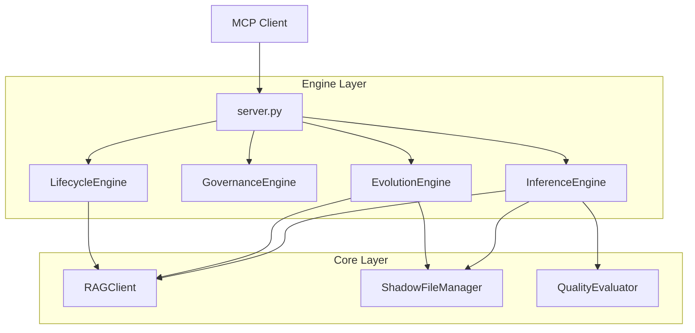
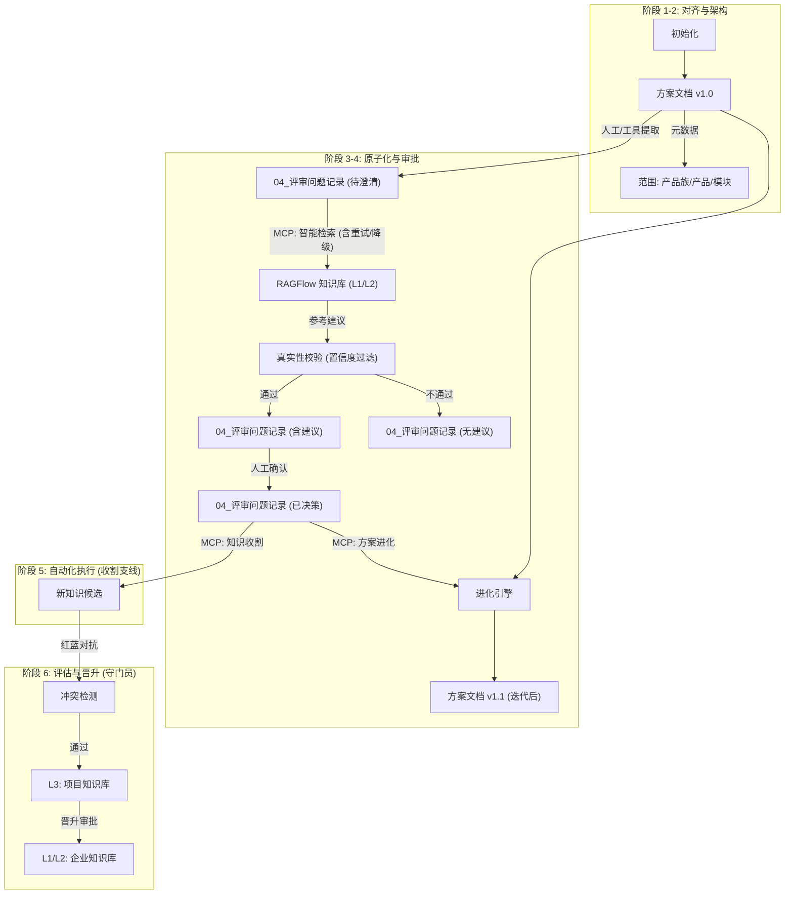

# 架构设计：RAG Flow MCP (rag_flow_mcp)

## 1. 核心理念：评审即知识管理

本方案将分散的 RAG 增强、风险控制、知识沉淀等机制，统一整合进标准的 **6A 评审工作流** 中。
核心目标双线并行：
1.  **主线**: 帮助用户利用知识库澄清方案，并基于澄清结果**迭代进化**原方案文档。
2.  **支线**: 将评审过程中产生的新知识收纳、验证并更新回知识库。

两条线**完全解耦**，分别触发，但共享同一个 Markdown 持久化状态。

## 2. 统一架构视图 (Unified Architecture)

系统采用严格的四层架构设计，实现关注点分离。

| 层级 | 核心组件 | 职责 |
| :--- | :--- | :--- |
| **L1 Interface** | `server.py` | **协议适配**: 处理 MCP JSON-RPC 请求，参数校验，统一日志与异常捕获。 |
| **L2 Engine** | `engines/*.py` | **业务编排**: 实现四大核心引擎 (Inference, Governance, Evolution, Lifecycle)。 |
| **L3 Core** | `core/*.py` | **通用能力**: 提供 RAG 客户端、文件操作、AST 解析、质量评估等底层服务。 |
| **L4 Infra** | `RAGFlow`, `FS` | **基础设施**: 外部依赖的 RAG 服务和本地文件系统。 |



## 3. 核心机制详解

#### 3.0.3 基础服务层 (Foundation Layer)
*   **FileService**: 统一封装文件系统操作。
    *   `read_text(path)`
    *   `write_text(path, content)`
    *   `create_shadow_copy(path, content)`
*   **RAGClient**: 统一封装 RAGFlow API 调用。
*   **QueryRewriter**: 统一的查询改写服务。
    *   `rewrite(query, context) -> str`: 将自然语言改写为优化后的 RAG 检索词。

### 3.1 影子副本机制 (Shadow Copy Strategy) - [核心]

**目标**: 确保 AI 操作的安全性，防止不可逆的数据丢失。

**逻辑**:
1. **Read**: 读取原文件内容。
2. **Modify**: 在内存中进行修改。
3. **Write Shadow**: 将修改后的内容写入新文件 `*_ai_revision_<timestamp>.<ext>`。
4. **Generate Diff**: (可选) 对比原内容与新内容，生成 Unified Diff 格式的 Markdown 报告。
5. **Return**: 返回影子文件路径，由用户决定是否覆盖原文件。

### 3.2 代理式检索 (Agentic RAG Search) - [核心]

**目标**: 提高检索的准确性和鲁棒性。

**逻辑**:
1. **Strict Query**: 首次尝试使用严格的 Prompt（强调不幻觉）进行检索。
2. **Confidence Check**: 检查返回的 `score`。若 `< 0.5`，进入重试流程。
3. **Retry Strategy**:
   * 去除上下文中的噪声，提取核心关键词。
   * 放宽搜索条件进行二次检索。
4. **Synthesis**: 若本地上下文与 RAG 知识存在冲突（模拟），在答案中追加警告。

#### 4.5.3 知识库管理工具 (KB CRUD)
*   **Dataset Ops**:
    *   `mcp_rag_base_create_dataset(name, avatar, description)`: 创建知识库。
    *   `mcp_rag_base_delete_dataset(id)`: 删除知识库。
    *   `mcp_rag_base_list_datasets(page, page_size)`: 列出知识库。
    *   `mcp_rag_base_update_dataset(id, name, description)`: 更新知识库元数据。
*   **Document Ops**:
    *   `mcp_rag_base_upload_document(dataset_id, file_path)`: 上传文件。
    *   `mcp_rag_base_delete_document(dataset_id, document_id)`: 删除文件。
    *   `mcp_rag_base_update_document(dataset_id, document_id, name, enabled)`: 更新文件状态。
    *   `mcp_rag_base_get_document_content(dataset_id, document_id)`: 获取解析后的切片内容。
    *   `mcp_rag_base_list_documents(dataset_id, page, page_size, keywords)`: 列出文件。

---

## 4. 引擎工作流细节

### 4.1 推理引擎 (InferenceEngine)

*   **职责**: 处理基于上下文的 RAG 检索与建议填充。
*   **核心工具**: `fill_clarification_suggestions`
*   **逻辑**:
    1.  **Read**: 调用 `FileService.read_text(doc_path)` 读取文档内容。
    2.  **Parse**: 正则提取 `## [index].[title]` 块和 Header 元数据。
    3.  **Search**: 对每个问题，调用 `RAGClient.agentic_search` 获取建议。
        *   **Prompt (Query Rewrite)**:
            ```text
            Role: 搜索专家
            Task: 将用户问题转化为适合向量检索的独立查询语句。
            Input:
              - 原始问题: {question}
              - 上下文片段: {context_snippet}
            Output: 仅输出改写后的查询语句，去除无关词汇。
            ```
    4.  **Verify**: 调用 `QualityEvaluator` 进行拒绝回答检测和置信度过滤。
        *   **Prompt (Answer Verification)**:
            ```text
            Role: 质量审计员
            Task: 验证生成的回答是否完全基于提供的参考文档。
            Input:
              - 问题: {question}
              - 参考文档: {references}
              - 生成回答: {answer}
            Output: JSON格式
              - score: 0.0-1.0 (置信度)
              - reason: 评分理由
              - has_hallucination: boolean
            ```
    5.  **Inject**: 将通过校验的建议注入到文档内容中。
    6.  **Write**: 调用 `FileService.create_shadow_copy(doc_path, new_content)` 生成影子文件。

### 4.2 治理引擎 (GovernanceEngine)

*   **职责**: 元数据检查与冲突检测。
*   **核心工具**: `check_metadata_compliance`, `validate_knowledge_conflict`
*   **逻辑**:
    1.  **Read**: 调用 `FileService.read_text(doc_path)`。
    2.  **Parse**: 解析 YAML Front Matter。
    3.  **Validate**: 校验必填字段 (`product`, `module`, `version`) 是否存在且非空。
    4.  **Conflict Check**: (针对 `validate_knowledge_conflict`) 调用 `RAGClient` 检索相似知识，计算语义冲突分值。
        *   **Prompt (Conflict Detection)**:
            ```text
            Role: 知识库管理员
            Task: 检测新知识是否与现有知识库存在事实冲突。
            Input:
              - 候选知识: {candidate_qa}
              - 现有相关知识: {existing_knowledge_chunks}
            Output: JSON格式
              - conflict_score: 0.0 (无冲突) - 1.0 (完全矛盾)
              - conflict_reason: 冲突的具体点
              - suggestion: "merge" | "reject" | "new_entry"
            ```

### 4.3 进化引擎 (EvolutionEngine)

*   **职责**: 基于澄清结果自动修订方案文档。
*   **核心工具**: `evolve_scheme_document`
*   **逻辑**:
    1.  **Read Decisions**: 调用 `FileService.read_text` 读取澄清文档，提取 `**问题**` 和 `**回答**` 对。
    2.  **Read Scheme**: 调用 `FileService.read_text` 读取原方案文档。
    3.  **LLM Reasoning**: 对每个决策点，调用 `RAGClient` 询问 LLM 应修改哪个章节 (Header) 以及新内容是什么。
        *   **Prompt (Document Evolution)**:
            ```text
            Role: 资深技术文档工程师
            Task: 基于澄清的问题和答案，更新原设计文档的相关章节。
            Input:
              - 原文档片段: {original_section}
              - 澄清问题: {question}
              - 确认答案: {answer}
            Constraints:
              - 保持原文档风格和Markdown格式。
              - 仅修改必要部分，不要重写整个章节。
              - 如果答案通过，必须将相关信息融合进正文。
            Output: 更新后的Markdown内容。
            ```
    4.  **AST Modify**: 使用 `MarkdownASTManager` 精确替换目标章节内容。
    5.  **Write**: 调用 `FileService.create_shadow_copy` 生成包含所有修订的 v1.1 影子文档。

### 4.4 生命周期引擎 (LifecycleEngine)

*   **职责**: 知识提取、晋升与同步。
*   **核心工具**: `harvest_knowledge_candidates`, `promote_knowledge`
*   **逻辑**:
    1.  **Harvest**:
        *   调用 `FileService.read_text` 读取澄清文档。
        *   正则提取已标记为 `[x]` 且包含有效 `**回答**` 的条目。
        *   **Refinement**: 调用 LLM 进行知识标准化。
            *   **Prompt (Knowledge Refinement)**:
                ```text
                Role: 知识加工专员
                Task: 从非结构化的问答记录中提取标准化的Q&A对。
                Input:
                  - 原始记录: {raw_record}
                Output: JSON格式
                  - question: 独立、完整的疑问句
                  - answer: 准确、精炼的回答
                  - tags: [关键词列表]
                ```
        *   构建 Candidate 对象 (含 Metadata)。
    2.  **Promote**:
        *   接收 Candidate JSON。
        *   调用 `FileService.write_json` 将其保存到 L1/L2 知识库目录。
        *   (未来扩展) 调用 `RAGClient.upload_document` 直接上传到 RAGFlow。

### 4.5 基础工具 (Base Tools / Implementation Layer)

*   **职责**: 提供无状态的原子操作，供 Client 直接调用或供 Agent 编排。
*   **核心工具**: `mcp_rag_base_*`
*   **逻辑**:
    *   **File Ops**: 直接透传调用 `FileService` 的 `read_text`, `write_text` (慎用), `list_files`。
    *   **RAG Ops**: 直接透传调用 `RAGClient` 的 `create_dataset`, `upload_document`, `retrieve_chunks` 等 API。
    *   **无业务逻辑**: 不进行任何复杂的业务判断或流程控制。

#### 4.5.1 原子工具 (Atomic Tools)
*   `mcp_rag_base_fill_clarification_suggestions`
*   `mcp_rag_base_create_shadow_file`
*   `mcp_rag_base_extract_questions_from_doc`
*   `mcp_rag_base_retrieve_rag_suggestion`
*   `mcp_rag_base_apply_suggestions_to_doc`

#### 4.5.2 质量与可视化工具 (QA & Viz)
*   `mcp_rag_flow_view_diff`: 调用 `view_last_diff` 显示差异。
*   `mcp_rag_flow_add_test_case`: 调用 `capture_test_case` 录制测试数据。

---

## 5. 异常处理与降级

*   **RAG 服务不可用**: `RAGClient` 内置重试机制 (Retries=1)。若最终失败，返回“服务暂时不可用”的降级回答，不中断整个流程。
*   **解析失败**: 若 LLM 返回的 JSON 格式错误，记录 Error Log 并跳过该条目的处理，继续执行后续任务。
*   **文件不存在**: 快速失败，返回明确的错误信息。

## 7. 配置管理设计

*   **加载库**: 使用 `python-dotenv`。
*   **加载策略**:
    1.  优先加载环境变量。
    2.  其次加载项目根目录下的 `.env`。
    3.  最后加载 EXE 同级目录下的 `.env` (针对打包后环境)。
*   **核心配置项**:
    *   `RAGFLOW_API_KEY`: 必填。
    *   `RAGFLOW_HOST_URL`: 必填，RAGFlow 服务地址。
    *   `LOG_LEVEL`: 可选，默认 INFO。


