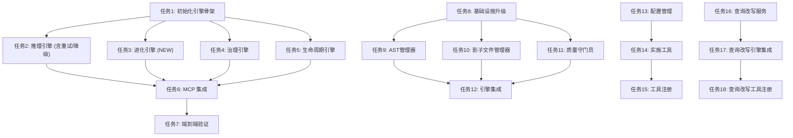

# 任务清单：RAG Flow MCP (统一版 v2.2)

## 1. 任务依赖图

## 2. 原子任务清单 (5W1H)

### 任务 1: 初始化核心引擎骨架 (Init Engine Scaffold)

* **责任人**: 开发者
* **内容**: 创建 `src/apps/rag_flow_mcp/engines/` 目录结构，并定义基类接口。
* **位置**: `src/apps/rag_flow_mcp/engines/` (`__init__.py`, `inference.py`, `evolution.py`, `governance.py`, `lifecycle.py`)。
* **目的**: 解耦模块，支持新增的“进化引擎”。
* **步骤**:
  1. 创建空文件结构。
  2. 重构 `config.py`，支持重试参数配置。
  3. 定义抽象基类 (ABC)。

### 任务 2: 实现推理引擎 (Implement Inference Engine)

* **责任人**: 开发者
* **内容**: 实现基于 RAGFlow 的智能检索与建议生成，**必须包含重试和降级逻辑**。
* **位置**: `src/apps/rag_flow_mcp/engines/inference.py`。
* **目的**: **主线能力**，提供澄清建议，并确保高可用和真实性。
* **步骤**:
  1. 实现 `search(query, metadata_scope)`:
     *   增加 **Retry 装饰器** (3次重试，指数退避)。
     *   增加 **Fallback 逻辑** (失败返回默认空结果)。
  2. 实现 `verify_truthfulness(results)`:
     *   检查置信度 (Confidence Score)。
     *   若低于阈值，标记为“无有效信息”。
  3. 实现 `fill_clarification_doc(doc_path)`: 读取 Markdown，填充 `**AI 参考建议**`，更新 Checkbox 状态。

### 任务 3: 实现进化引擎 (Implement Evolution Engine) **[NEW]**

* **责任人**: 开发者
* **内容**: 基于澄清结果，自动迭代方案文档。
* **位置**: `src/apps/rag_flow_mcp/engines/evolution.py`。
* **目的**: **主线核心价值**，实现方案的自我进化。
* **步骤**:
  1. 实现 `evolve_scheme(doc_path, clarification_doc_path)`。
  2. 提示词 (Prompt) 设计: "基于以下问答对，修改方案文档的对应章节..."。
  3. 实现 Markdown 文档的精确插入与修订记录更新。

### 任务 4: 实现治理引擎 (Implement Governance Engine)

* **责任人**: 开发者
* **内容**: 元数据管理与冲突检测。
* **位置**: `src/apps/rag_flow_mcp/engines/governance.py`。
* **目的**: 多产品线区分与防污染。
* **步骤**:
  1. 实现分层元数据解析 (`family`, `product`, `module`)。
  2. 实现 `validate_conflict`: 确保新知识不与现有知识库冲突。

### 任务 5: 实现生命周期引擎 (Implement Lifecycle Engine)

* **责任人**: 开发者
* **内容**: 知识收割、晋升与浏览。
* **位置**: `src/apps/rag_flow_mcp/engines/lifecycle.py`。
* **目的**: **支线能力**，沉淀与管理知识。
* **步骤**:
  1. 实现 `harvest_candidates`: 仅提取 `[x]` 且含 `**回答**` 的条目。
  2. 实现 `promote_to_golden`: 将项目知识晋升到产品/企业知识库。
  3. 实现 `list_knowledge_bases`: 列出知识库列表。
  4. 实现 `list_knowledge_base_files`: 列出知识库文件列表。

### 任务 6: MCP Server 接口适配 (MCP Integration)

* **责任人**: 开发者
* **内容**: 注册 MCP 工具。
* **位置**: `src/apps/rag_flow_mcp/server.py`。
* **工具列表**:
  1. `check_metadata_compliance` (治理: 检查元数据合规性)
  2. `fill_clarification_suggestions` (推理: 填充澄清建议)
  3. `evolve_scheme_document` (进化: 演进方案文档)
  4. `harvest_knowledge_candidates` (生命周期: 收割知识候选)
  5. `validate_knowledge_conflict` (治理: 验证知识冲突)
  6. `promote_knowledge` (生命周期: 晋升知识)
  7. `list_knowledge_bases` (生命周期: 知识库列表)
  8. `list_knowledge_base_files` (生命周期: 知识库文件)

### 任务 7: 端到端验证 (E2E Verification)

* **责任人**: 开发者
* **内容**: 验证主线（澄清->进化）和支线（收割->晋升），以及容错能力。
* **步骤**:
  1. **场景 1 (主线)**: 生成问题 -> AI 建议 -> 人工确认 -> 方案自动进化。
  2. **场景 3 (容错)**: 模拟 RAG 服务断开，验证系统是否触发重试并优雅降级。
  3. **场景 4 (防幻觉)**: 提问无关问题，验证系统是否拒绝编造答案。

## 3. v2.1 生产环境升级任务 (P0)

### 任务 8: 基础设施升级 (Infrastructure Upgrade)
*   **依赖安装**: 更新 `requirements.txt`，添加 `markdown-it-py`, `mdformat`, `litellm`。
*   **测试准备**: 创建 `tests/golden_dataset.json` 和 `tests/test_inference_quality.py`。
*   **Git 移除**: 移除 Git 相关依赖。

### 任务 9: 实现 AST 管理器 (Implement AST Manager)
*   **位置**: `src/apps/rag_flow_mcp/core/markdown_ast.py`
*   **内容**:
    *   `parse(content) -> tokens`
    *   `find_header(tokens, header_text) -> index`
    *   `replace_section(tokens, header_text, new_content)`
    *   `render(tokens) -> str`

### 任务 10: 实现影子文件管理器 (Implement Shadow File Manager)
*   **位置**: `src/apps/rag_flow_mcp/core/shadow_file_manager.py`
*   **内容**:
    *   `generate_shadow_copy(original_path, new_content) -> (shadow_path, diff_path)`
    *   `generate_diff_report(old, new) -> str` (使用 difflib)

### 任务 11: 实现质量守门员 (Implement Quality Gatekeeper)
*   **位置**: `src/apps/rag_flow_mcp/core/evaluator.py` (升级)
*   **内容**:
    *   实现 `evaluate_similarity(actual, expected) -> float`。
    *   集成到 `tests/test_inference_quality.py`。

### 任务 12: 引擎集成 (Engine Integration)
*   **进化引擎升级**: 修改 `EvolutionEngine`，使用 `MarkdownASTManager` 处理内容，使用 `ShadowFileManager` 保存结果。
*   **推理引擎升级**: 修改 `InferenceEngine`，使用 `ShadowFileManager` 生成建议填充后的副本。

## 4. v2.2 基础架构升级任务

### 任务 13: 实施配置管理 (Implement Config Management)
*   **责任人**: 开发者
*   **文件**: `src/apps/rag_flow_mcp/config.py`, `src/apps/rag_flow_mcp/.env`
*   **内容**:
    1.  引入 `python-dotenv`。
    2.  重构 `Config` 类，优先读取环境变量。
    3.  创建 `.env.example`。
    4.  更新 `.gitignore` 忽略 `.env`。
    5.  更新 `src/factory/build_app.py` 确保打包时正确处理 .env 加载逻辑（如需要）。

### 任务 14: 实现实施工具 (Implement Implementation Tools)
*   **责任人**: 开发者
*   **文件**: `src/apps/rag_flow_mcp/tools/base_tools.py` (新文件)
*   **内容**:
    *   实现 Dataset CRUD: `create_dataset`, `delete_dataset`, `list_datasets`.
    *   实现 Document CRUD: `upload_document`, `update_document`, `delete_document`, `get_document_content`.
    *   确保每个函数都包含完整的 Type Hints 和 Docstrings。

### 任务 15: 工具注册与解耦 (Tool Registration & Decoupling)
*   **责任人**: 开发者
*   **文件**: `src/apps/rag_flow_mcp/server.py`
*   **内容**:
    1.  重构 `mcp.tool` 注册逻辑。
    2.  导入并注册 `base_tools` 中的所有工具，前缀统一为 `mcp_rag_base_`。
    3.  重命名现有逻辑工具的前缀为 `mcp_rag_flow_` (如果尚未统一)。
    4.  更新 `UserManual.md` 反映新的工具列表。

### 任务 16: 实现查询改写服务 (Implement Query Rewriter) **[NEW]**
*   **责任人**: 开发者
*   **文件**: `src/apps/rag_flow_mcp/core/query_rewriter.py`
*   **内容**:
    *   创建 `QueryRewriter` 类。
    *   实现 `rewrite(query, context) -> str` 方法，调用 RAG 模型的 LLM 接口优化查询。
    *   处理 RAG 客户端未初始化的情况（Fallback）。

### 任务 17: 查询改写引擎集成 (Engine Integration for Query Rewriter) **[NEW]**
*   **责任人**: 开发者
*   **文件**: 
    *   `src/apps/rag_flow_mcp/engines/base.py`: 统一初始化 `QueryRewriter`。
    *   `inference.py`: 优化检索查询。
    *   `evolution.py`: 优化进化过程中的检索。
    *   `governance.py`: 优化冲突检测查询。
    *   `lifecycle.py`: 优化知识切片检索。

### 任务 18: 查询改写工具注册 (Register Query Rewrite Tool) **[NEW]**
*   **责任人**: 开发者
*   **文件**: `src/apps/rag_flow_mcp/server.py`, `src/apps/rag_flow_mcp/tools/base_tools.py`
*   **内容**:
    *   在 `base_tools.py` 中暴露 `rewrite_query` 函数。
    *   在 `server.py` 中注册 `mcp_rag_base_rewrite_query` 工具。
