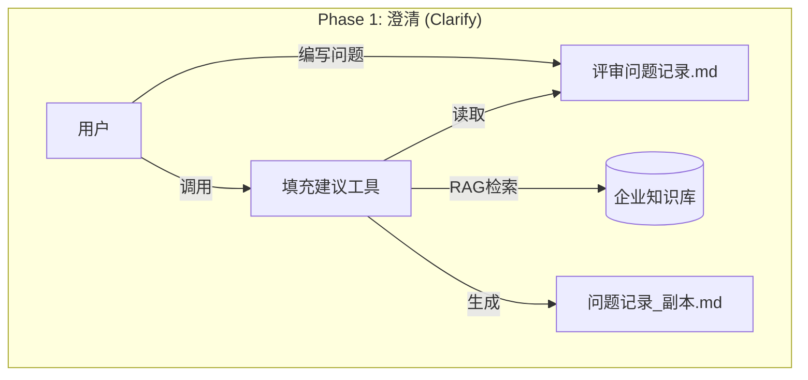

# RAG Flow MCP 用户指南 (L1 - 业务流程级)

本文档面向 **最终用户** 和 **产品经理**，旨在介绍 RAG Flow MCP 的核心功能、使用场景及操作流程。

> **注意**: 本版本仅聚焦 **“场景一：智能澄清与建议填充”**。方案进化和知识库管理功能暂时隐藏，待后续版本开放。

---

## 1. 产品简介

**RAG Flow MCP** 是一个智能文档助手，它连接了您的本地文档编辑器（如 VS Code）与企业级知识库（RAGFlow）。

**核心价值**:
*   **智能澄清**: 自动回答需求文档中的疑问，加速评审效率。
*   **安全可靠**: 所有修改均生成“影子副本”，绝不直接覆盖原文件。

---

## 2. 核心功能与使用场景

### 场景一：需求澄清与建议填充 (Clarification) - [P0 核心]

当您在编写《评审问题记录》时，可能会遇到一些不确定的业务规则或技术细节。

*   **您的操作**: 在文档中列出问题（推荐格式：`## 1. 问题标题`）。
*   **MCP 的工作**:
    1.  读取您的问题。
    2.  在企业知识库中检索相关资料。
    3.  将建议答案自动填入文档，并标注置信度。
*   **调用工具**: `fill_clarification_suggestions`
*   **产出物**: 生成一份包含 AI 建议的副本文档 (`.shadow` 文件)。

### [暂未开放] 场景二：方案文档自动进化 (Evolution)
*(功能开发中，敬请期待)*

### [暂未开放] 场景三：知识库管理 (Knowledge Lifecycle)
*(功能开发中，敬请期待)*

### 场景四：合规性检查 (Governance) - [辅助]

确保所有文档符合公司规范。

*   **MCP 的工作**: 检查文档是否包含必要的信息（如产品名、模块名、版本号）。
*   **调用工具**: `check_metadata_compliance`

---

## 3. 工具参考手册

| 工具名称 | 中文名称 | 输入参数 | 预期输出 | 状态 |
| :--- | :--- | :--- | :--- | :--- |
| `fill_clarification_suggestions` | 填充澄清建议 | `doc_path`: 问题记录文档路径 | 返回处理结果摘要，生成 `.shadow` 文件 | **可用** |
| `check_metadata_compliance` | 检查元数据 | `doc_path`: 文档路径 | 返回检查通过/失败状态及缺失字段 | **可用** |
| `evolve_scheme_document` | 进化方案文档 | - | - | *禁用* |
| `harvest_knowledge_candidates` | 收割知识候选 | - | - | *禁用* |
| `promote_knowledge` | 晋升知识 | - | - | *禁用* |

---

## 4. 业务流程图

