# 项目看板: RAG Flow MCP

> **状态**: ✅ Stage 6: Assess (已交付)
> **版本**: v2.0
> **最后更新**: 2025-12-09

## 1. 项目简介
**RAG Flow MCP** 是一个基于 6A 工作流打造的 MCP 服务，旨在通过 RAG 技术闭环软件架构设计过程中的“问题澄清-方案进化-知识沉淀”链路。

👉 **[技术文档与使用说明](../../src/apps/rag_flow_mcp/README.md)**

## 2. 6A 工作流执行记录

| 阶段 | 名称 | 状态 | 交付物 |
| :--- | :--- | :--- | :--- |
| **S0** | **Initialization** | ✅ 完成 | 项目骨架, `.venv` |
| **S1** | **Align (对齐)** | ✅ 完成 | [需求对齐](01_Align/ALIGNMENT_RAG Flow MCP.md), [共识确认](01_Align/CONSENSUS_RAG Flow MCP.md) |
| **S2** | **Architect (架构)** | ✅ 完成 | [统一架构设计 v2.0](02_Architect/UNIFIED_DESIGN.md) |
| **S3** | **Atomize (原子化)** | ✅ 完成 | [原子任务清单](03_Atomize/TASK_RAG Flow MCP.md) |
| **S4** | **Approve (审批)** | ✅ 完成 | [执行前检查单](04_Approve/CHECKLIST_RAG Flow MCP.md) |
| **S5** | **Automate (执行)** | ✅ 完成 | 源代码 (`src/apps/rag_flow_mcp/`) |
| **S6** | **Assess (评估)** | ✅ 完成 | [验收报告](06_Assess/ACCEPTANCE_RAG Flow MCP.md), [项目总结](06_Assess/FINAL_RAG Flow MCP.md) |

## 3. 核心架构 (v2.0)

```mermaid
graph LR
    User -->|MCP| Server[RAG Flow MCP Server]
    
    subgraph "Four-Core Engines"
        Server --> Inference[推理引擎]
        Server --> Evolution[进化引擎]
        Server --> Governance[治理引擎]
        Server --> Lifecycle[生命周期引擎]
    end
    
    Inference <--> RAG((RAGFlow))
    Evolution --> Docs[Markdown Docs]
    Lifecycle --> KB[Knowledge Base]
```



## 4. 快速链接
- [用户手册 (User Manual)](UserManual.md)
- [待办事项 (TODO)](06_Assess/TODO_RAG Flow MCP.md)

## 5. 构建与打包

使用以下命令构建可执行文件 (EXE)：

```powershell
python -m src.factory.build_app rag_flow_mcp
```

构建产物位于 `dist/rag_flow_mcp/` 目录。
