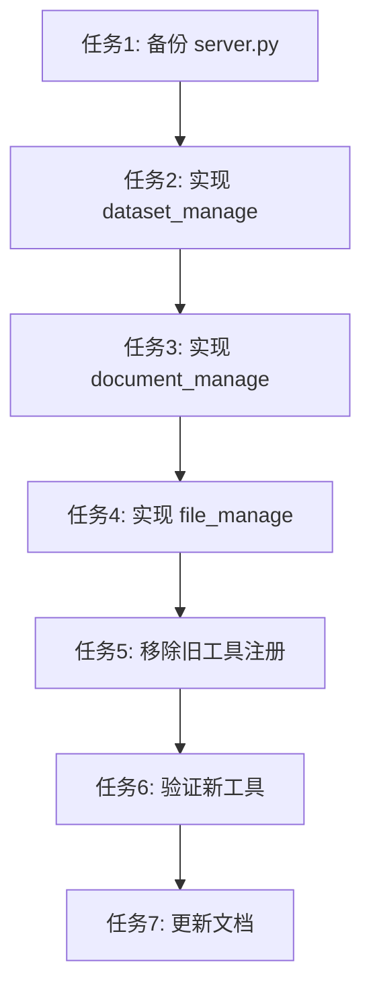

# 任务：精简 RAG Flow MCP 工具 (Simplify Tools)

## 1. 任务依赖图

## 2. 原子任务清单

### 任务 1: 备份 server.py
*   **内容**: 复制 `src/apps/rag_flow_mcp/server.py` 到 `src/apps/rag_flow_mcp/server.py.bak`。
*   **目的**: 防止重构失误导致服务不可用。

### 任务 2: 实现 dataset_manage
*   **内容**: 在 `server.py` 中添加 `dataset_manage` 工具函数，实现对 `base_tools.create_dataset`, `delete_dataset`, `update_dataset`, `list_datasets` 的调度。

### 任务 3: 实现 document_manage
*   **内容**: 在 `server.py` 中添加 `document_manage` 工具函数，实现对 `base_tools.upload_document` 等的调度。

### 任务 4: 实现 file_manage
*   **内容**: 在 `server.py` 中添加 `file_manage` 工具函数，实现对 `read_file`, `list_files` 的调度。

### 任务 5: 移除旧工具注册
*   **内容**: 从 `server.py` 中删除以下工具的注册代码：
    *   细粒度的 Dataset/Document/File 工具。
    *   `mcp_rag_base_fill_clarification_suggestions_controller`。
    *   所有 Atomic Tools (`create_shadow_file` 等)。

### 任务 6: 验证新工具
*   **内容**: 使用 `src.factory.verify_mcp` 或手动编写脚本验证新工具的调用是否正常。
*   **验收**: `dataset_manage(action='list')` 返回 JSON 列表。

### 任务 7: 更新文档
*   **内容**: 更新 `docs/rag_flow_mcp/UserManual.md`，反映工具列表的变更。
