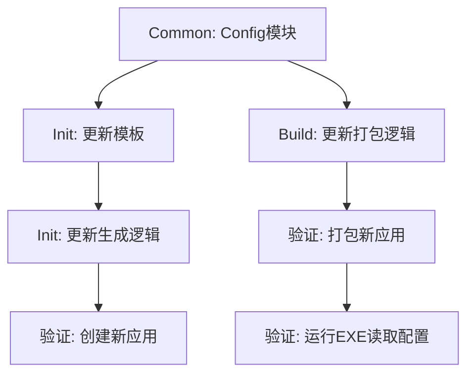

# 任务分解：MCP交付规范升级

## 任务依赖图 (Mermaid)

## 原子任务列表

### 1. 基础库升级 (Common)
- [ ] **T1_Common_Config**: 创建 `src/common/config.py`，实现 `load_config` 函数，支持从 EXE 同级目录读取 `config.json`。
- [ ] **T1_Common_Init**: 在 `src/common/__init__.py` 中导出 `load_config`。

### 2. 初始化工具升级 (Init)
- [ ] **T2_Init_Templates**: 在 `src/factory/init_app.py` 中：
    - 更新 `SERVER_TEMPLATE`: 引入 `load_config`。
    - 新增 `CONFIG_TEMPLATE`: 默认 JSON 内容。
    - 新增 `MANUAL_TEMPLATE`: 默认使用手册内容。
- [ ] **T3_Init_Logic**: 更新 `create_app` 函数：
    - 生成 `config.json` 到应用源码目录。
    - 生成 `UserManual.md` 到文档目录。

### 3. 构建工具升级 (Build)
- [ ] **T4_Build_Logic**: 更新 `src/factory/build_app.py`：
    - 在 `dist` 下创建 `{app_name}_release` 文件夹。
    - 移动生成的 exe。
    - 复制 `src/apps/{app_name}/config.json` (如果存在)。
    - 复制 `docs/{display_name}/UserManual.md` (优先) 或 `Readme.md`，重命名为 `README.md`。

### 4. 验证 (Verify)
- [ ] **T5_Verify_Create**: 运行 `init_app` 创建 `test_standard_app`。
- [ ] **T6_Verify_Build**: 运行 `build_app` 打包 `test_standard_app`。
- [ ] **T7_Verify_Run**: 运行生成的 EXE，并修改 `config.json` 验证配置是否生效（通过日志或输出）。

## 验收标准
1.  `src/common` 提供可靠的配置读取能力。
2.  `init_app` 生成的新项目包含配置和手册。
3.  `build_app` 产出的 `dist` 目录包含规范的 release 文件夹结构。
