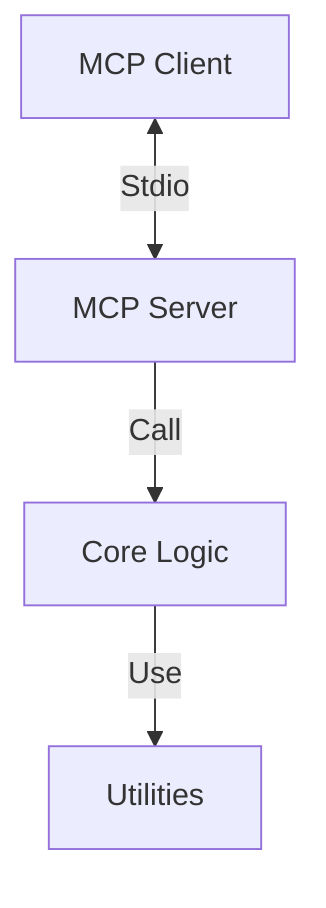

# 自动生成测试 - 架构设计 (Architect)

## 1. 整体架构

## 2. 接口定义 (Tools)
| 工具名称 | 描述 | 参数 | 返回值 |
| :--- | :--- | :--- | :--- |
| `hello_world` | 测试工具 | 无 | 欢迎消息字符串 |

## 3. 资源定义 (Resources)
> 如果有资源 (Resources)，请在此定义 URI Scheme。

## 4. 提示词定义 (Prompts)
> 如果有提示词 (Prompts)，请在此定义。
