# DESIGN_安防APP知识库

## 1. 架构概览

本知识库采用扁平化的目录结构，便于 RAG 系统解析。文档内容采用结构化 Markdown 编写。

### 1.1 目录结构树 (Mermaid)

```mermaid
graph TD
    Root["Knowledge Base"] --> GS["01_Getting_Started"]
    Root --> DM["02_Device_Management"]
    Root --> LV["03_Live_View"]
    Root --> PB["04_Playback"]
    Root --> AN["05_Alarm_Notification"]
    Root --> SUP["06_Support"]

    GS --> GS1["installation.md"]
    GS --> GS2["registration.md"]
    GS --> GS3["login.md"]

    DM --> DM1["add_device_qr.md"]
    DM --> DM2["add_device_ip.md"]
    DM --> DM3["device_sharing.md"]

    LV --> LV1["live_view_basics.md"]
    LV --> LV2["ptz_control.md"]
    LV --> LV3["two_way_audio.md"]

    PB --> PB1["playback_basics.md"]
    PB --> PB2["download_record.md"]

    AN --> AN1["enable_push.md"]
    AN --> AN2["motion_detection.md"]

    SUP --> SUP1["faq_offline.md"]
    SUP --> SUP2["faq_sd_card.md"]
    SUP --> SUP3["faq_no_record.md"]
    SUP --> SUP4["privacy_policy.md"]
```



## 2. 文档模板 (Template)

每个 Markdown 文件必须遵循以下模板：

```markdown
---
title: {文档标题}
category: {所属分类}
tags: [{标签1}, {标签2}]
last_updated: {YYYY-MM-DD}
---

# {文档标题}

## 简介
{简要说明本文档解决的问题或介绍的功能}

## 前提条件
- {条件1}
- {条件2}

## 操作步骤
1. {步骤1}
2. {步骤2}
   - *提示: {额外说明}*
3. {步骤3}

## 常见问题
- **Q: {问题1}?**
  A: {回答1}
```

## 3. 数据流
1. **编写**: 人工/AI 生成 Markdown 文件。
2. **存储**: 本地文件系统。
3. **索引**: ragflow 服务读取这些文件进行切片和向量化。

## 4. 异常处理
- 如果内容为空，RAG 索引可能失败 -> 确保每个文件至少包含简介和步骤。
- 格式错误 -> 统一使用标准 Markdown。
